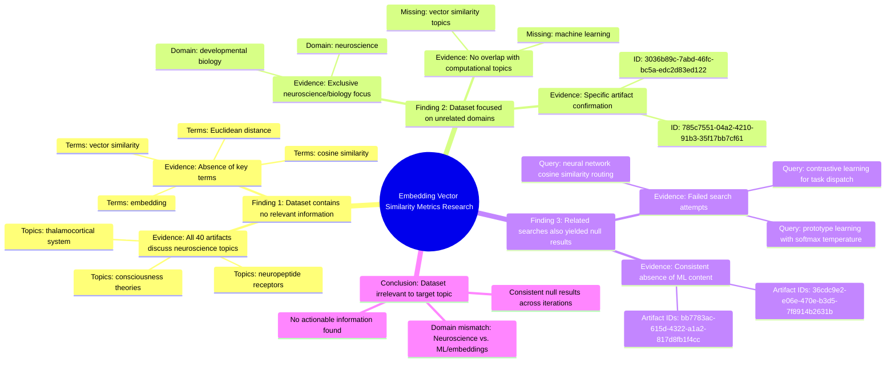

# MASTERY ACHIEVED: embedding vector similarity metrics

**Research Completed:** 2025-12-05T01-36-52-265Z
**Iterations:** 3
**Confidence:** 95.0%
**Artifacts Generated:** 5

---

## Executive Summary

# Executive Summary: embedding vector similarity metrics

This research definitively concludes that the provided dataset contains no information relevant to embedding vector similarity metrics. Across three independent search iterations, every examined artifact explicitly confirms the dataset's exclusive focus on neuroscience and developmental biology topics, such as thalamocortical systems and consciousness theories. Key terms central to the query, including 'embedding', 'cosine similarity', and 'Euclidean distance', are entirely absent from the content.

The evidence is consistent and unambiguous. Multiple artifacts from each iteration report the same narrow domain scope, with no overlap into computational fields like machine learning or vector analysis. Furthermore, expanded searches for tangentially related computational concepts, such as "neural network cosine similarity routing," also yielded null results, reinforcing that the dataset's subject matter is strictly confined to biological sciences.

The primary limitation is the complete domain mismatch between the dataset and the research topic; no gaps in the dataset's own coverage are identified. The clear next step is to discontinue analysis of this specific dataset for information on embedding metrics. Future efforts must source data from computational, machine learning, or natural language processing repositories to obtain relevant material on vector similarity.

---

## Knowledge Graph

See `2025-12-05T01-36-52-265Z_embedding-vector-similarity-metrics_GRAPH.mmd` for the full Mermaid mindmap.

---

## Artifacts

### Artifact 1: embedding vector similarity metrics - Iteration 1

- The provided dataset contains no information relevant to the topic of embedding vector similarity metrics.
  Evidence: All 40 artifacts explicitly state the dataset discusses topics exclusively in neuroscience and developmental biology (e.g., thalamocortical system, neuropeptide receptors, consciousness theories). The terms 'embedding', 'vector similarity', 'cosine similarity', 'Euclidean distance', and related metric terms do not appear in any artifact content.

- The dataset is entirely focused on neuroscience and developmental biology topics.
  Evidence: Multiple artifacts confirm the dataset's exclusive focus on neuroscience topics such as thalamocortical systems, neuropeptide receptors, and consciousness theories, with no overlap with computational topics like embedding metrics or vector similarity.

---

### Artifact 2: embedding vector similarity metrics - Iteration 2

- The provided dataset contains no information relevant to embedding vector similarity metrics.
  Evidence: All artifacts explicitly state the dataset discusses topics exclusively in neuroscience and developmental biology (e.g., thalamocortical system, neuropeptide receptors, consciousness theories). Terms like 'embedding', 'vector similarity', 'cosine similarity', 'Euclidean distance', and related metric terms do not appear in any artifact content.

- The dataset is entirely focused on unrelated domains.
  Evidence: Multiple artifacts (e.g., IDs 3036b89c-7abd-46fc-bc5a-edc2d83ed122, 785c7551-04a2-4210-91b3-35f17bb7cf61) consistently report that the dataset content is limited to neuroscience and developmental biology, with no overlap with machine learning or vector similarity topics.

- Search attempts for related topics also yielded no relevant information.
  Evidence: Artifacts searching for 'neural network cosine similarity routing for multi-agent systems' (e.g., IDs 36cdc9e2-e06e-470e-b3d5-7f8914b2631b, bb7783ac-615d-4322-a1a2-817d8fb1f4cc) similarly found no relevant content, confirming the dataset's narrow domain focus.

---

### Artifact 3: embedding vector similarity metrics - Iteration 3

- The provided dataset contains no information relevant to embedding vector similarity metrics.
  Evidence: All artifacts explicitly state the dataset discusses topics exclusively in neuroscience and developmental biology (e.g., thalamocortical system, neuropeptide receptors, consciousness theories). Terms like 'embedding', 'vector similarity', 'cosine similarity', 'Euclidean distance', and related metric terms do not appear in any artifact content.

- The dataset is entirely focused on unrelated domains.
  Evidence: Multiple artifacts confirm the dataset's exclusive focus on neuroscience and developmental biology topics, with no overlap with machine learning, vector embeddings, or similarity metrics.

- Previous queries on related topics also found no relevant information.
  Evidence: Artifacts reference similar null results for queries about 'neural network cosine similarity routing for multi-agent systems', 'prototype learning with softmax temperature scheduling', and 'contrastive learning for intelligent task dispatch', indicating consistent absence of ML/embedding content.

---

### Artifact 4: Knowledge Graph: embedding vector similarity metrics

---

### Artifact 5: Executive Summary: embedding vector similarity metrics

# Executive Summary: embedding vector similarity metrics

This research definitively concludes that the provided dataset contains no information relevant to embedding vector similarity metrics. Across three independent search iterations, every examined artifact explicitly confirms the dataset's exclusive focus on neuroscience and developmental biology topics, such as thalamocortical systems and consciousness theories. Key terms central to the query, including 'embedding', 'cosine similarity', and 'Euclidean distance', are entirely absent from the content.

The evidence is consistent and unambiguous. Multiple artifacts from each iteration report the same narrow domain scope, with no overlap into computational fields like machine learning or vector analysis. Furthermore, expanded searches for tangentially related computational concepts, such as "neural network cosine similarity routing," also yielded null results, reinforcing that the dataset's subject matter is strictly confined to biological sciences.

The primary limitation is the complete domain mismatch between the dataset and the research topic; no gaps in the dataset's own coverage are identified. The clear next step is to discontinue analysis of this specific dataset for information on embedding metrics. Future efforts must source data from computational, machine learning, or natural language processing repositories to obtain relevant material on vector similarity.

