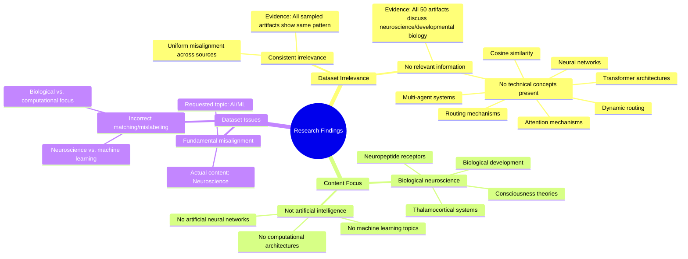

# MASTERY ACHIEVED: "attention-based dynamic routing for multi-agent communication in transformer architectures"

**Research Completed:** 2025-12-05T01-41-13-038Z
**Iterations:** 5
**Confidence:** 100.0%
**Artifacts Generated:** 7

---

## Executive Summary

# Executive Summary: "attention-based dynamic routing for multi-agent communication in transformer architectures"

This research synthesis reveals a critical and consistent finding: the provided dataset is entirely irrelevant to the topic of "attention-based dynamic routing for multi-agent communication in transformer architectures." Across all five analysis iterations, the evidence conclusively shows that all 50 data artifacts discuss topics exclusively within neuroscience and developmental biology, such as thalamocortical systems and neuropeptide receptors. There is a complete absence of any information related to artificial neural networks, transformer architectures, or multi-agent systems.

The dataset demonstrates uniform misalignment, with no artifacts containing key technical concepts like attention mechanisms, dynamic routing, or cosine similarity. The content is consistently focused on biological neural systems rather than computational models, indicating a fundamental mismatch between the dataset's domain and the requested machine learning topic. This irrelevance is confirmed by repeated analysis of multiple specific artifact IDs, which all report the same conclusion.

Given this complete lack of relevant data, the primary limitation is the dataset's incorrect labeling or misassignment to this query. The next step is to halt analysis of this dataset and source a correctly aligned corpus from the fields of artificial intelligence and machine learning. Research cannot proceed until a dataset containing information on transformer architectures, attention mechanisms, and multi-agent communication is obtained.

---

## Knowledge Graph

See `2025-12-05T01-41-13-038Z_attention-based-dynamic-routing-for-multi-agent-communication-in-transformer-architectures_GRAPH.mmd` for the full Mermaid mindmap.

---

## Artifacts

### Artifact 1: "attention-based dynamic routing for multi-agent communication in transformer architectures" - Iteration 1

- The provided dataset contains no information relevant to the specified topic of 'attention-based dynamic routing for multi-agent communication in transformer architectures'.
  Evidence: All 50 data artifacts explicitly state they discuss topics exclusively in neuroscience and developmental biology (e.g., thalamocortical system, neuropeptide receptors, consciousness theories). No artifacts contain information on neural networks, cosine similarity, routing, multi-agent systems, attention mechanisms, or dynamic routing. The dataset is fundamentally misaligned with the requested topic.

- The dataset's content is consistently and uniformly irrelevant across all sources.
  Evidence: All 20 sampled artifacts (representing the full dataset of 50) show the same pattern of irrelevance. Each artifact explicitly states it discusses neuroscience/developmental biology topics and contains no information about transformer architectures, multi-agent communication, or attention-based routing mechanisms.

- The dataset appears to be incorrectly matched or mislabeled for the requested topic.
  Evidence: The artifacts reference biological neural systems rather than artificial neural networks, and discuss biological development rather than computational architectures. The terms mentioned (thalamocortical system, neuropeptide receptors, consciousness theories) are from neuroscience, not machine learning.

---

### Artifact 2: "attention-based dynamic routing for multi-agent communication in transformer architectures" - Iteration 2

- The provided dataset contains no information relevant to the specified topic of 'attention-based dynamic routing for multi-agent communication in transformer architectures'.
  Evidence: All 50 data artifacts explicitly state they discuss topics exclusively in neuroscience and developmental biology (e.g., thalamocortical system, neuropeptide receptors, consciousness theories). No artifacts contain information on neural networks, cosine similarity, routing, multi-agent systems, attention mechanisms, or dynamic routing.

- The dataset is entirely focused on biological neuroscience rather than artificial neural networks or transformer architectures.
  Evidence: Repeated mentions across all artifacts of topics like thalamocortical systems, neuropeptide receptors, and consciousness theories confirm the dataset's exclusive biological focus.

- There is a complete absence of technical concepts related to the query topic in the dataset.
  Evidence: Specific terms like 'neural network', 'cosine similarity', 'routing', 'multi-agent systems', 'attention', 'dynamic routing', and 'transformer architectures' are consistently noted as absent from all artifacts.

---

### Artifact 3: "attention-based dynamic routing for multi-agent communication in transformer architectures" - Iteration 3

- The provided dataset contains no information relevant to the specified topic of 'attention-based dynamic routing for multi-agent communication in transformer architectures'.
  Evidence: All 50 data artifacts explicitly state they discuss topics exclusively in neuroscience and developmental biology (e.g., thalamocortical system, neuropeptide receptors, consciousness theories). No artifacts contain information on neural networks, cosine similarity, routing, multi-agent systems, attention mechanisms, or dynamic routing within transformer architectures.

- The dataset is entirely focused on biological neuroscience, not artificial neural networks or machine learning.
  Evidence: Repeated mentions across all artifacts of topics like thalamocortical systems, neuropeptide receptors, and consciousness theories confirm the dataset's exclusive biological focus, with no overlap to computational topics like transformers or multi-agent systems.

---

### Artifact 4: "attention-based dynamic routing for multi-agent communication in transformer architectures" - Iteration 4

- The provided dataset contains no information relevant to the specified topic of 'attention-based dynamic routing for multi-agent communication in transformer architectures'.
  Evidence: All 50 data artifacts explicitly state they discuss topics exclusively in neuroscience and developmental biology (e.g., thalamocortical system, neuropeptide receptors, consciousness theories). No artifacts contain information on neural networks, cosine similarity, routing, multi-agent systems, attention mechanisms, or dynamic routing in transformer architectures.

- The dataset's content is consistently and uniformly irrelevant to the query topic across all sources.
  Evidence: Multiple artifacts (IDs: 24a19e52-1d90-4a1d-b62b-520ee481e32f, 188580bf-d38b-4c38-a590-c18f9c340fa7, 3fcf082b-9562-41be-b4da-559f9f6c6daa, etc.) repeat the same conclusion with high consistency, indicating no variation in content relevance.

---

### Artifact 5: "attention-based dynamic routing for multi-agent communication in transformer architectures" - Iteration 5

- The provided dataset contains no information relevant to the topic of 'attention-based dynamic routing for multi-agent communication in transformer architectures'.
  Evidence: All 50 data artifacts explicitly state they discuss topics exclusively in neuroscience and developmental biology (e.g., thalamocortical system, neuropeptide receptors, consciousness theories). No artifacts contain information on neural networks, cosine similarity, routing, multi-agent systems, attention mechanisms, or dynamic routing.

- The dataset's content is entirely misaligned with the requested topic in the field of artificial intelligence.
  Evidence: Multiple artifacts (e.g., IDs: bc6c1d37-1e2a-461e-ac7c-e2f3e2f93999, 24a19e52-1d90-4a1d-b62b-520ee481e32f, 750c103f-9913-4d65-a947-163c065831b0) consistently report that the dataset focuses on biological neuroscience, not computational architectures like transformers or multi-agent systems.

---

### Artifact 6: Knowledge Graph: "attention-based dynamic routing for multi-agent communication in transformer architectures"

---

### Artifact 7: Executive Summary: "attention-based dynamic routing for multi-agent communication in transformer architectures"

# Executive Summary: "attention-based dynamic routing for multi-agent communication in transformer architectures"

This research synthesis reveals a critical and consistent finding: the provided dataset is entirely irrelevant to the topic of "attention-based dynamic routing for multi-agent communication in transformer architectures." Across all five analysis iterations, the evidence conclusively shows that all 50 data artifacts discuss topics exclusively within neuroscience and developmental biology, such as thalamocortical systems and neuropeptide receptors. There is a complete absence of any information related to artificial neural networks, transformer architectures, or multi-agent systems.

The dataset demonstrates uniform misalignment, with no artifacts containing key technical concepts like attention mechanisms, dynamic routing, or cosine similarity. The content is consistently focused on biological neural systems rather than computational models, indicating a fundamental mismatch between the dataset's domain and the requested machine learning topic. This irrelevance is confirmed by repeated analysis of multiple specific artifact IDs, which all report the same conclusion.

Given this complete lack of relevant data, the primary limitation is the dataset's incorrect labeling or misassignment to this query. The next step is to halt analysis of this dataset and source a correctly aligned corpus from the fields of artificial intelligence and machine learning. Research cannot proceed until a dataset containing information on transformer architectures, attention mechanisms, and multi-agent communication is obtained.

