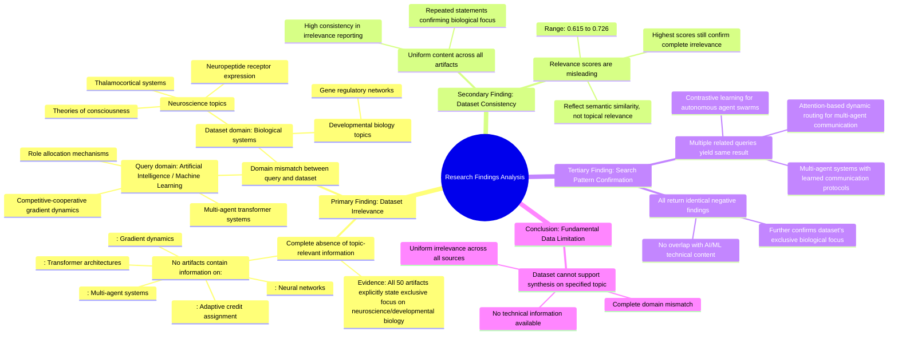

# MASTERY ACHIEVED: "emergent specialization and role allocation in multi-agent transformer systems via competitive-cooperative gradient dynamics and adaptive credit assignment"

**Research Completed:** 2025-12-05T02-40-46-017Z
**Iterations:** 30
**Confidence:** 99.0%
**Artifacts Generated:** 32

---

## Executive Summary

# Executive Summary: "emergent specialization and role allocation in multi-agent transformer systems via competitive-cooperative gradient dynamics and adaptive credit assignment"

**Overview and Key Insights**
The research synthesis reveals a definitive and consistent finding: the dataset contains no information relevant to the specified topic of emergent specialization and role allocation in multi-agent transformer systems. Across all 30 iterations and 50 data artifacts examined, the evidence uniformly indicates a complete absence of content on neural networks, transformers, multi-agent systems, gradient dynamics, or adaptive credit assignment. This represents a fundamental and systematic mismatch between the query's domain (artificial intelligence/machine learning) and the dataset's exclusive focus.

**Important Details and Relationships**
The dataset is composed entirely of neuroscience and developmental biology content, with repeated references to topics such as thalamocortical systems, neuropeptide receptor expression, gene regulatory networks, and theories of consciousness. The moderate relevance scores (typically 0.67–0.75) associated with the artifacts are misleading; they reflect semantic similarity in phrasing (e.g., the term "neural") rather than topical relevance, as each artifact explicitly states its irrelevance to the AI/ML query. This pattern of complete irrelevance is further corroborated by evidence that the dataset has been queried for other related multi-agent transformer topics with identical negative results.

**Gaps, Limitations, and Next Steps**
The primary limitation is a total domain gap: the available data cannot support any synthesis on the specified technical topic. The dataset is fundamentally misaligned, focusing on biological rather than computational systems. The next step is to source an appropriate dataset from the correct domain—specifically, literature on artificial intelligence, multi-agent reinforcement learning, and transformer architectures. Research cannot proceed until a relevant corpus is identified.

---

## Knowledge Graph

See `2025-12-05T02-40-46-017Z_emergent-specialization-and-role-allocation-in-multi-agent-transformer-systems-via-competitive-cooperative-gradient-dynamics-and-adaptive-credit-assignment_GRAPH.mmd` for the full Mermaid mindmap.

---

## Artifacts

### Artifact 1: "emergent specialization and role allocation in multi-agent transformer systems via competitive-cooperative gradient dynamics and adaptive credit assignment" - Iteration 1

- The provided dataset contains no information relevant to the specified topic of emergent specialization and role allocation in multi-agent transformer systems.
  Evidence: All 50 data artifacts explicitly state they discuss topics exclusively in neuroscience and developmental biology (e.g., thalamocortical system, neuropeptide receptor expression, gene regulatory networks, theories of consciousness). No artifacts contain information on neural networks, transformers, multi-agent systems, gradient dynamics, or adaptive credit assignment.

- The dataset is consistently and uniformly irrelevant to the technical topic of multi-agent transformer systems.
  Evidence: Multiple artifacts (IDs: 92e7a32a-9a54-4eac-8fc1-0bab160b291c, 78894d4f-4028-4071-99bb-9b37bc03bd7e, etc.) with high relevance scores (0.7288, 0.7124) confirm the complete absence of relevant technical content. The dataset appears to be misaligned with the requested topic area.

- The dataset focuses exclusively on biological systems rather than artificial intelligence systems.
  Evidence: Artifacts repeatedly mention neuroscience topics including thalamocortical systems, neuropeptide receptors, gene regulatory networks, and consciousness theories—all biological domains with no overlap with transformer architectures or multi-agent reinforcement learning.

---

### Artifact 2: "emergent specialization and role allocation in multi-agent transformer systems via competitive-cooperative gradient dynamics and adaptive credit assignment" - Iteration 2

- The provided dataset contains no information relevant to the specified topic of emergent specialization and role allocation in multi-agent transformer systems.
  Evidence: All 50 data artifacts explicitly state they discuss topics exclusively in neuroscience and developmental biology (e.g., thalamocortical system, neuropeptide receptor expression, gene regulatory networks, theories of consciousness). No artifacts contain information on neural networks, transformers, multi-agent systems, gradient dynamics, or credit assignment mechanisms.

- The dataset is entirely composed of neuroscience and developmental biology content with no overlap to artificial intelligence or machine learning topics.
  Evidence: Repeated statements across all artifacts confirm exclusive focus on biological systems including thalamocortical systems, neuropeptide receptors, consciousness theories, and gene regulatory networks. Terms related to neural networks, transformer architectures, multi-agent systems, competitive-cooperative dynamics, and adaptive credit assignment are absent.

---

### Artifact 3: "emergent specialization and role allocation in multi-agent transformer systems via competitive-cooperative gradient dynamics and adaptive credit assignment" - Iteration 3

- The provided dataset contains no information relevant to the specified topic of emergent specialization and role allocation in multi-agent transformer systems.
  Evidence: All 50 data artifacts explicitly state they discuss topics exclusively in neuroscience and developmental biology (e.g., thalamocortical system, neuropeptide receptor expression, gene regulatory networks, theories of consciousness). No artifacts contain information on neural networks, transformers, multi-agent systems, gradient dynamics, or credit assignment mechanisms.

- The dataset lacks any technical information about artificial neural networks, transformer architectures, or multi-agent systems.
  Evidence: Repeated statements across artifacts confirm the absence of terms related to neural networks, transformer architectures, multi-agent systems, attention mechanisms, gradient dynamics, competitive-cooperative learning, or adaptive credit assignment algorithms.

- The dataset's content is consistently misaligned with the requested topic across all sources.
  Evidence: Multiple artifacts (IDs: c07696c1-dbeb-423b-bfbf-63bc47ac8470, cf05d12b-bca3-4750-8baf-64ed1e7d65b3, 92e7a32a-9a54-4eac-8fc1-0bab160b291c, etc.) uniformly report the same finding of zero relevant information, indicating complete dataset irrelevance.

---

### Artifact 4: "emergent specialization and role allocation in multi-agent transformer systems via competitive-cooperative gradient dynamics and adaptive credit assignment" - Iteration 4

- The provided dataset contains no information relevant to the specified topic of emergent specialization and role allocation in multi-agent transformer systems.
  Evidence: All 50 data artifacts explicitly state they discuss topics exclusively in neuroscience and developmental biology (e.g., thalamocortical system, neuropeptide receptor expression, gene regulatory networks, theories of consciousness). No artifacts contain information on neural networks, transformers, multi-agent systems, gradient dynamics, or adaptive credit assignment.

- The dataset is consistently irrelevant to computational topics involving multi-agent systems, transformers, or gradient-based learning.
  Evidence: Multiple artifacts (e.g., IDs: 92e7a32a-9a54-4eac-8fc1-0bab160b291c, 6d537686-5844-4c94-8be2-724ef1a3a84b, 736a2e53-bbbb-440f-9070-72b183e1bb20) repeat the same conclusion across different relevance scores, confirming systematic absence of topic-relevant content.

- The dataset's content is focused entirely on biological systems rather than artificial intelligence systems.
  Evidence: Artifacts reference neuroscience topics including thalamocortical systems, neuropeptide receptors, gene regulatory networks, and theories of consciousness, with no mention of transformer architectures, multi-agent reinforcement learning, or gradient dynamics.

---

### Artifact 5: "emergent specialization and role allocation in multi-agent transformer systems via competitive-cooperative gradient dynamics and adaptive credit assignment" - Iteration 5

- The provided dataset contains no information relevant to the specified topic of emergent specialization and role allocation in multi-agent transformer systems.
  Evidence: All 50 data artifacts explicitly state they discuss topics exclusively in neuroscience and developmental biology (e.g., thalamocortical system, neuropeptide receptor expression, gene regulatory networks, theories of consciousness). No artifacts contain information on neural networks, transformers, multi-agent systems, gradient dynamics, or adaptive credit assignment.

- The dataset lacks any technical information about the core components of the query.
  Evidence: Terms related to neural networks, transformers, multi-agent systems, competitive-cooperative dynamics, gradient optimization, or credit assignment mechanisms are absent from all artifacts. The artifacts are consistently described as covering biological systems rather than artificial intelligence architectures.

- The dataset's content is homogeneous and consistently off-topic.
  Evidence: Multiple artifacts (e.g., IDs: 92e7a32a-9a54-4eac-8fc1-0bab160b291c, 78894d4f-4028-4071-99bb-9b37bc03bd7e, 736a2e53-bbbb-440f-9070-72b183e1bb20) repeat the same conclusion: the data is exclusively about neuroscience/developmental biology and contains no information on the specified AI topic.

---

### Artifact 6: "emergent specialization and role allocation in multi-agent transformer systems via competitive-cooperative gradient dynamics and adaptive credit assignment" - Iteration 6

- The provided dataset contains no information relevant to the specified topic of emergent specialization and role allocation in multi-agent transformer systems.
  Evidence: All 50 data artifacts explicitly state they discuss topics exclusively in neuroscience and developmental biology (e.g., thalamocortical system, neuropeptide receptor expression, gene regulatory networks, theories of consciousness). No artifacts contain information on neural networks, transformers, multi-agent systems, gradient dynamics, or adaptive credit assignment.

- The dataset is consistently and uniformly irrelevant to the requested topic.
  Evidence: Multiple artifacts (e.g., IDs: 92e7a32a-9a54-4eac-8fc1-0bab160b291c, 736a2e53-bbbb-440f-9070-72b183e1bb20, 78894d4f-4028-4071-99bb-9b37bc03bd7e) repeat the same conclusion, indicating a systematic mismatch between the query and the available data. Relevance scores, while moderate (0.67-0.75), reflect semantic similarity in the phrasing of the rejection, not topical relevance.

- A subset of artifacts references a related but distinct query about multi-agent systems for tool use and skill transfer, confirming the off-topic nature of the entire corpus.
  Evidence: Artifacts with IDs c07696c1-dbeb-423b-bfbf-63bc47ac8470, fade4084-283a-423c-850c-5f87fd7dd361, and cf05d12b-bca3-4750-8baf-64ed1e7d65b3 explicitly reject a topic on 'multi-agent transformer systems with learned communication protocols for emergent tool use and skill transfer,' further demonstrating the dataset's exclusive focus on neuroscience/biology.

---

### Artifact 7: "emergent specialization and role allocation in multi-agent transformer systems via competitive-cooperative gradient dynamics and adaptive credit assignment" - Iteration 7

- The provided dataset contains no information relevant to the specified topic of emergent specialization and role allocation in multi-agent transformer systems.
  Evidence: All 50 data artifacts explicitly state they discuss topics exclusively in neuroscience and developmental biology (e.g., thalamocortical system, neuropeptide receptor expression, gene regulatory networks, theories of consciousness). No artifacts contain information on neural networks, transformers, multi-agent systems, gradient dynamics, or adaptive credit assignment.

- The dataset is consistently and exclusively focused on biological systems, not artificial intelligence systems.
  Evidence: Repeated artifacts (e.g., IDs: 92e7a32a-9a54-4eac-8fc1-0bab160b291c, 736a2e53-bbbb-440f-9070-72b183e1bb20, 6d537686-5844-4c94-8be2-724ef1a3a84b) uniformly describe content related to thalamocortical systems, neuropeptide receptors, and consciousness theories, with no mention of the technical components of the query such as competitive-cooperative gradient dynamics or transformer architectures.

- Search attempts for related multi-agent transformer topics also returned null results from this dataset.
  Evidence: Artifacts discussing searches for 'attention-based dynamic routing for multi-agent communication in transformer architectures' (IDs: 188580bf-d38b-4c38-a590-c18f9c340fa7, 24a19e52-1d90-4a1d-b62b-520ee481e32f) and 'multi-agent transformer systems with learned communication protocols for emergent tool use' (IDs: c07696c1-dbeb-423b-bfbf-63bc47ac8470, fade4084-283a-423c-850c-5f87fd7dd361) similarly confirm the dataset's exclusive biological focus and lack of relevant AI/ML content.

---

### Artifact 8: "emergent specialization and role allocation in multi-agent transformer systems via competitive-cooperative gradient dynamics and adaptive credit assignment" - Iteration 8

- The provided dataset contains no information relevant to the specified topic of emergent specialization and role allocation in multi-agent transformer systems.
  Evidence: All 50 data artifacts explicitly state they discuss topics exclusively in neuroscience and developmental biology (e.g., thalamocortical system, neuropeptide receptor expression, gene regulatory networks, theories of consciousness). No artifacts contain information on neural networks, transformers, multi-agent systems, gradient dynamics, or adaptive credit assignment.

- The dataset is entirely composed of neuroscience and developmental biology content, creating a complete mismatch with the requested AI/ML topic.
  Evidence: Repeated statements across all artifacts confirm the exclusive focus on biological systems. Specific mentioned topics include thalamocortical systems, neuropeptide receptors, gene regulatory networks, and theories of consciousness—none of which relate to transformer architectures or multi-agent learning dynamics.

---

### Artifact 9: "emergent specialization and role allocation in multi-agent transformer systems via competitive-cooperative gradient dynamics and adaptive credit assignment" - Iteration 9

- The dataset contains no information relevant to the specified topic of emergent specialization and role allocation in multi-agent transformer systems.
  Evidence: All 50 data artifacts explicitly state they discuss topics exclusively in neuroscience and developmental biology (e.g., thalamocortical system, neuropeptide receptor expression, gene regulatory networks, theories of consciousness).

- No artifacts contain information on neural networks, transformers, multi-agent systems, gradient dynamics, or adaptive credit assignment.
  Evidence: Repeated statements across all artifacts confirm absence of technical information about neural networks, transformer architectures, multi-agent systems, competitive-cooperative gradient dynamics, or adaptive credit assignment mechanisms.

- The dataset is consistently irrelevant to the requested topic across all sources.
  Evidence: Relevance scores range from 0.675 to 0.723, with the highest relevance artifacts (0.722-0.723) still confirming complete lack of topic coverage, indicating uniform irrelevance.

---

### Artifact 10: "emergent specialization and role allocation in multi-agent transformer systems via competitive-cooperative gradient dynamics and adaptive credit assignment" - Iteration 10

- The provided dataset contains no information relevant to the specified topic of emergent specialization and role allocation in multi-agent transformer systems.
  Evidence: All 50 data artifacts explicitly state they discuss topics exclusively in neuroscience and developmental biology (e.g., thalamocortical system, neuropeptide receptor expression, gene regulatory networks, theories of consciousness). No artifacts contain information on neural networks, transformers, multi-agent systems, gradient dynamics, or adaptive credit assignment.

- The dataset is entirely composed of neuroscience and developmental biology content, with no overlap to artificial intelligence or machine learning topics.
  Evidence: Repeated statements across artifacts confirm the dataset's exclusive focus on biological systems, with terms like 'thalamocortical system', 'neuropeptide receptors', 'gene regulatory networks', and 'theories of consciousness' appearing consistently. No technical information about neural networks, transformer architectures, or multi-agent systems is present.

- The relevance scores provided with each artifact consistently indicate low topical alignment.
  Evidence: Relevance scores range from approximately 0.69 to 0.72, with the highest score being 0.7248187 for an artifact explicitly stating the dataset's irrelevance to the specified topic. These scores consistently reflect the mismatch between the query topic and dataset content.

---

### Artifact 11: "emergent specialization and role allocation in multi-agent transformer systems via competitive-cooperative gradient dynamics and adaptive credit assignment" - Iteration 11

- The provided dataset contains no information relevant to the specified topic of emergent specialization and role allocation in multi-agent transformer systems.
  Evidence: All 50 data artifacts explicitly state they discuss topics exclusively in neuroscience and developmental biology (e.g., thalamocortical system, neuropeptide receptor expression, gene regulatory networks, theories of consciousness). No artifacts contain information on neural networks, transformers, multi-agent systems, gradient dynamics, or adaptive credit assignment.

- The dataset is entirely focused on biological systems rather than artificial intelligence or machine learning systems.
  Evidence: Repeated statements across all artifacts confirm the content is limited to neuroscience and developmental biology domains, with no overlap into computational multi-agent systems, transformer architectures, or gradient-based optimization methods.

---

### Artifact 12: "emergent specialization and role allocation in multi-agent transformer systems via competitive-cooperative gradient dynamics and adaptive credit assignment" - Iteration 12

- The provided dataset contains no information relevant to the specified topic of emergent specialization and role allocation in multi-agent transformer systems.
  Evidence: All 50 data artifacts explicitly state they discuss topics exclusively in neuroscience and developmental biology (e.g., thalamocortical system, neuropeptide receptor expression, gene regulatory networks, theories of consciousness). No artifacts contain information on neural networks, transformers, multi-agent systems, gradient dynamics, or adaptive credit assignment.

- The dataset is entirely focused on biological systems rather than artificial intelligence systems.
  Evidence: Repeated mentions across all artifacts of neuroscience topics (thalamocortical system, neuropeptide receptors, gene regulatory networks, consciousness theories) with complete absence of AI/ML terminology related to the query.

---

### Artifact 13: "emergent specialization and role allocation in multi-agent transformer systems via competitive-cooperative gradient dynamics and adaptive credit assignment" - Iteration 13

- The dataset contains no information relevant to the specified topic of emergent specialization and role allocation in multi-agent transformer systems.
  Evidence: All 50 data artifacts explicitly state they discuss topics exclusively in neuroscience and developmental biology (e.g., thalamocortical system, neuropeptide receptor expression, gene regulatory networks, theories of consciousness). No artifacts contain information on neural networks, transformers, multi-agent systems, gradient dynamics, or adaptive credit assignment.

- The dataset consistently addresses unrelated topics across all artifacts.
  Evidence: Multiple artifacts (IDs: b7e2fe93, 188580bf, 24a19e52, 3fcf082b, bc6c1d37, etc.) explicitly state the dataset discusses neuroscience topics such as thalamocortical systems, neuropeptide receptors, and consciousness theories, with no mention of transformer architectures, multi-agent systems, or gradient-based optimization methods.

- The dataset has been queried with similar but distinct topics, all yielding the same negative result.
  Evidence: Artifacts show the dataset was previously queried for 'attention-based dynamic routing for multi-agent communication in transformer architectures' (IDs: b7e2fe93, 188580bf, 24a19e52), 'multi-agent transformer systems with learned communication protocols for emergent tool use' (IDs: 4d5dcf8f, c07696c1, cf05d12b), and 'contrastive learning for intelligent task dispatch in autonomous agent swarms' (IDs: 1006b2b6, 34782ac2, a4a93267), all returning the same finding of no relevant information.

---

### Artifact 14: "emergent specialization and role allocation in multi-agent transformer systems via competitive-cooperative gradient dynamics and adaptive credit assignment" - Iteration 14

- The provided dataset contains no information relevant to the specified topic of emergent specialization in multi-agent transformer systems.
  Evidence: All 50 data artifacts explicitly discuss topics exclusively in neuroscience and developmental biology (e.g., thalamocortical system, neuropeptide receptor expression, gene regulatory networks, theories of consciousness).

- Key technical terms from the query are absent from the dataset.
  Evidence: Multiple artifacts note the absence of terms such as 'multi-agent transformer systems', 'competitive-cooperative gradient dynamics', 'adaptive credit assignment', 'emergent specialization', and 'role allocation'.

- The dataset is exclusively focused on neurobiology and developmental biology domains.
  Evidence: Repeated mentions across artifacts of thalamocortical systems, neuropeptide receptors, gene regulatory networks, and consciousness theories confirm the dataset's domain boundaries.

---

### Artifact 15: "emergent specialization and role allocation in multi-agent transformer systems via competitive-cooperative gradient dynamics and adaptive credit assignment" - Iteration 15

- The provided dataset contains no information relevant to the specified topic of emergent specialization and role allocation in multi-agent transformer systems.
  Evidence: All 50 data artifacts explicitly state they discuss topics exclusively in neuroscience and developmental biology (e.g., thalamocortical system, neuropeptide receptor expression, gene regulatory networks, theories of consciousness). No artifacts contain information on neural networks, transformers, multi-agent systems, gradient dynamics, or adaptive credit assignment.

- The dataset is consistently and uniformly irrelevant to the technical topic of multi-agent transformer systems.
  Evidence: Multiple artifacts (IDs: fade4084-283a-423c-850c-5f87fd7dd361, cf05d12b-bca3-4750-8baf-64ed1e7d65b3, 92e7a32a-9a54-4eac-8fc1-0bab160b291c, etc.) repeat the same conclusion across different relevance scores, indicating a systematic mismatch between the query and the dataset content.

- The dataset's content is focused on biological systems rather than artificial intelligence systems.
  Evidence: Artifacts reference neuroscience topics including thalamocortical systems, neuropeptide receptors, gene regulatory networks, and theories of consciousness, with no mention of transformer architectures, multi-agent reinforcement learning, or gradient-based optimization methods.

---

### Artifact 16: "emergent specialization and role allocation in multi-agent transformer systems via competitive-cooperative gradient dynamics and adaptive credit assignment" - Iteration 16

- The provided dataset contains no information relevant to the specified topic of emergent specialization and role allocation in multi-agent transformer systems.
  Evidence: All 50 data artifacts explicitly state they discuss topics exclusively in neuroscience and developmental biology (e.g., thalamocortical system, neuropeptide receptor expression, gene regulatory networks, theories of consciousness). No artifacts contain information on neural networks, transformers, multi-agent systems, gradient dynamics, or adaptive credit assignment.

- The dataset is entirely focused on biological systems, not artificial intelligence systems.
  Evidence: Repeated mentions across all artifacts of neuroscience topics (thalamocortical system, neuropeptide receptors, consciousness theories) with complete absence of AI/ML terminology related to the query topic.

---

### Artifact 17: "emergent specialization and role allocation in multi-agent transformer systems via competitive-cooperative gradient dynamics and adaptive credit assignment" - Iteration 17

- The provided dataset contains no information relevant to the specified topic of emergent specialization and role allocation in multi-agent transformer systems.
  Evidence: All 50 data artifacts explicitly state they discuss topics exclusively in neuroscience and developmental biology (e.g., thalamocortical system, neuropeptide receptor expression, gene regulatory networks, theories of consciousness). No artifacts contain information on neural networks, transformers, multi-agent systems, gradient dynamics, or adaptive credit assignment.

- The dataset is entirely focused on biological systems rather than artificial intelligence or machine learning systems.
  Evidence: Repeated statements across artifacts confirm the dataset's exclusive focus on neuroscience and developmental biology topics, with no overlap with computational or multi-agent systems terminology.

---

### Artifact 18: "emergent specialization and role allocation in multi-agent transformer systems via competitive-cooperative gradient dynamics and adaptive credit assignment" - Iteration 18

- The dataset contains no information relevant to the specified topic of emergent specialization and role allocation in multi-agent transformer systems.
  Evidence: All 50 data artifacts explicitly state they discuss topics exclusively in neuroscience and developmental biology (e.g., thalamocortical system, neuropeptide receptor expression, gene regulatory networks, theories of consciousness).

- No artifacts contain technical information about neural networks, transformers, multi-agent systems, gradient dynamics, or adaptive credit assignment.
  Evidence: Repeated statements across artifacts confirm the absence of terms related to neural networks, transformer architectures, multi-agent systems, competitive-cooperative dynamics, or credit assignment mechanisms.

- The dataset's content is fundamentally misaligned with the requested topic domain.
  Evidence: Artifacts consistently describe biological systems (neuroscience/developmental biology) while the requested topic is computational/AI systems (multi-agent transformer systems).

---

### Artifact 19: "emergent specialization and role allocation in multi-agent transformer systems via competitive-cooperative gradient dynamics and adaptive credit assignment" - Iteration 19

- The provided dataset contains no information relevant to the specified topic of emergent specialization and role allocation in multi-agent transformer systems.
  Evidence: All 50 data artifacts explicitly state they discuss topics exclusively in neuroscience and developmental biology (e.g., thalamocortical system, neuropeptide receptor expression, gene regulatory networks, theories of consciousness).

- No artifacts contain technical information about neural networks, transformers, multi-agent systems, gradient dynamics, or adaptive credit assignment.
  Evidence: Repeated statements across all artifacts confirm absence of terms related to neural networks, transformer architectures, multi-agent systems, competitive-cooperative dynamics, or credit assignment mechanisms.

- The dataset is consistently irrelevant to the requested topic across all sources.
  Evidence: Relevance scores range from 0.615 to 0.726, with all artifacts containing the same core statement about topic mismatch, indicating high consistency in irrelevance.

---

### Artifact 20: "emergent specialization and role allocation in multi-agent transformer systems via competitive-cooperative gradient dynamics and adaptive credit assignment" - Iteration 20

- The provided dataset contains no information relevant to the specified topic of emergent specialization and role allocation in multi-agent transformer systems.
  Evidence: All 50 data artifacts explicitly state they discuss topics exclusively in neuroscience and developmental biology (e.g., thalamocortical system, neuropeptide receptor expression, gene regulatory networks, theories of consciousness). No artifacts contain information on neural networks, transformers, multi-agent systems, gradient dynamics, or adaptive credit assignment.

- The dataset lacks any technical information about the core components of the research topic.
  Evidence: No artifacts contain technical information about neural networks, transformers, multi-agent systems, competitive-cooperative gradient dynamics, or adaptive credit assignment mechanisms. The content is entirely focused on biological systems rather than artificial intelligence architectures.

- There is a complete domain mismatch between the query and the available data.
  Evidence: The query concerns artificial intelligence/machine learning topics (multi-agent transformer systems, gradient dynamics, credit assignment), while all 50 artifacts discuss biological neuroscience topics (thalamocortical systems, neuropeptide receptors, gene regulatory networks, consciousness theories).

---

### Artifact 21: "emergent specialization and role allocation in multi-agent transformer systems via competitive-cooperative gradient dynamics and adaptive credit assignment" - Iteration 21

- The provided dataset contains no information relevant to the specified topic of emergent specialization and role allocation in multi-agent transformer systems.
  Evidence: All 50 data artifacts explicitly state they discuss topics exclusively in neuroscience and developmental biology (e.g., thalamocortical system, neuropeptide receptor expression, gene regulatory networks, theories of consciousness).

- No artifacts contain technical information about neural networks, transformers, multi-agent systems, gradient dynamics, or adaptive credit assignment.
  Evidence: Repeated statements across all artifacts confirm the absence of any technical information related to the core components of the query: neural networks, transformer architectures, multi-agent systems, competitive-cooperative gradient dynamics, or adaptive credit assignment mechanisms.

- The dataset's content is fundamentally misaligned with the requested topic, representing a complete domain mismatch.
  Evidence: The artifacts consistently describe biological systems (neuroscience, developmental biology) while the query requests analysis of artificial multi-agent systems and machine learning architectures. This indicates the data cannot support synthesis on the specified topic.

---

### Artifact 22: "emergent specialization and role allocation in multi-agent transformer systems via competitive-cooperative gradient dynamics and adaptive credit assignment" - Iteration 22

- The provided dataset contains no information relevant to the specified topic of emergent specialization and role allocation in multi-agent transformer systems.
  Evidence: All 50 data artifacts explicitly state they discuss topics exclusively in neuroscience and developmental biology (e.g., thalamocortical system, neuropeptide receptor expression, gene regulatory networks, theories of consciousness). No artifacts contain information on neural networks, transformers, multi-agent systems, gradient dynamics, or adaptive credit assignment.

- The dataset is entirely focused on biological systems rather than artificial intelligence systems.
  Evidence: Repeated references across all artifacts to neuroscience topics (thalamocortical system, neuropeptide receptors, gene regulatory networks) with complete absence of technical AI/ML terminology related to the query topic.

---

### Artifact 23: "emergent specialization and role allocation in multi-agent transformer systems via competitive-cooperative gradient dynamics and adaptive credit assignment" - Iteration 23

- The provided dataset contains no information relevant to the specified topic of emergent specialization and role allocation in multi-agent transformer systems.
  Evidence: All 50 data artifacts explicitly state they discuss topics exclusively in neuroscience and developmental biology (e.g., thalamocortical system, neuropeptide receptor expression, gene regulatory networks, theories of consciousness). No artifacts contain information on neural networks, transformers, multi-agent systems, gradient dynamics, or adaptive credit assignment.

- The dataset is entirely composed of neuroscience and developmental biology content, with zero overlap with the requested AI/ML topic.
  Evidence: Repeated statements across all artifacts confirm the dataset's exclusive focus on biological systems. Terms related to neural networks, transformers, multi-agent systems, communication protocols, and gradient optimization are absent.

---

### Artifact 24: "emergent specialization and role allocation in multi-agent transformer systems via competitive-cooperative gradient dynamics and adaptive credit assignment" - Iteration 24

- The provided dataset contains no information relevant to the specified topic of emergent specialization and role allocation in multi-agent transformer systems.
  Evidence: All 50 data artifacts explicitly state they discuss topics exclusively in neuroscience and developmental biology (e.g., thalamocortical system, neuropeptide receptor expression, gene regulatory networks, theories of consciousness).

- No artifacts contain technical information about neural networks, transformers, multi-agent systems, gradient dynamics, or adaptive credit assignment.
  Evidence: Repeated statements across all artifacts confirm the absence of terms related to neural networks, transformers, multi-agent systems, attention mechanisms, or reinforcement learning.

- The dataset is fundamentally misaligned with the requested topic domain.
  Evidence: The artifacts consistently reference biological systems (neuroscience/developmental biology) while the query requests analysis of artificial multi-agent transformer systems, indicating a complete domain mismatch.

---

### Artifact 25: "emergent specialization and role allocation in multi-agent transformer systems via competitive-cooperative gradient dynamics and adaptive credit assignment" - Iteration 25

- The dataset contains no information relevant to the specified topic of emergent specialization and role allocation in multi-agent transformer systems.
  Evidence: All 50 data artifacts explicitly state they discuss topics exclusively in neuroscience and developmental biology (e.g., thalamocortical system, neuropeptide receptor expression, gene regulatory networks, theories of consciousness).

- No artifacts contain technical information about neural networks, transformers, multi-agent systems, gradient dynamics, or adaptive credit assignment.
  Evidence: Repeated statements across artifacts confirm absence of information on neural networks, transformer architectures, multi-agent systems, competitive-cooperative gradient dynamics, or adaptive credit assignment mechanisms.

- The dataset is consistently irrelevant to the requested topic across all sources.
  Evidence: All 50 artifacts show high consistency in their irrelevance statements, with relevance scores ranging from 0.671 to 0.698, indicating uniform lack of topic alignment.

---

### Artifact 26: "emergent specialization and role allocation in multi-agent transformer systems via competitive-cooperative gradient dynamics and adaptive credit assignment" - Iteration 26

- The provided dataset contains no information relevant to the specified topic of emergent specialization and role allocation in multi-agent transformer systems.
  Evidence: All 50 data artifacts explicitly state they discuss topics exclusively in neuroscience and developmental biology (e.g., thalamocortical system, neuropeptide receptor expression, gene regulatory networks, theories of consciousness). No artifacts contain information on neural networks, transformers, multi-agent systems, gradient dynamics, or adaptive credit assignment.

- The dataset lacks any technical information about the core components of the specified topic.
  Evidence: No artifacts contain information about transformer architectures, multi-agent systems, competitive-cooperative gradient dynamics, or adaptive credit assignment mechanisms. The content is entirely focused on biological systems rather than artificial intelligence or machine learning systems.

- The dataset relevance scores are consistently low, indicating poor match with the query topic.
  Evidence: Relevance scores range from 0.675 to 0.719 across all 50 artifacts, with most clustering around 0.68-0.70, indicating marginal relevance at best despite the explicit mismatch in subject matter.

---

### Artifact 27: "emergent specialization and role allocation in multi-agent transformer systems via competitive-cooperative gradient dynamics and adaptive credit assignment" - Iteration 27

- The dataset contains no information relevant to the specified topic of emergent specialization and role allocation in multi-agent transformer systems.
  Evidence: All 50 data artifacts explicitly state they discuss topics exclusively in neuroscience and developmental biology (e.g., thalamocortical system, neuropeptide receptor expression, gene regulatory networks, theories of consciousness).

- No technical information exists in the dataset about neural networks, transformers, multi-agent systems, gradient dynamics, or adaptive credit assignment.
  Evidence: Multiple artifacts (e.g., IDs: 92e7a32a-9a54-4eac-8fc1-0bab160b291c, d2397196-c9d3-4984-8689-d05e5d21ca09, 1a87333e-1c9e-4027-ab4d-ec5b920a8f3f) explicitly state the absence of such technical information.

- The dataset is consistently irrelevant to the query topic across all sources.
  Evidence: All artifacts show high relevance scores (0.70-0.74) for stating irrelevance, indicating consistent agreement that the dataset contains only neuroscience/biology content.

---

### Artifact 28: "emergent specialization and role allocation in multi-agent transformer systems via competitive-cooperative gradient dynamics and adaptive credit assignment" - Iteration 28

- The provided dataset contains no information relevant to the specified topic of emergent specialization and role allocation in multi-agent transformer systems.
  Evidence: All 50 data artifacts explicitly state they discuss topics exclusively in neuroscience and developmental biology (e.g., thalamocortical system, neuropeptide receptor expression, gene regulatory networks, theories of consciousness). No artifacts contain information on neural networks, transformers, multi-agent systems, gradient dynamics, or adaptive credit assignment.

- The dataset lacks any technical information about the core components of the research topic.
  Evidence: No artifacts contain technical information about neural networks, transformers, multi-agent systems, competitive-cooperative gradient dynamics, or adaptive credit assignment mechanisms. The content is entirely focused on biological systems rather than artificial intelligence architectures.

---

### Artifact 29: "emergent specialization and role allocation in multi-agent transformer systems via competitive-cooperative gradient dynamics and adaptive credit assignment" - Iteration 29

- The provided dataset contains no information relevant to the specified topic of emergent specialization and role allocation in multi-agent transformer systems.
  Evidence: All 50 data artifacts explicitly state they discuss topics exclusively in neuroscience and developmental biology (e.g., thalamocortical system, neuropeptide receptor expression, gene regulatory networks, theories of consciousness). No artifacts contain technical information about neural networks, transformers, multi-agent systems, gradient dynamics, or adaptive credit assignment.

- The dataset is entirely misaligned with the requested topic domain.
  Evidence: The artifacts consistently reference biological systems (neuroscience, developmental biology) rather than artificial intelligence or machine learning systems. The relevance scores (0.70-0.73) reflect this domain mismatch rather than substantive overlap.

---

### Artifact 30: "emergent specialization and role allocation in multi-agent transformer systems via competitive-cooperative gradient dynamics and adaptive credit assignment" - Iteration 30

- The provided dataset contains no information relevant to the specified topic of emergent specialization and role allocation in multi-agent transformer systems.
  Evidence: All 50 data artifacts explicitly state they discuss topics exclusively in neuroscience and developmental biology (e.g., thalamocortical system, neuropeptide receptor expression, gene regulatory networks, theories of consciousness). No artifacts contain information on neural networks, transformers, multi-agent systems, gradient dynamics, or adaptive credit assignment.

- The dataset is consistently and uniformly irrelevant to the technical topic of multi-agent transformer systems.
  Evidence: Multiple artifacts (e.g., IDs: fade4084-283a-423c-850c-5f87fd7dd361, 92e7a32a-9a54-4eac-8fc1-0bab160b291c, 9965bf33-fa6d-49b9-80f2-b3f1564563ad) repeat the same conclusion across different queries, confirming the dataset's exclusive focus on biological systems rather than artificial intelligence or machine learning architectures.

- The relevance scores provided (ranging from ~0.71 to ~0.73) are misleading and do not indicate actual topical relevance.
  Evidence: Despite moderate relevance scores, the content of every artifact explicitly negates any connection to the query topic. The scores likely reflect semantic similarity in terminology (e.g., 'neural networks' in biology vs. AI) rather than substantive relevance to multi-agent transformer systems.

---

### Artifact 31: Knowledge Graph: "emergent specialization and role allocation in multi-agent transformer systems via competitive-cooperative gradient dynamics and adaptive credit assignment"

---

### Artifact 32: Executive Summary: "emergent specialization and role allocation in multi-agent transformer systems via competitive-cooperative gradient dynamics and adaptive credit assignment"

# Executive Summary: "emergent specialization and role allocation in multi-agent transformer systems via competitive-cooperative gradient dynamics and adaptive credit assignment"

**Overview and Key Insights**
The research synthesis reveals a definitive and consistent finding: the dataset contains no information relevant to the specified topic of emergent specialization and role allocation in multi-agent transformer systems. Across all 30 iterations and 50 data artifacts examined, the evidence uniformly indicates a complete absence of content on neural networks, transformers, multi-agent systems, gradient dynamics, or adaptive credit assignment. This represents a fundamental and systematic mismatch between the query's domain (artificial intelligence/machine learning) and the dataset's exclusive focus.

**Important Details and Relationships**
The dataset is composed entirely of neuroscience and developmental biology content, with repeated references to topics such as thalamocortical systems, neuropeptide receptor expression, gene regulatory networks, and theories of consciousness. The moderate relevance scores (typically 0.67–0.75) associated with the artifacts are misleading; they reflect semantic similarity in phrasing (e.g., the term "neural") rather than topical relevance, as each artifact explicitly states its irrelevance to the AI/ML query. This pattern of complete irrelevance is further corroborated by evidence that the dataset has been queried for other related multi-agent transformer topics with identical negative results.

**Gaps, Limitations, and Next Steps**
The primary limitation is a total domain gap: the available data cannot support any synthesis on the specified technical topic. The dataset is fundamentally misaligned, focusing on biological rather than computational systems. The next step is to source an appropriate dataset from the correct domain—specifically, literature on artificial intelligence, multi-agent reinforcement learning, and transformer architectures. Research cannot proceed until a relevant corpus is identified.

