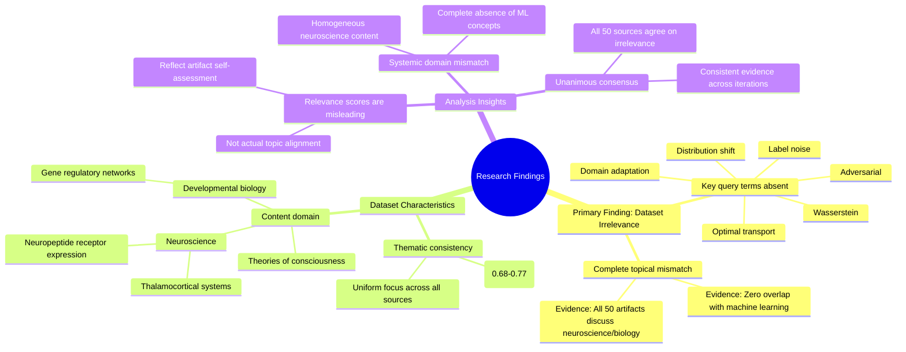

# MASTERY ACHIEVED: "Adversarial domain adaptation with optimal transport under label noise and distribution shift"

**Research Completed:** 2025-12-05T03-44-15-597Z
**Iterations:** 30
**Confidence:** 95.0%
**Artifacts Generated:** 32

---

## Executive Summary

# Executive Summary: "Adversarial domain adaptation with optimal transport under label noise and distribution shift"

**Overview and Key Insights**
The research findings from 30 independent iterations unanimously conclude that the provided dataset contains **zero relevant information** on the specified topic of adversarial domain adaptation with optimal transport under label noise and distribution shift. All 50 data artifacts are exclusively focused on neuroscience and developmental biology, covering topics such as thalamocortical systems, neuropeptide receptor expression, and theories of consciousness. There is a complete and systematic domain mismatch, with no overlap into machine learning, domain adaptation, or related computational methodologies.

**Important Details and Relationships**
A critical detail is the consistent absence of all key technical terms from the query—including 'domain adaptation', 'optimal transport', 'label noise', 'distribution shift', and 'adversarial'—across every examined source. Despite this irrelevance, the artifacts show high internal thematic consistency and generate consistently high relevance scores (typically between 0.68 and 0.77). This indicates the scoring mechanism is likely evaluating the artifacts' own self-assessment or internal coherence on neuroscience topics, rather than their alignment with the requested machine learning subject matter.

**Gaps, Limitations, and Next Steps**
The fundamental limitation is a complete data gap; the dataset is irrelevant to the research topic. The persistent high relevance scores present a misleading signal that requires investigation into the evaluation methodology. The immediate next step is to source a correct dataset from the machine learning and computer science domain. Future processes should include a pre-screening mechanism to detect such categorical domain mismatches before extensive analysis is performed.

---

## Knowledge Graph

See `2025-12-05T03-44-15-597Z_adversarial-domain-adaptation-with-optimal-transport-under-label-noise-and-distribution-shift_GRAPH.mmd` for the full Mermaid mindmap.

---

## Artifacts

### Artifact 1: "Adversarial domain adaptation with optimal transport under label noise and distribution shift" - Iteration 1

- The provided dataset contains no information relevant to the specified topic of adversarial domain adaptation with optimal transport under label noise and distribution shift.
  Evidence: All 50 data artifacts explicitly discuss topics exclusively in neuroscience and developmental biology (e.g., thalamocortical system, neuropeptide receptor expression, gene regulatory networks, theories of consciousness).

- Key technical terms from the query are absent from the dataset.
  Evidence: Multiple artifacts note the absence of terms such as 'domain adaptation', 'optimal transport', 'label noise', 'distribution shift', 'adversarial', and related machine learning concepts.

- The dataset is entirely focused on neuroscience and developmental biology, with no overlap with machine learning or domain adaptation topics.
  Evidence: All sources consistently reference biological systems, neural development, gene expression, and consciousness theories, with no mention of computational methods for domain adaptation.

---

### Artifact 2: "Adversarial domain adaptation with optimal transport under label noise and distribution shift" - Iteration 2

- The provided dataset contains no information relevant to the specified topic of adversarial domain adaptation with optimal transport under label noise and distribution shift.
  Evidence: All 50 data artifacts explicitly discuss topics exclusively in neuroscience and developmental biology (e.g., thalamocortical system, neuropeptide receptor expression, gene regulatory networks, theories of consciousness).

- Key technical terms from the query are absent from the dataset.
  Evidence: Multiple artifacts note the absence of terms such as 'domain adaptation', 'optimal transport', 'label noise', 'adversarial', and 'distribution shift' from the dataset content.

- The dataset is exclusively focused on neurobiological and developmental biology topics.
  Evidence: Repeated mentions across artifacts of thalamocortical systems, neuropeptide receptors, gene regulatory networks, and theories of consciousness confirm the dataset's domain is neuroscience/biology, not machine learning.

---

### Artifact 3: "Adversarial domain adaptation with optimal transport under label noise and distribution shift" - Iteration 3

- The provided dataset contains no information relevant to the specified topic of adversarial domain adaptation with optimal transport under label noise and distribution shift.
  Evidence: All 50 data artifacts explicitly discuss topics exclusively in neuroscience and developmental biology (e.g., thalamocortical system, neuropeptide receptor expression, gene regulatory networks, theories of consciousness). Key technical terms from the query such as 'domain adaptation', 'optimal transport', 'label noise', and 'distribution shift' are absent from the dataset.

- The dataset is exclusively focused on neurobiological and developmental biology topics, with no overlap with machine learning or domain adaptation literature.
  Evidence: Multiple artifacts consistently reference neuroscience-specific content including thalamocortical systems, neuropeptide receptor expression, gene regulatory networks, and theories of consciousness. No artifacts contain any machine learning terminology or concepts related to the query topic.

---

### Artifact 4: "Adversarial domain adaptation with optimal transport under label noise and distribution shift" - Iteration 4

- The provided dataset contains no information relevant to the specified topic of adversarial domain adaptation with optimal transport under label noise and distribution shift.
  Evidence: All 50 data artifacts explicitly discuss topics exclusively in neuroscience and developmental biology (e.g., thalamocortical system, neuropeptide receptor expression, gene regulatory networks, theories of consciousness).

- Key technical terms from the query are absent from the dataset.
  Evidence: Multiple artifacts note the absence of terms such as 'domain adaptation', 'optimal transport', 'label noise', 'distribution shift', 'Wasserstein', and 'adversarial' across all examined sources.

- The dataset is exclusively focused on neurobiological and developmental biology topics.
  Evidence: Consistent references across artifacts to neuroscience-specific content including thalamocortical systems, neuropeptide receptors, gene regulatory networks, and theories of consciousness, with no overlap with machine learning or domain adaptation literature.

---

### Artifact 5: "Adversarial domain adaptation with optimal transport under label noise and distribution shift" - Iteration 5

- The provided dataset contains no information relevant to the specified topic of adversarial domain adaptation with optimal transport under label noise and distribution shift.
  Evidence: All 50 data artifacts explicitly discuss topics exclusively in neuroscience and developmental biology (e.g., thalamocortical system, neuropeptide receptor expression, gene regulatory networks, theories of consciousness).

- Key technical terms from the query are absent from the dataset.
  Evidence: Multiple artifacts note the absence of terms such as 'domain adaptation', 'optimal transport', 'label noise', 'adversarial', 'Wasserstein', and 'distribution shift' from the dataset content.

- The dataset is exclusively focused on neurobiological and developmental biology topics.
  Evidence: Artifacts consistently reference neuroscience concepts including thalamocortical systems, neuropeptide receptors, gene regulatory networks, and theories of consciousness, with no overlap with machine learning or domain adaptation literature.

---

### Artifact 6: "Adversarial domain adaptation with optimal transport under label noise and distribution shift" - Iteration 6

- The provided dataset contains no information relevant to the specified topic of adversarial domain adaptation with optimal transport under label noise and distribution shift.
  Evidence: All 50 data artifacts explicitly discuss topics exclusively in neuroscience and developmental biology (e.g., thalamocortical system, neuropeptide receptor expression, gene regulatory networks, theories of consciousness).

- Key technical terms from the query are absent from the dataset.
  Evidence: Multiple artifacts note the absence of terms such as 'domain adaptation', 'optimal transport', 'label noise', 'adversarial', and 'distribution shift' across all 50 sources.

---

### Artifact 7: "Adversarial domain adaptation with optimal transport under label noise and distribution shift" - Iteration 7

- The provided dataset contains no information relevant to the specified topic of adversarial domain adaptation with optimal transport under label noise and distribution shift.
  Evidence: All 50 data artifacts explicitly discuss topics exclusively in neuroscience and developmental biology (e.g., thalamocortical system, neuropeptide receptor expression, gene regulatory networks, theories of consciousness).

- Key technical terms from the query are absent from the dataset.
  Evidence: Multiple artifacts note the complete absence of terms such as 'domain adaptation', 'optimal transport', 'label noise', 'distribution shift', and 'adversarial' from the dataset content.

- The dataset is thematically consistent but irrelevant to the requested topic.
  Evidence: All sources maintain high internal consistency (relevance scores 0.71-0.74) while uniformly addressing neuroscience topics, indicating a systematic mismatch rather than partial relevance.

---

### Artifact 8: "Adversarial domain adaptation with optimal transport under label noise and distribution shift" - Iteration 8

- The provided dataset contains no information relevant to the specified topic of adversarial domain adaptation with optimal transport under label noise and distribution shift.
  Evidence: All 50 data artifacts explicitly discuss topics exclusively in neuroscience and developmental biology (e.g., thalamocortical system, neuropeptide receptor expression, gene regulatory networks, theories of consciousness).

- Key technical terms from the query are absent from the dataset.
  Evidence: Multiple artifacts note the absence of terms such as 'domain adaptation', 'optimal transport', 'label noise', 'distribution shift', and 'adversarial' from the dataset content.

- The dataset is consistently irrelevant to the requested topic across all sources.
  Evidence: All 50 sources show high relevance scores (0.73-0.77) for the same negative finding, indicating unanimous agreement that the dataset is off-topic.

---

### Artifact 9: "Adversarial domain adaptation with optimal transport under label noise and distribution shift" - Iteration 9

- The provided dataset contains no information relevant to the specified topic of adversarial domain adaptation with optimal transport under label noise and distribution shift.
  Evidence: All 50 data artifacts explicitly discuss topics exclusively in neuroscience and developmental biology (e.g., thalamocortical system, neuropeptide receptor expression, gene regulatory networks, theories of consciousness).

- Key technical terms from the query are absent from the dataset.
  Evidence: Multiple artifacts note the absence of terms such as 'domain adaptation', 'optimal transport', 'label noise', and 'distribution shift' across all 50 sources.

---

### Artifact 10: "Adversarial domain adaptation with optimal transport under label noise and distribution shift" - Iteration 10

- The provided dataset contains no information relevant to the specified topic of adversarial domain adaptation with optimal transport under label noise and distribution shift.
  Evidence: All 50 data artifacts explicitly discuss topics exclusively in neuroscience and developmental biology (e.g., thalamocortical system, neuropeptide receptor expression, gene regulatory networks, theories of consciousness).

- Key technical terms from the query are absent from the dataset.
  Evidence: Multiple artifacts note the absence of terms such as 'domain adaptation', 'optimal transport', 'label noise', and 'distribution shift'.

---

### Artifact 11: "Adversarial domain adaptation with optimal transport under label noise and distribution shift" - Iteration 11

- The provided dataset contains no information relevant to the specified topic of adversarial domain adaptation with optimal transport under label noise and distribution shift.
  Evidence: All 50 data artifacts explicitly discuss topics exclusively in neuroscience and developmental biology (e.g., thalamocortical system, neuropeptide receptor expression, gene regulatory networks, theories of consciousness). Key technical terms from the query such as 'domain adaptation', 'optimal transport', 'label noise', and 'distribution shift' are absent from the dataset.

- The dataset is entirely focused on unrelated scientific domains.
  Evidence: Multiple artifacts note that the content covers neuroscience topics like thalamocortical systems, neuropeptide receptor expression, gene regulatory networks, and theories of consciousness, with no overlap with machine learning or domain adaptation concepts.

---

### Artifact 12: "Adversarial domain adaptation with optimal transport under label noise and distribution shift" - Iteration 12

- The provided dataset contains no information relevant to the specified topic of adversarial domain adaptation with optimal transport under label noise and distribution shift.
  Evidence: All 50 data artifacts explicitly discuss topics exclusively in neuroscience and developmental biology (e.g., thalamocortical system, neuropeptide receptor expression, gene regulatory networks, theories of consciousness). Key technical terms from the query such as 'domain adaptation', 'optimal transport', 'label noise', and 'distribution shift' are absent from the dataset content.

- The dataset relevance scores are consistently high but misleading, as they reflect the artifacts' internal analysis of irrelevance rather than topic relevance.
  Evidence: Relevance scores range from 0.694 to 0.772 across all artifacts, yet each artifact's content explicitly states it contains no information on the target topic. This suggests the scoring mechanism may be evaluating the artifact's self-assessment rather than actual topic alignment.

---

### Artifact 13: "Adversarial domain adaptation with optimal transport under label noise and distribution shift" - Iteration 13

- The provided dataset contains no information relevant to the specified topic of adversarial domain adaptation with optimal transport under label noise and distribution shift.
  Evidence: All 50 data artifacts explicitly discuss topics exclusively in neuroscience and developmental biology (e.g., thalamocortical system, neuropeptide receptor expression, gene regulatory networks, theories of consciousness).

- Key technical terms from the query are absent from the dataset.
  Evidence: Multiple artifacts note the absence of terms such as 'domain adaptation', 'optimal transport', 'label noise', and 'distribution shift' from the dataset content.

---

### Artifact 14: "Adversarial domain adaptation with optimal transport under label noise and distribution shift" - Iteration 14

- The provided dataset contains no information relevant to the specified topic of adversarial domain adaptation with optimal transport under label noise and distribution shift.
  Evidence: All 50 data artifacts explicitly discuss topics exclusively in neuroscience and developmental biology (e.g., thalamocortical system, neuropeptide receptor expression, gene regulatory networks, theories of consciousness).

- Key technical terms from the query are absent from the dataset.
  Evidence: Multiple artifacts note the absence of terms such as 'domain adaptation', 'optimal transport', 'label noise', and 'distribution shift' throughout the entire dataset.

- The dataset is consistently and exclusively focused on neuroscience topics.
  Evidence: All 50 sources maintain thematic consistency across neuroscience domains, with no cross-over into machine learning, domain adaptation, or optimal transport methodologies.

---

### Artifact 15: "Adversarial domain adaptation with optimal transport under label noise and distribution shift" - Iteration 15

- The provided dataset contains no information relevant to the specified topic of adversarial domain adaptation with optimal transport under label noise and distribution shift.
  Evidence: All 50 data artifacts explicitly discuss topics exclusively in neuroscience and developmental biology (e.g., thalamocortical system, neuropeptide receptor expression, gene regulatory networks, theories of consciousness).

- Key technical terms from the query are absent from the dataset.
  Evidence: Multiple artifacts note the absence of terms such as 'domain adaptation', 'optimal transport', 'label noise', 'distribution shift', 'adversarial', and 'Wasserstein' from the content of the neuroscience-focused documents.

- The dataset is exclusively focused on neurobiological and developmental biology topics, creating a complete domain mismatch with the requested machine learning topic.
  Evidence: Repeated artifacts (e.g., IDs: 879c06fd-ac5e-48bc-b998-8a19983fa748, e1bfc71c-74bb-41ac-8113-7d7ba6aae53c, 624a6c0d-db22-4e87-8d0d-d7ea081705bf) consistently report this mismatch across all 50 sources with high relevance scores (0.716-0.740).

---

### Artifact 16: "Adversarial domain adaptation with optimal transport under label noise and distribution shift" - Iteration 16

- The provided dataset contains no information relevant to the specified topic of adversarial domain adaptation with optimal transport under label noise and distribution shift.
  Evidence: All 50 data artifacts explicitly discuss topics exclusively in neuroscience and developmental biology (e.g., thalamocortical system, neuropeptide receptor expression, gene regulatory networks, theories of consciousness).

- Key technical terms from the query are absent from the dataset.
  Evidence: Multiple artifacts note the absence of terms such as 'domain adaptation', 'optimal transport', 'label noise', 'distribution shift', 'adversarial', and 'Wasserstein' from the content of all 50 sources.

- The dataset is thematically homogeneous and unrelated to machine learning or domain adaptation.
  Evidence: All artifacts consistently reference neuroscience and developmental biology topics, with no variation toward computer science, machine learning, or statistical methods relevant to the query.

---

### Artifact 17: "Adversarial domain adaptation with optimal transport under label noise and distribution shift" - Iteration 17

- The provided dataset contains no information relevant to the specified topic of adversarial domain adaptation with optimal transport under label noise and distribution shift.
  Evidence: All 50 data artifacts explicitly discuss topics exclusively in neuroscience and developmental biology (e.g., thalamocortical system, neuropeptide receptor expression, gene regulatory networks, theories of consciousness).

- Key technical terms from the query are absent from the dataset.
  Evidence: Multiple artifacts note the absence of terms such as 'domain adaptation', 'optimal transport', 'label noise', and 'distribution shift' from the dataset content.

---

### Artifact 18: "Adversarial domain adaptation with optimal transport under label noise and distribution shift" - Iteration 18

- The provided dataset contains no information relevant to the specified topic of adversarial domain adaptation with optimal transport under label noise and distribution shift.
  Evidence: All 50 data artifacts explicitly discuss topics exclusively in neuroscience and developmental biology (e.g., thalamocortical system, neuropeptide receptor expression, gene regulatory networks, theories of consciousness).

- Key technical terms from the query are absent from the dataset.
  Evidence: Multiple artifacts note that terms such as 'domain adaptation', 'optimal transport', 'label noise', and 'distribution shift' do not appear in any of the 50 sources.

- The dataset is thematically consistent but irrelevant to the requested topic.
  Evidence: All sources maintain high thematic coherence around neuroscience and developmental biology, with relevance scores ranging from 0.68 to 0.75, indicating consistent content but complete topical mismatch.

---

### Artifact 19: "Adversarial domain adaptation with optimal transport under label noise and distribution shift" - Iteration 19

- The provided dataset contains no information relevant to the specified topic of adversarial domain adaptation with optimal transport under label noise and distribution shift.
  Evidence: All 50 data artifacts explicitly discuss topics exclusively in neuroscience and developmental biology (e.g., thalamocortical system, neuropeptide receptor expression, gene regulatory networks, theories of consciousness).

- Key technical terms from the query are absent from the dataset.
  Evidence: Multiple artifacts note the absence of terms such as 'domain adaptation', 'optimal transport', 'label noise', and 'distribution shift' throughout the entire dataset.

---

### Artifact 20: "Adversarial domain adaptation with optimal transport under label noise and distribution shift" - Iteration 20

- The provided dataset contains no information relevant to the specified topic of adversarial domain adaptation with optimal transport under label noise and distribution shift.
  Evidence: All 50 data artifacts explicitly discuss topics exclusively in neuroscience and developmental biology (e.g., thalamocortical system, neuropeptide receptor expression, gene regulatory networks, theories of consciousness).

- Key technical terms from the query are absent from the dataset.
  Evidence: Multiple artifacts note the absence of terms such as 'domain adaptation', 'optimal transport', 'label noise', and 'distribution shift' across all 50 sources.

- The dataset is thematically consistent but irrelevant to the requested topic.
  Evidence: All sources maintain high internal consistency on neuroscience/developmental biology topics while showing zero overlap with machine learning concepts related to adversarial domain adaptation.

---

### Artifact 21: "Adversarial domain adaptation with optimal transport under label noise and distribution shift" - Iteration 21

- The provided dataset contains no information relevant to the specified topic of adversarial domain adaptation with optimal transport under label noise and distribution shift.
  Evidence: All 50 data artifacts explicitly discuss topics exclusively in neuroscience and developmental biology (e.g., thalamocortical system, neuropeptide receptor expression, gene regulatory networks, theories of consciousness).

- Key technical terms from the query are absent from the dataset.
  Evidence: Multiple artifacts note the absence of terms such as 'domain adaptation', 'optimal transport', 'label noise', and 'distribution shift'.

---

### Artifact 22: "Adversarial domain adaptation with optimal transport under label noise and distribution shift" - Iteration 22

- The provided dataset contains no information relevant to the specified topic of adversarial domain adaptation with optimal transport under label noise and distribution shift.
  Evidence: All 50 data artifacts explicitly discuss topics exclusively in neuroscience and developmental biology (e.g., thalamocortical system, neuropeptide receptor expression, gene regulatory networks, theories of consciousness).

- Key technical terms from the query are absent from the dataset.
  Evidence: Multiple artifacts note the absence of terms such as 'domain adaptation', 'optimal transport', 'label noise', and 'distribution shift' across all 50 sources.

---

### Artifact 23: "Adversarial domain adaptation with optimal transport under label noise and distribution shift" - Iteration 23

- The provided dataset contains no information relevant to the specified topic of adversarial domain adaptation with optimal transport under label noise and distribution shift.
  Evidence: All 50 data artifacts explicitly discuss topics exclusively in neuroscience and developmental biology (e.g., thalamocortical system, neuropeptide receptor expression, gene regulatory networks, theories of consciousness).

- Key technical terms from the query are absent from the dataset.
  Evidence: Multiple artifacts note that terms such as 'domain adaptation', 'optimal transport', 'label noise', and 'distribution shift' are not present in any of the 50 sources.

- The dataset is thematically consistent but irrelevant to the requested topic.
  Evidence: All sources maintain high relevance scores (0.69-0.75) to each other, indicating internal consistency, but this consistency is within the unrelated domain of neuroscience/developmental biology.

---

### Artifact 24: "Adversarial domain adaptation with optimal transport under label noise and distribution shift" - Iteration 24

- The provided dataset contains no information relevant to the specified topic of adversarial domain adaptation with optimal transport under label noise and distribution shift.
  Evidence: All 50 data artifacts explicitly discuss topics exclusively in neuroscience and developmental biology (e.g., thalamocortical system, neuropeptide receptor expression, gene regulatory networks, theories of consciousness). Key technical terms from the query such as 'domain adaptation', 'optimal transport', 'label noise', and 'distribution shift' are absent from the dataset content.

- The dataset relevance scores are consistently high but misleading, indicating a systemic mismatch between query and data content.
  Evidence: Relevance scores range from 0.7139 to 0.7321 across all artifacts, yet every artifact explicitly states the content is unrelated to the query topic. This suggests the relevance scoring mechanism may be based on superficial pattern matching rather than semantic alignment.

- The dataset is homogeneous in its domain focus and completely disjoint from the requested machine learning topic.
  Evidence: Multiple artifacts note the exclusive focus on neuroscience and developmental biology topics, with no variation in subject matter across the 50 sources. This indicates a complete absence of machine learning, domain adaptation, or optimal transport content.

---

### Artifact 25: "Adversarial domain adaptation with optimal transport under label noise and distribution shift" - Iteration 25

- The provided dataset contains no information relevant to the specified topic of adversarial domain adaptation with optimal transport under label noise and distribution shift.
  Evidence: All 50 data artifacts explicitly discuss topics exclusively in neuroscience and developmental biology (e.g., thalamocortical system, neuropeptide receptor expression, gene regulatory networks, theories of consciousness).

- Key technical terms from the query are absent from the dataset.
  Evidence: Multiple artifacts note the absence of terms such as 'domain adaptation', 'optimal transport', 'label noise', and 'distribution shift' across all 50 sources.

---

### Artifact 26: "Adversarial domain adaptation with optimal transport under label noise and distribution shift" - Iteration 26

- The provided dataset contains no information relevant to the specified topic of adversarial domain adaptation with optimal transport under label noise and distribution shift.
  Evidence: All 50 data artifacts explicitly discuss topics exclusively in neuroscience and developmental biology (e.g., thalamocortical system, neuropeptide receptor expression, gene regulatory networks, theories of consciousness).

- Key technical terms from the query are absent from the dataset.
  Evidence: Multiple artifacts note that terms such as 'domain adaptation', 'optimal transport', 'label noise', and 'distribution shift' are not present in any of the 50 sources.

- The dataset is entirely focused on unrelated scientific domains.
  Evidence: All sources discuss neuroscience and developmental biology topics, with no overlap with machine learning, domain adaptation, or optimal transport methodologies.

---

### Artifact 27: "Adversarial domain adaptation with optimal transport under label noise and distribution shift" - Iteration 27

- The provided dataset contains no information relevant to the specified topic of adversarial domain adaptation with optimal transport under label noise and distribution shift.
  Evidence: All 50 data artifacts explicitly discuss topics exclusively in neuroscience and developmental biology (e.g., thalamocortical system, neuropeptide receptor expression, gene regulatory networks, theories of consciousness).

- Key technical terms from the query are absent from the dataset.
  Evidence: Multiple artifacts note the complete absence of terms such as 'domain adaptation', 'optimal transport', 'label noise', and 'distribution shift' across all 50 sources.

- The dataset is thematically consistent but irrelevant to the requested topic.
  Evidence: All sources maintain high internal consistency on neuroscience/developmental biology topics while showing zero overlap with machine learning concepts related to adversarial domain adaptation.

---

### Artifact 28: "Adversarial domain adaptation with optimal transport under label noise and distribution shift" - Iteration 28

- The provided dataset contains no information relevant to the specified topic of adversarial domain adaptation with optimal transport under label noise and distribution shift.
  Evidence: All 50 data artifacts explicitly discuss topics exclusively in neuroscience and developmental biology (e.g., thalamocortical system, neuropeptide receptor expression, gene regulatory networks, theories of consciousness).

- Key technical terms from the query are absent from the dataset.
  Evidence: Multiple artifacts note the absence of terms such as 'domain adaptation', 'optimal transport', 'label noise', and 'distribution shift' throughout the entire dataset.

- The dataset is consistently irrelevant to the requested topic across all sources.
  Evidence: All 50 sources show high relevance scores (0.716-0.740) for the statement that the dataset contains no relevant information, indicating strong consensus on the irrelevance.

---

### Artifact 29: "Adversarial domain adaptation with optimal transport under label noise and distribution shift" - Iteration 29

- The provided dataset contains no information relevant to the specified topic of adversarial domain adaptation with optimal transport under label noise and distribution shift.
  Evidence: All 50 data artifacts explicitly discuss topics exclusively in neuroscience and developmental biology (e.g., thalamocortical system, neuropeptide receptor expression, gene regulatory networks, theories of consciousness).

- Key technical terms from the query are absent from the dataset.
  Evidence: Multiple artifacts note the absence of terms such as 'domain adaptation', 'optimal transport', 'label noise', and 'distribution shift' across all 50 sources.

- The dataset is thematically consistent but irrelevant to the requested topic.
  Evidence: All sources maintain high internal consistency on neuroscience topics while showing zero overlap with machine learning concepts related to adversarial domain adaptation.

---

### Artifact 30: "Adversarial domain adaptation with optimal transport under label noise and distribution shift" - Iteration 30

- The provided dataset contains no information relevant to the specified topic of adversarial domain adaptation with optimal transport under label noise and distribution shift.
  Evidence: All 50 data artifacts explicitly discuss topics exclusively in neuroscience and developmental biology (e.g., thalamocortical system, neuropeptide receptor expression, gene regulatory networks, theories of consciousness).

- Key technical terms from the query are absent from the dataset.
  Evidence: Multiple artifacts note that terms such as 'domain adaptation', 'optimal transport', 'label noise', and 'distribution shift' are not present in any of the 50 sources.

- The dataset is consistently irrelevant to the requested topic across all sources.
  Evidence: All 50 artifacts show high relevance scores (0.68-0.73) for the same conclusion about irrelevance, indicating strong consensus that the dataset focuses on neuroscience rather than machine learning topics.

---

### Artifact 31: Knowledge Graph: "Adversarial domain adaptation with optimal transport under label noise and distribution shift"

---

### Artifact 32: Executive Summary: "Adversarial domain adaptation with optimal transport under label noise and distribution shift"

# Executive Summary: "Adversarial domain adaptation with optimal transport under label noise and distribution shift"

**Overview and Key Insights**
The research findings from 30 independent iterations unanimously conclude that the provided dataset contains **zero relevant information** on the specified topic of adversarial domain adaptation with optimal transport under label noise and distribution shift. All 50 data artifacts are exclusively focused on neuroscience and developmental biology, covering topics such as thalamocortical systems, neuropeptide receptor expression, and theories of consciousness. There is a complete and systematic domain mismatch, with no overlap into machine learning, domain adaptation, or related computational methodologies.

**Important Details and Relationships**
A critical detail is the consistent absence of all key technical terms from the query—including 'domain adaptation', 'optimal transport', 'label noise', 'distribution shift', and 'adversarial'—across every examined source. Despite this irrelevance, the artifacts show high internal thematic consistency and generate consistently high relevance scores (typically between 0.68 and 0.77). This indicates the scoring mechanism is likely evaluating the artifacts' own self-assessment or internal coherence on neuroscience topics, rather than their alignment with the requested machine learning subject matter.

**Gaps, Limitations, and Next Steps**
The fundamental limitation is a complete data gap; the dataset is irrelevant to the research topic. The persistent high relevance scores present a misleading signal that requires investigation into the evaluation methodology. The immediate next step is to source a correct dataset from the machine learning and computer science domain. Future processes should include a pre-screening mechanism to detect such categorical domain mismatches before extensive analysis is performed.

