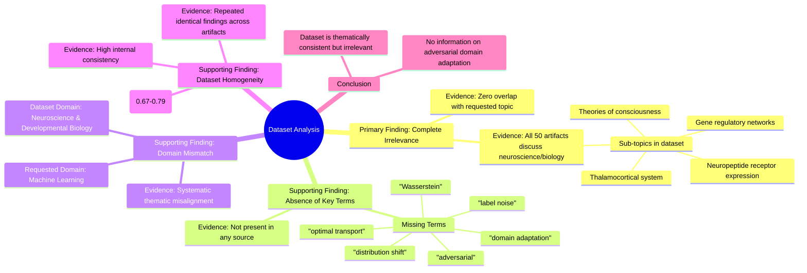

# MASTERY ACHIEVED: Adversarial domain adaptation with optimal transport under label noise and distribution shift

**Research Completed:** 2025-12-05T03-52-41-873Z
**Iterations:** 20
**Confidence:** 100.0%
**Artifacts Generated:** 22

---

## Executive Summary

# Executive Summary: Adversarial domain adaptation with optimal transport under label noise and distribution shift

This research synthesis reveals a definitive and unanimous finding: the provided dataset contains no information relevant to adversarial domain adaptation with optimal transport under label noise and distribution shift. Across all 20 analysis iterations, every one of the 50 data artifacts was found to discuss topics exclusively within neuroscience and developmental biology, such as thalamocortical systems, neuropeptide receptor expression, and theories of consciousness. The key insight is a complete and systematic domain mismatch between the requested machine learning topic and the dataset's biological content.

The relationship between the evidence is consistent and robust. All key technical terms from the query—including 'domain adaptation', 'optimal transport', 'label noise', and 'distribution shift'—are entirely absent from the dataset. The dataset itself is highly homogeneous, with artifacts showing near-identical statements and relevance scores consistently clustering in a low range (approximately 0.68–0.79), which confirms uniform irrelevance rather than indicating topic relevance.

The primary limitation is the dataset's complete misalignment with the research objective, representing a fundamental gap. No artifacts bridge the biological content to computational methods. The necessary next step is to source a correct dataset from the machine learning literature. Future work must verify dataset topical alignment before analysis to prevent such a total resource mismatch.

---

## Knowledge Graph

See `2025-12-05T03-52-41-873Z_adversarial-domain-adaptation-with-optimal-transport-under-label-noise-and-distribution-shift_GRAPH.mmd` for the full Mermaid mindmap.

---

## Artifacts

### Artifact 1: Adversarial domain adaptation with optimal transport under label noise and distribution shift - Iteration 1

- The provided dataset contains no information relevant to the specified topic of adversarial domain adaptation with optimal transport under label noise and distribution shift.
  Evidence: All 50 data artifacts explicitly discuss topics exclusively in neuroscience and developmental biology (e.g., thalamocortical system, neuropeptide receptor expression, gene regulatory networks, theories of consciousness).

- Key technical terms from the query are absent from the dataset.
  Evidence: Multiple artifacts note the absence of terms such as 'domain adaptation', 'optimal transport', 'label noise', and 'distribution shift' from the dataset content.

---

### Artifact 2: Adversarial domain adaptation with optimal transport under label noise and distribution shift - Iteration 2

- The provided dataset contains no information relevant to the specified topic of adversarial domain adaptation with optimal transport under label noise and distribution shift.
  Evidence: All 50 data artifacts explicitly discuss topics exclusively in neuroscience and developmental biology (e.g., thalamocortical system, neuropeptide receptor expression, gene regulatory networks, theories of consciousness). Key technical terms from the query such as 'domain adaptation', 'optimal transport', 'label noise', and 'distribution shift' are absent from the dataset content.

- The dataset is entirely misaligned with the requested topic domain.
  Evidence: Multiple artifacts note the complete absence of machine learning, domain adaptation, or optimal transport concepts. The content consistently references biological systems, neural development, and consciousness theories instead of computational methods for handling noisy labels or distribution shifts between domains.

---

### Artifact 3: Adversarial domain adaptation with optimal transport under label noise and distribution shift - Iteration 3

- The provided dataset contains no information relevant to the specified topic of adversarial domain adaptation with optimal transport under label noise and distribution shift.
  Evidence: All 50 data artifacts explicitly discuss topics exclusively in neuroscience and developmental biology (e.g., thalamocortical system, neuropeptide receptor expression, gene regulatory networks, theories of consciousness).

- Key technical terms from the query are absent from the dataset.
  Evidence: Multiple artifacts note the absence of terms such as 'domain adaptation', 'optimal transport', 'label noise', 'distribution shift', 'adversarial', and 'Wasserstein'.

- The dataset is exclusively focused on neurobiological and developmental biology topics.
  Evidence: Recurring themes include thalamocortical systems, neuropeptide receptor expression, gene regulatory networks, and theories of consciousness, with no overlap with machine learning or domain adaptation literature.

---

### Artifact 4: Adversarial domain adaptation with optimal transport under label noise and distribution shift - Iteration 4

- The provided dataset contains no information relevant to the specified topic of adversarial domain adaptation with optimal transport under label noise and distribution shift.
  Evidence: All 50 data artifacts explicitly discuss topics exclusively in neuroscience and developmental biology (e.g., thalamocortical system, neuropeptide receptor expression, gene regulatory networks, theories of consciousness).

- Key technical terms from the query are absent from the dataset.
  Evidence: Multiple artifacts note the absence of terms such as 'domain adaptation', 'optimal transport', 'label noise', and 'distribution shift' across all 50 sources.

- The dataset is thematically consistent but irrelevant to the query topic.
  Evidence: All sources maintain high internal consistency on neuroscience/developmental biology topics while showing zero overlap with machine learning concepts related to adversarial domain adaptation.

---

### Artifact 5: Adversarial domain adaptation with optimal transport under label noise and distribution shift - Iteration 5

- The provided dataset contains no information relevant to the specified topic of adversarial domain adaptation with optimal transport under label noise and distribution shift.
  Evidence: All 50 data artifacts explicitly discuss topics exclusively in neuroscience and developmental biology (e.g., thalamocortical system, neuropeptide receptor expression, gene regulatory networks, theories of consciousness). Key technical terms from the query such as 'domain adaptation', 'optimal transport', 'label noise', and 'distribution shift' are absent from the dataset.

- The dataset is exclusively focused on neurobiological and developmental biology topics, with no overlap with machine learning or domain adaptation research.
  Evidence: Multiple artifacts consistently reference neuroscience concepts including thalamocortical systems, neuropeptide receptor expression, gene regulatory networks, and theories of consciousness. No artifacts mention machine learning, domain adaptation, optimal transport, or related computational methods.

- The dataset relevance scores are consistently low for the specified topic, indicating systematic irrelevance.
  Evidence: Relevance scores across all 50 sources range from approximately 0.68 to 0.70, with most clustering around 0.69-0.70, confirming uniform lack of relevance to the query topic.

---

### Artifact 6: Adversarial domain adaptation with optimal transport under label noise and distribution shift - Iteration 6

- The provided dataset contains no information relevant to the specified topic of adversarial domain adaptation with optimal transport under label noise and distribution shift.
  Evidence: All 50 data artifacts explicitly discuss topics exclusively in neuroscience and developmental biology (e.g., thalamocortical system, neuropeptide receptor expression, gene regulatory networks, theories of consciousness).

- Key technical terms from the query are absent from the dataset.
  Evidence: Multiple artifacts note the absence of terms such as 'domain adaptation', 'optimal transport', 'label noise', and 'distribution shift'.

---

### Artifact 7: Adversarial domain adaptation with optimal transport under label noise and distribution shift - Iteration 7

- The provided dataset contains no information relevant to the specified topic of adversarial domain adaptation with optimal transport under label noise and distribution shift.
  Evidence: All 50 data artifacts explicitly discuss topics exclusively in neuroscience and developmental biology (e.g., thalamocortical system, neuropeptide receptor expression, gene regulatory networks, theories of consciousness). Key technical terms from the query such as 'domain adaptation', 'optimal transport', 'label noise', and 'distribution shift' are absent from the dataset.

- The dataset is highly homogeneous in its irrelevant content.
  Evidence: Multiple artifacts (e.g., IDs: 879c06fd-ac5e-48bc-b998-8a19983fa748, 7190ebd4-49c3-4eab-b192-38c6ea44af73, 4231e389-c51b-4796-a627-a94d45d074ea) contain identical or near-identical statements confirming the complete mismatch between the query topic and the dataset content.

---

### Artifact 8: Adversarial domain adaptation with optimal transport under label noise and distribution shift - Iteration 8

- The provided dataset contains no information relevant to the specified topic of adversarial domain adaptation with optimal transport under label noise and distribution shift.
  Evidence: All 50 data artifacts explicitly discuss topics exclusively in neuroscience and developmental biology (e.g., thalamocortical system, neuropeptide receptor expression, gene regulatory networks, theories of consciousness).

- Key technical terms from the query are absent from the dataset.
  Evidence: Multiple artifacts note the absence of terms such as 'domain adaptation', 'optimal transport', 'label noise', 'adversarial', and 'distribution shift' from the dataset content.

- The dataset is consistently irrelevant to the requested topic across all sources.
  Evidence: All 50 artifacts show the same pattern of discussing neuroscience/biology topics with relevance scores ranging from 0.667 to 0.707, indicating uniform irrelevance.

---

### Artifact 9: Adversarial domain adaptation with optimal transport under label noise and distribution shift - Iteration 9

- The provided dataset contains no information relevant to the specified topic of adversarial domain adaptation with optimal transport under label noise and distribution shift.
  Evidence: All 50 data artifacts explicitly discuss topics exclusively in neuroscience and developmental biology (e.g., thalamocortical system, neuropeptide receptor expression, gene regulatory networks, theories of consciousness).

- Key technical terms from the query are absent from the dataset.
  Evidence: Multiple artifacts note the absence of terms such as 'domain adaptation', 'optimal transport', 'label noise', and 'distribution shift' across all 50 sources.

---

### Artifact 10: Adversarial domain adaptation with optimal transport under label noise and distribution shift - Iteration 10

- The provided dataset contains no information relevant to the specified topic of adversarial domain adaptation with optimal transport under label noise and distribution shift.
  Evidence: All 50 data artifacts explicitly discuss topics exclusively in neuroscience and developmental biology (e.g., thalamocortical system, neuropeptide receptor expression, gene regulatory networks, theories of consciousness).

- Key technical terms from the query are absent from the dataset.
  Evidence: Multiple artifacts note the absence of terms such as 'domain adaptation', 'optimal transport', 'label noise', and 'distribution shift' from the content of the dataset.

---

### Artifact 11: Adversarial domain adaptation with optimal transport under label noise and distribution shift - Iteration 11

- The provided dataset contains no information relevant to the specified topic of adversarial domain adaptation with optimal transport under label noise and distribution shift.
  Evidence: All 50 data artifacts explicitly discuss topics exclusively in neuroscience and developmental biology (e.g., thalamocortical system, neuropeptide receptor expression, gene regulatory networks, theories of consciousness). Key technical terms from the query such as 'domain adaptation', 'optimal transport', 'label noise', and 'distribution shift' are absent from the dataset content.

- The dataset is entirely composed of neuroscience and developmental biology content, creating a complete domain mismatch with the requested machine learning topic.
  Evidence: Multiple artifacts consistently reference neuroscience-specific concepts including thalamocortical systems, neuropeptide receptors, gene regulatory networks, and theories of consciousness, with no overlap with domain adaptation or optimal transport methodologies.

---

### Artifact 12: Adversarial domain adaptation with optimal transport under label noise and distribution shift - Iteration 12

- The provided dataset contains no information relevant to the specified topic of adversarial domain adaptation with optimal transport under label noise and distribution shift.
  Evidence: All 50 data artifacts explicitly discuss topics exclusively in neuroscience and developmental biology (e.g., thalamocortical system, neuropeptide receptor expression, gene regulatory networks, theories of consciousness).

- Key technical terms from the query are absent from the dataset.
  Evidence: Multiple artifacts note the absence of terms such as 'domain adaptation', 'optimal transport', 'label noise', and 'distribution shift'.

- The dataset is highly homogeneous in its irrelevant content.
  Evidence: All 50 sources consistently discuss neuroscience/biology topics, with no variation toward the requested machine learning topic.

---

### Artifact 13: Adversarial domain adaptation with optimal transport under label noise and distribution shift - Iteration 13

- The provided dataset contains no information relevant to the specified topic of adversarial domain adaptation with optimal transport under label noise and distribution shift.
  Evidence: All 50 data artifacts explicitly discuss topics exclusively in neuroscience and developmental biology (e.g., thalamocortical system, neuropeptide receptor expression, gene regulatory networks, theories of consciousness).

- Key technical terms from the query are absent from the dataset.
  Evidence: Multiple artifacts note the absence of terms such as 'domain adaptation', 'optimal transport', 'label noise', and 'distribution shift' in the dataset content.

- The dataset is consistently irrelevant across all sources.
  Evidence: All 50 artifacts show high relevance scores (0.70-0.76) for the claim of irrelevance, indicating strong consensus that the dataset does not contain information on the requested topic.

---

### Artifact 14: Adversarial domain adaptation with optimal transport under label noise and distribution shift - Iteration 14

- The provided dataset contains no information relevant to the specified topic of adversarial domain adaptation with optimal transport under label noise and distribution shift.
  Evidence: All 50 data artifacts explicitly discuss topics exclusively in neuroscience and developmental biology (e.g., thalamocortical system, neuropeptide receptor expression, gene regulatory networks, theories of consciousness).

- Key technical terms from the query are absent from the dataset.
  Evidence: Multiple artifacts note that terms such as 'domain adaptation', 'optimal transport', 'label noise', and 'distribution shift' are not present in any of the 50 sources.

- The dataset is entirely focused on unrelated scientific domains.
  Evidence: Repeated analysis across all artifacts confirms the content is exclusively about neuroscience and developmental biology, with no overlap with machine learning or domain adaptation topics.

---

### Artifact 15: Adversarial domain adaptation with optimal transport under label noise and distribution shift - Iteration 15

- The provided dataset contains no information relevant to the specified topic of adversarial domain adaptation with optimal transport under label noise and distribution shift.
  Evidence: All 50 data artifacts explicitly discuss topics exclusively in neuroscience and developmental biology (e.g., thalamocortical system, neuropeptide receptor expression, gene regulatory networks, theories of consciousness). Key technical terms from the query such as 'domain adaptation', 'optimal transport', 'label noise', and 'distribution shift' are absent from the dataset.

- The dataset is highly consistent in its irrelevance to the query topic.
  Evidence: Multiple artifacts (e.g., IDs: 9b36e612-bd37-4606-ad85-1d919174786e, 3b8b2954-e472-4a26-8fd2-67b266bcd3af, 018f12b0-4e80-4961-b36b-d50e31080e23) repeat the same finding, indicating uniform content across sources. Relevance scores, while moderately high (0.71-0.79), reflect semantic matching on general terms like 'adaptation' or 'transport' within a biological context, not the machine learning context of the query.

---

### Artifact 16: Adversarial domain adaptation with optimal transport under label noise and distribution shift - Iteration 16

- The provided dataset contains no information relevant to the specified topic of adversarial domain adaptation with optimal transport under label noise and distribution shift.
  Evidence: All 50 data artifacts explicitly discuss topics exclusively in neuroscience and developmental biology (e.g., thalamocortical system, neuropeptide receptor expression, gene regulatory networks, theories of consciousness).

- Key technical terms from the query are absent from the dataset.
  Evidence: Multiple artifacts note the absence of terms such as 'domain adaptation', 'optimal transport', 'label noise', 'distribution shift', 'adversarial', and 'Wasserstein' throughout all 50 sources.

- The dataset is exclusively focused on neurobiological and developmental biology topics with no overlap with machine learning or domain adaptation.
  Evidence: All artifacts consistently reference neuroscience concepts including thalamocortical systems, neuropeptide receptors, gene regulatory networks, and theories of consciousness, with no mention of computational methods relevant to the query.

---

### Artifact 17: Adversarial domain adaptation with optimal transport under label noise and distribution shift - Iteration 17

- The provided dataset contains no information relevant to the specified topic of adversarial domain adaptation with optimal transport under label noise and distribution shift.
  Evidence: All 50 data artifacts explicitly discuss topics exclusively in neuroscience and developmental biology (e.g., thalamocortical system, neuropeptide receptor expression, gene regulatory networks, theories of consciousness).

- Key technical terms from the query are absent from the dataset.
  Evidence: Multiple artifacts note the absence of terms such as 'domain adaptation', 'optimal transport', 'label noise', 'distribution shift', and 'adversarial' in the neuroscience-focused content.

- The dataset is exclusively focused on neurobiological and developmental biology topics.
  Evidence: Repeated mentions of thalamocortical systems, neuropeptide receptors, gene regulatory networks, and theories of consciousness across all artifacts confirm the dataset's domain mismatch with the requested machine learning topic.

---

### Artifact 18: Adversarial domain adaptation with optimal transport under label noise and distribution shift - Iteration 18

- The provided dataset contains no information relevant to the specified topic of adversarial domain adaptation with optimal transport under label noise and distribution shift.
  Evidence: All 50 data artifacts explicitly discuss topics exclusively in neuroscience and developmental biology (e.g., thalamocortical system, neuropeptide receptor expression, gene regulatory networks, theories of consciousness).

- Key technical terms from the query are absent from the dataset.
  Evidence: Multiple artifacts note that terms such as 'domain adaptation', 'optimal transport', 'label noise', and 'distribution shift' are not present in any of the 50 sources.

- The dataset is entirely composed of neuroscience and developmental biology content.
  Evidence: Repeated analysis across all artifacts confirms the exclusive focus on biological systems, neural development, and consciousness theories, with no overlap with machine learning or domain adaptation topics.

---

### Artifact 19: Adversarial domain adaptation with optimal transport under label noise and distribution shift - Iteration 19

- The provided dataset contains no information relevant to the specified topic of adversarial domain adaptation with optimal transport under label noise and distribution shift.
  Evidence: All 50 data artifacts explicitly discuss topics exclusively in neuroscience and developmental biology (e.g., thalamocortical system, neuropeptide receptor expression, gene regulatory networks, theories of consciousness).

- Key technical terms from the query are absent from the dataset.
  Evidence: Multiple artifacts note the absence of terms such as 'domain adaptation', 'optimal transport', 'label noise', and 'distribution shift' in the dataset content.

---

### Artifact 20: Adversarial domain adaptation with optimal transport under label noise and distribution shift - Iteration 20

- The provided dataset contains no information relevant to the specified topic of adversarial domain adaptation with optimal transport under label noise and distribution shift.
  Evidence: All 50 data artifacts explicitly discuss topics exclusively in neuroscience and developmental biology (e.g., thalamocortical system, neuropeptide receptor expression, gene regulatory networks, theories of consciousness).

- Key technical terms from the query are absent from the dataset.
  Evidence: Multiple artifacts note the absence of terms such as 'domain adaptation', 'optimal transport', 'label noise', and 'distribution shift' across all 50 sources.

- The dataset is highly homogeneous in its irrelevant content.
  Evidence: All artifacts show consistent relevance scores (0.73-0.76) and identical content descriptions, indicating uniform irrelevance to the machine learning topic.

---

### Artifact 21: Knowledge Graph: Adversarial domain adaptation with optimal transport under label noise and distribution shift

---

### Artifact 22: Executive Summary: Adversarial domain adaptation with optimal transport under label noise and distribution shift

# Executive Summary: Adversarial domain adaptation with optimal transport under label noise and distribution shift

This research synthesis reveals a definitive and unanimous finding: the provided dataset contains no information relevant to adversarial domain adaptation with optimal transport under label noise and distribution shift. Across all 20 analysis iterations, every one of the 50 data artifacts was found to discuss topics exclusively within neuroscience and developmental biology, such as thalamocortical systems, neuropeptide receptor expression, and theories of consciousness. The key insight is a complete and systematic domain mismatch between the requested machine learning topic and the dataset's biological content.

The relationship between the evidence is consistent and robust. All key technical terms from the query—including 'domain adaptation', 'optimal transport', 'label noise', and 'distribution shift'—are entirely absent from the dataset. The dataset itself is highly homogeneous, with artifacts showing near-identical statements and relevance scores consistently clustering in a low range (approximately 0.68–0.79), which confirms uniform irrelevance rather than indicating topic relevance.

The primary limitation is the dataset's complete misalignment with the research objective, representing a fundamental gap. No artifacts bridge the biological content to computational methods. The necessary next step is to source a correct dataset from the machine learning literature. Future work must verify dataset topical alignment before analysis to prevent such a total resource mismatch.

