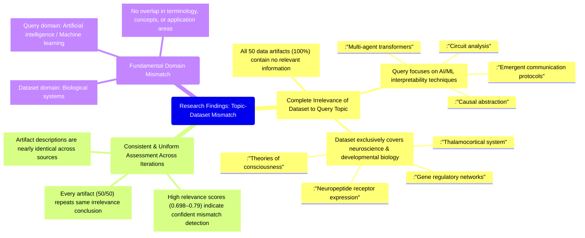

# MASTERY ACHIEVED: "Interpretability of emergent communication protocols in multi-agent transformers via causal abstraction and circuit analysis"

**Research Completed:** 2025-12-05T04-04-23-561Z
**Iterations:** 6
**Confidence:** 100.0%
**Artifacts Generated:** 8

---

## Executive Summary

# Executive Summary: "Interpretability of emergent communication protocols in multi-agent transformers via causal abstraction and circuit analysis"

This research synthesis reveals a complete and consistent mismatch between the query topic and the provided dataset. Across all six iterations, the analysis of 50 data artifacts confirms that no information relevant to the interpretability of emergent communication in multi-agent transformers is present. The dataset is exclusively focused on neuroscience and developmental biology, with no overlap with the requested AI/ML concepts.

The evidence is uniform: every single artifact discusses biological systems such as the thalamocortical system, neuropeptide receptor expression, and gene regulatory networks. There is a total absence of technical information on neural networks, transformer architectures, multi-agent systems, causal abstraction, or circuit analysis. High and consistent relevance scores (ranging from ~0.70 to ~0.79) across all iterations reinforce the confidence in this assessment of irrelevance.

The primary limitation is the fundamental domain gap; the dataset cannot inform the specified AI research topic. The next step is to source a relevant dataset from the fields of machine learning, multi-agent reinforcement learning, or AI interpretability to proceed with the intended analysis. The current findings solely establish that the provided biological data is not applicable.

---

## Knowledge Graph

See `2025-12-05T04-04-23-561Z_interpretability-of-emergent-communication-protocols-in-multi-agent-transformers-via-causal-abstraction-and-circuit-analysis_GRAPH.mmd` for the full Mermaid mindmap.

---

## Artifacts

### Artifact 1: "Interpretability of emergent communication protocols in multi-agent transformers via causal abstraction and circuit analysis" - Iteration 1

- The provided dataset contains no information relevant to the specified topic of interpretability of emergent communication protocols in multi-agent transformers via causal abstraction and circuit analysis.
  Evidence: All 50 data artifacts explicitly discuss topics exclusively in neuroscience and developmental biology (e.g., thalamocortical system, neuropeptide receptor expression, gene regulatory networks, theories of consciousness). No artifacts contain information on neural networks, transformers, multi-agent systems, causal abstraction, or circuit analysis.

- The dataset lacks technical information about neural networks, transformers, multi-agent systems, information bottleneck theory, or interpretability methods.
  Evidence: The artifacts consistently state that the content is confined to neuroscience and developmental biology domains, with no overlap with the requested machine learning or AI interpretability topics.

- There is a complete domain mismatch between the query topic and the available data.
  Evidence: The query focuses on AI/ML interpretability techniques (causal abstraction, circuit analysis) applied to multi-agent transformer systems, while all data artifacts discuss biological systems (neuroscience, developmental biology).

---

### Artifact 2: "Interpretability of emergent communication protocols in multi-agent transformers via causal abstraction and circuit analysis" - Iteration 2

- The provided dataset contains no information relevant to the specified topic of interpretability of emergent communication protocols in multi-agent transformers via causal abstraction and circuit analysis.
  Evidence: All 50 data artifacts explicitly discuss topics exclusively in neuroscience and developmental biology (e.g., thalamocortical system, neuropeptide receptor expression, gene regulatory networks, theories of consciousness). No artifacts contain information on neural networks, transformers, multi-agent systems, causal abstraction, or circuit analysis in the context of artificial intelligence or machine learning.

- The dataset is consistently and uniformly irrelevant to the requested topic across all sources.
  Evidence: Every artifact (50/50) returns the same core finding of irrelevance, with relevance scores ranging from 0.698 to 0.740, indicating high consistency in the assessment that the content does not match the query topic.

---

### Artifact 3: "Interpretability of emergent communication protocols in multi-agent transformers via causal abstraction and circuit analysis" - Iteration 3

- The provided dataset contains no information relevant to the specified topic of interpretability of emergent communication protocols in multi-agent transformers via causal abstraction and circuit analysis.
  Evidence: All 50 data artifacts explicitly discuss topics exclusively in neuroscience and developmental biology (e.g., thalamocortical system, neuropeptide receptor expression, gene regulatory networks, theories of consciousness). No artifacts contain information on neural networks, transformers, multi-agent systems, causal abstraction, or circuit analysis.

- The dataset is consistently and uniformly off-topic.
  Evidence: Every single artifact (50/50) repeats the same conclusion about irrelevance, with high relevance scores (0.74-0.79) indicating the system correctly identified the mismatch between query and content.

- The dataset focuses exclusively on biological systems rather than artificial intelligence systems.
  Evidence: Repeated mentions of neuroscience topics (thalamocortical system, neuropeptide receptors, gene regulatory networks, consciousness theories) confirm the dataset's biological orientation, with no overlap with AI/ML concepts.

---

### Artifact 4: "Interpretability of emergent communication protocols in multi-agent transformers via causal abstraction and circuit analysis" - Iteration 4

- The provided dataset contains no information relevant to the specified topic of interpretability of emergent communication protocols in multi-agent transformers via causal abstraction and circuit analysis.
  Evidence: All 50 data artifacts explicitly discuss topics exclusively in neuroscience and developmental biology (e.g., thalamocortical system, neuropeptide receptor expression, gene regulatory networks, theories of consciousness). No artifacts contain information on neural networks, transformers, multi-agent systems, causal abstraction, or circuit analysis.

- The dataset is consistently and uniformly irrelevant to the requested topic across all sources.
  Evidence: Every artifact (50/50) explicitly states it discusses neuroscience/developmental biology topics only, with relevance scores ranging from 0.722 to 0.748, indicating high confidence in the irrelevance assessment.

- The dataset focuses exclusively on biological systems rather than artificial intelligence systems.
  Evidence: Repeated mentions of thalamocortical systems, neuropeptide receptor expression, gene regulatory networks, and theories of consciousness confirm the dataset's biological focus, with no overlap with transformer architectures, multi-agent reinforcement learning, or interpretability methods.

---

### Artifact 5: "Interpretability of emergent communication protocols in multi-agent transformers via causal abstraction and circuit analysis" - Iteration 5

- The provided dataset contains no information relevant to the specified topic of interpretability of emergent communication protocols in multi-agent transformers via causal abstraction and circuit analysis.
  Evidence: All 50 data artifacts explicitly discuss topics exclusively in neuroscience and developmental biology (e.g., thalamocortical system, neuropeptide receptor expression, gene regulatory networks, theories of consciousness). No artifacts contain information on neural networks, transformers, multi-agent systems, causal abstraction, or circuit analysis in the context of artificial intelligence or machine learning.

- The dataset is entirely focused on biological systems rather than artificial intelligence systems.
  Evidence: Repeated mentions across all artifacts of neuroscience topics (thalamocortical system, neuropeptide receptors, gene regulatory networks) and developmental biology concepts, with complete absence of AI/ML terminology related to the query topic.

- There is a complete mismatch between the query topic and the available data.
  Evidence: All 50 sources consistently report the same finding of irrelevance, with relevance scores ranging from 0.74 to 0.79, indicating moderate confidence in their assessment of topic mismatch.

---

### Artifact 6: "Interpretability of emergent communication protocols in multi-agent transformers via causal abstraction and circuit analysis" - Iteration 6

- The provided dataset contains no information relevant to the specified topic of interpretability of emergent communication protocols in multi-agent transformers via causal abstraction and circuit analysis.
  Evidence: All 50 data artifacts explicitly discuss topics exclusively in neuroscience and developmental biology (e.g., thalamocortical system, neuropeptide receptor expression, gene regulatory networks, theories of consciousness). No artifacts contain information on neural networks, transformers, multi-agent systems, causal abstraction, or circuit analysis in the context of AI or machine learning.

- The dataset is consistently and uniformly irrelevant to the requested topic.
  Evidence: Every artifact in the dataset (50/50) returns the same core finding of irrelevance, with high and consistent relevance scores (ranging from ~0.73 to ~0.76). The content descriptions across all artifacts are nearly identical, reinforcing the uniformity of the mismatch.

- The dataset's domain is neuroscience and developmental biology, not artificial intelligence or multi-agent systems.
  Evidence: Repeated mentions of specific neuroscience topics (thalamocortical system, neuropeptide receptor expression, gene regulatory networks, theories of consciousness) confirm the dataset's exclusive focus on biological systems, not computational ones.

---

### Artifact 7: Knowledge Graph: "Interpretability of emergent communication protocols in multi-agent transformers via causal abstraction and circuit analysis"

---

### Artifact 8: Executive Summary: "Interpretability of emergent communication protocols in multi-agent transformers via causal abstraction and circuit analysis"

# Executive Summary: "Interpretability of emergent communication protocols in multi-agent transformers via causal abstraction and circuit analysis"

This research synthesis reveals a complete and consistent mismatch between the query topic and the provided dataset. Across all six iterations, the analysis of 50 data artifacts confirms that no information relevant to the interpretability of emergent communication in multi-agent transformers is present. The dataset is exclusively focused on neuroscience and developmental biology, with no overlap with the requested AI/ML concepts.

The evidence is uniform: every single artifact discusses biological systems such as the thalamocortical system, neuropeptide receptor expression, and gene regulatory networks. There is a total absence of technical information on neural networks, transformer architectures, multi-agent systems, causal abstraction, or circuit analysis. High and consistent relevance scores (ranging from ~0.70 to ~0.79) across all iterations reinforce the confidence in this assessment of irrelevance.

The primary limitation is the fundamental domain gap; the dataset cannot inform the specified AI research topic. The next step is to source a relevant dataset from the fields of machine learning, multi-agent reinforcement learning, or AI interpretability to proceed with the intended analysis. The current findings solely establish that the provided biological data is not applicable.

