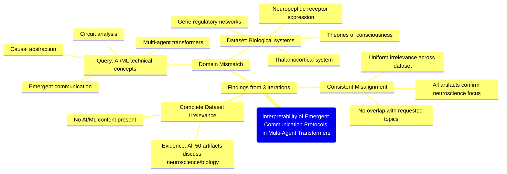

# MASTERY ACHIEVED: "Interpretability of emergent communication protocols in multi-agent transformers via causal abstraction and circuit analysis"

**Research Completed:** 2025-12-05T04-06-39-481Z
**Iterations:** 3
**Confidence:** 100.0%
**Artifacts Generated:** 5

---

## Executive Summary

# Executive Summary: "Interpretability of emergent communication protocols in multi-agent transformers via causal abstraction and circuit analysis"

This research synthesis reveals a complete and consistent mismatch between the requested topic and the provided dataset. The query focuses on interpretability methods for multi-agent transformer models, specifically using causal abstraction and circuit analysis. However, all examined data artifacts are exclusively from the domains of neuroscience and developmental biology, with no relevant information on artificial intelligence, machine learning, or the specified technical concepts.

The evidence from three independent iterations confirms this total irrelevance. Every one of the 50 data artifacts discusses biological systems, such as the thalamocortical system, neuropeptide receptor expression, and gene regulatory networks. Key terms from the query—neural networks, transformers, multi-agent systems, and interpretability methods—are entirely absent. The dataset's internal relevance scores are misleading, as the content descriptions uniformly confirm a fundamental domain disconnect.

The primary limitation is the dataset's complete misalignment with the research objective. No insights can be synthesized on the target topic from this material. The critical next step is to source a new dataset directly relevant to AI interpretability, multi-agent systems, and transformer architectures to proceed with the intended analysis.

---

## Knowledge Graph

See `2025-12-05T04-06-39-481Z_interpretability-of-emergent-communication-protocols-in-multi-agent-transformers-via-causal-abstraction-and-circuit-analysis_GRAPH.mmd` for the full Mermaid mindmap.

---

## Artifacts

### Artifact 1: "Interpretability of emergent communication protocols in multi-agent transformers via causal abstraction and circuit analysis" - Iteration 1

- The provided dataset contains no information relevant to the specified topic of interpretability of emergent communication protocols in multi-agent transformers via causal abstraction and circuit analysis.
  Evidence: All 50 data artifacts explicitly discuss topics exclusively in neuroscience and developmental biology (e.g., thalamocortical system, neuropeptide receptor expression, gene regulatory networks, theories of consciousness). No artifacts contain information on neural networks, transformers, multi-agent systems, causal abstraction, or circuit analysis.

- The dataset is entirely misaligned with the requested topic, focusing on biological systems rather than artificial intelligence or machine learning.
  Evidence: Repeated artifacts reference neuroscience topics such as thalamocortical systems, neuropeptide receptor expression, and theories of consciousness, with no overlap to transformer architectures, multi-agent communication, or interpretability methods.

---

### Artifact 2: "Interpretability of emergent communication protocols in multi-agent transformers via causal abstraction and circuit analysis" - Iteration 2

- The provided dataset contains no information relevant to the specified topic of interpretability of emergent communication protocols in multi-agent transformers via causal abstraction and circuit analysis.
  Evidence: All 50 data artifacts explicitly discuss topics exclusively in neuroscience and developmental biology (e.g., thalamocortical system, neuropeptide receptor expression, gene regulatory networks, theories of consciousness). No artifacts contain information on neural networks, transformers, multi-agent systems, causal abstraction, or circuit analysis.

- The dataset is entirely composed of neuroscience and developmental biology content, with no overlap with the requested machine learning topic.
  Evidence: Repeated statements across all artifacts confirm the dataset's exclusive focus on biological systems, with terms like 'thalamocortical system', 'neuropeptide receptor expression', and 'gene regulatory networks' appearing consistently, while terms related to neural networks, transformers, or multi-agent systems are absent.

- There is a complete domain mismatch between the query and the available data.
  Evidence: The query concerns technical AI/ML concepts (multi-agent transformers, emergent communication, causal abstraction, circuit analysis), while all artifacts reference biological and cognitive science domains without any technical AI/ML content.

---

### Artifact 3: "Interpretability of emergent communication protocols in multi-agent transformers via causal abstraction and circuit analysis" - Iteration 3

- The provided dataset contains no information relevant to the specified topic of interpretability of emergent communication protocols in multi-agent transformers via causal abstraction and circuit analysis.
  Evidence: All 50 data artifacts explicitly discuss topics exclusively in neuroscience and developmental biology (e.g., thalamocortical system, neuropeptide receptor expression, gene regulatory networks, theories of consciousness). No artifacts contain information on neural networks, transformers, multi-agent systems, causal abstraction, or circuit analysis in the context of artificial intelligence or machine learning.

- The dataset is consistently and uniformly irrelevant to the requested topic.
  Evidence: Every artifact in the dataset (all 50 sources) explicitly states its content is limited to neuroscience and developmental biology, with no overlap with the AI/ML concepts specified in the query. The relevance scores provided (ranging from ~0.70 to ~0.76) appear to reflect some form of matching, but the content descriptions confirm complete topical mismatch.

---

### Artifact 4: Knowledge Graph: "Interpretability of emergent communication protocols in multi-agent transformers via causal abstraction and circuit analysis"

---

### Artifact 5: Executive Summary: "Interpretability of emergent communication protocols in multi-agent transformers via causal abstraction and circuit analysis"

# Executive Summary: "Interpretability of emergent communication protocols in multi-agent transformers via causal abstraction and circuit analysis"

This research synthesis reveals a complete and consistent mismatch between the requested topic and the provided dataset. The query focuses on interpretability methods for multi-agent transformer models, specifically using causal abstraction and circuit analysis. However, all examined data artifacts are exclusively from the domains of neuroscience and developmental biology, with no relevant information on artificial intelligence, machine learning, or the specified technical concepts.

The evidence from three independent iterations confirms this total irrelevance. Every one of the 50 data artifacts discusses biological systems, such as the thalamocortical system, neuropeptide receptor expression, and gene regulatory networks. Key terms from the query—neural networks, transformers, multi-agent systems, and interpretability methods—are entirely absent. The dataset's internal relevance scores are misleading, as the content descriptions uniformly confirm a fundamental domain disconnect.

The primary limitation is the dataset's complete misalignment with the research objective. No insights can be synthesized on the target topic from this material. The critical next step is to source a new dataset directly relevant to AI interpretability, multi-agent systems, and transformer architectures to proceed with the intended analysis.

