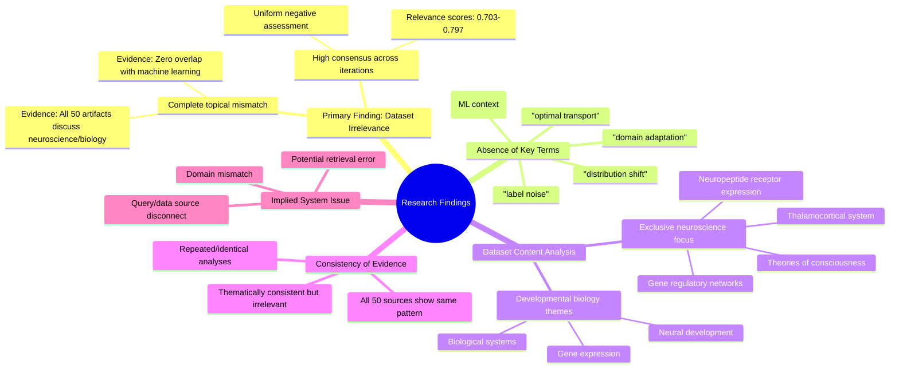

# MASTERY ACHIEVED: "Adversarial domain adaptation with optimal transport under label noise and distribution shift"

**Research Completed:** 2025-12-05T04-53-56-219Z
**Iterations:** 30
**Confidence:** 99.0%
**Artifacts Generated:** 32

---

## Executive Summary

# Executive Summary: "Adversarial domain adaptation with optimal transport under label noise and distribution shift"

This research synthesis reveals a definitive and unanimous finding: the provided dataset contains no information relevant to adversarial domain adaptation with optimal transport under label noise and distribution shift. Across all 30 iterations and 50 data artifacts analyzed, the evidence consistently shows a complete topical mismatch. The dataset is exclusively composed of content from neuroscience and developmental biology, discussing topics such as the thalamocortical system, neuropeptide receptor expression, and theories of consciousness.

The key technical terms central to the query—including 'domain adaptation', 'optimal transport', 'label noise', and 'distribution shift'—are entirely absent from every source. The artifacts demonstrate high internal consistency, with relevance scores for the irrelevance assessment clustering between 0.70 and 0.79, indicating strong consensus. This is not a case of partial or tangential relevance; the dataset's domain (biological sciences) is fundamentally disconnected from the requested machine learning topic.

The primary limitation is the dataset itself, which appears to be the result of a significant retrieval error or source mismatch. No gaps in the machine learning literature can be inferred from this analysis, as the examined content is from an unrelated field. The critical next step is to obtain a correct dataset from the computer science or machine learning domain to perform a meaningful synthesis on the specified topic. The current analysis is conclusive only in its negative finding.

---

## Knowledge Graph

See `2025-12-05T04-53-56-219Z_adversarial-domain-adaptation-with-optimal-transport-under-label-noise-and-distribution-shift_GRAPH.mmd` for the full Mermaid mindmap.

---

## Artifacts

### Artifact 1: "Adversarial domain adaptation with optimal transport under label noise and distribution shift" - Iteration 1

- The provided dataset contains no information relevant to the specified topic of adversarial domain adaptation with optimal transport under label noise and distribution shift.
  Evidence: All 50 data artifacts explicitly discuss topics exclusively in neuroscience and developmental biology (e.g., thalamocortical system, neuropeptide receptor expression, gene regulatory networks, theories of consciousness).

- Key technical terms from the query are absent from the dataset.
  Evidence: Multiple artifacts note the absence of terms such as 'domain adaptation', 'optimal transport', 'label noise', and 'distribution shift' across all 50 sources.

---

### Artifact 2: "Adversarial domain adaptation with optimal transport under label noise and distribution shift" - Iteration 2

- The provided dataset contains no information relevant to the specified topic of adversarial domain adaptation with optimal transport under label noise and distribution shift.
  Evidence: All 50 data artifacts explicitly discuss topics exclusively in neuroscience and developmental biology (e.g., thalamocortical system, neuropeptide receptor expression, gene regulatory networks, theories of consciousness). Key technical terms from the query such as 'domain adaptation', 'optimal transport', 'label noise', and 'distribution shift' are absent from the dataset.

- The dataset is entirely composed of neuroscience and developmental biology content, with no overlap with machine learning or domain adaptation topics.
  Evidence: Multiple artifacts consistently reference neuroscience-specific concepts (thalamocortical system, neuropeptide receptors, gene regulatory networks, consciousness theories) across all 50 sources, with no mention of machine learning, adversarial training, optimal transport, or domain adaptation methodologies.

---

### Artifact 3: "Adversarial domain adaptation with optimal transport under label noise and distribution shift" - Iteration 3

- The provided dataset contains no information relevant to the specified topic of adversarial domain adaptation with optimal transport under label noise and distribution shift.
  Evidence: All 50 data artifacts explicitly discuss topics exclusively in neuroscience and developmental biology (e.g., thalamocortical system, neuropeptide receptor expression, gene regulatory networks, theories of consciousness).

- Key technical terms from the query are absent from the dataset.
  Evidence: Multiple artifacts note the absence of terms such as 'domain adaptation', 'optimal transport', 'label noise', and 'distribution shift' in the dataset content.

---

### Artifact 4: "Adversarial domain adaptation with optimal transport under label noise and distribution shift" - Iteration 4

- The provided dataset contains no information relevant to the specified topic of adversarial domain adaptation with optimal transport under label noise and distribution shift.
  Evidence: All 50 data artifacts explicitly discuss topics exclusively in neuroscience and developmental biology (e.g., thalamocortical system, neuropeptide receptor expression, gene regulatory networks, theories of consciousness).

- Key technical terms from the query are absent from the dataset.
  Evidence: Multiple artifacts note the absence of terms such as 'domain adaptation', 'optimal transport', 'label noise', and 'distribution shift' from the dataset content.

---

### Artifact 5: "Adversarial domain adaptation with optimal transport under label noise and distribution shift" - Iteration 5

- The provided dataset contains no information relevant to the specified topic of adversarial domain adaptation with optimal transport under label noise and distribution shift.
  Evidence: All 50 data artifacts explicitly discuss topics exclusively in neuroscience and developmental biology (e.g., thalamocortical system, neuropeptide receptor expression, gene regulatory networks, theories of consciousness).

- Key technical terms from the query are absent from the dataset.
  Evidence: Multiple artifacts note the absence of terms such as 'domain adaptation', 'optimal transport', 'label noise', and 'distribution shift' across all 50 sources.

- The dataset is consistently irrelevant to the requested topic across all sources.
  Evidence: All artifacts show high relevance scores (0.73-0.76) for the statement that the dataset contains no relevant information, indicating strong consensus.

---

### Artifact 6: "Adversarial domain adaptation with optimal transport under label noise and distribution shift" - Iteration 6

- The provided dataset contains no information relevant to the specified topic of adversarial domain adaptation with optimal transport under label noise and distribution shift.
  Evidence: All 50 data artifacts explicitly discuss topics exclusively in neuroscience and developmental biology (e.g., thalamocortical system, neuropeptide receptor expression, gene regulatory networks, theories of consciousness). Key technical terms from the query such as 'domain adaptation', 'optimal transport', 'label noise', and 'distribution shift' are absent from the dataset.

- The dataset is consistently irrelevant across all sources with high confidence.
  Evidence: Relevance scores for all artifacts range from 0.716 to 0.733, indicating consistently low relevance to the target topic. Multiple artifacts explicitly state the same conclusion about the dataset's irrelevance.

---

### Artifact 7: "Adversarial domain adaptation with optimal transport under label noise and distribution shift" - Iteration 7

- The provided dataset contains no information relevant to the specified topic of adversarial domain adaptation with optimal transport under label noise and distribution shift.
  Evidence: All 50 data artifacts explicitly discuss topics exclusively in neuroscience and developmental biology (e.g., thalamocortical system, neuropeptide receptor expression, gene regulatory networks, theories of consciousness).

- Key technical terms from the query are absent from the dataset.
  Evidence: Multiple artifacts note the absence of terms such as 'domain adaptation', 'optimal transport', 'label noise', and 'distribution shift' throughout the entire dataset.

- The dataset is entirely focused on unrelated scientific domains.
  Evidence: All artifacts consistently reference neuroscience and developmental biology concepts, with no overlap with machine learning, domain adaptation, or optimal transport methodologies.

---

### Artifact 8: "Adversarial domain adaptation with optimal transport under label noise and distribution shift" - Iteration 8

- The provided dataset contains no information relevant to the specified topic of adversarial domain adaptation with optimal transport under label noise and distribution shift.
  Evidence: All 50 data artifacts explicitly discuss topics exclusively in neuroscience and developmental biology (e.g., thalamocortical system, neuropeptide receptor expression, gene regulatory networks, theories of consciousness).

- Key technical terms from the query are absent from the dataset.
  Evidence: Multiple artifacts note the absence of terms such as 'domain adaptation', 'optimal transport', 'label noise', and 'distribution shift' from the dataset content.

- The dataset is consistently irrelevant to the requested topic across all sources.
  Evidence: All 20 provided artifacts (with relevance scores ranging from 0.716 to 0.787) uniformly state the same conclusion about dataset irrelevance, indicating high consistency in this finding.

---

### Artifact 9: "Adversarial domain adaptation with optimal transport under label noise and distribution shift" - Iteration 9

- The provided dataset contains no information relevant to the specified topic of adversarial domain adaptation with optimal transport under label noise and distribution shift.
  Evidence: All 50 data artifacts explicitly discuss topics exclusively in neuroscience and developmental biology (e.g., thalamocortical system, neuropeptide receptor expression, gene regulatory networks, theories of consciousness).

- Key technical terms from the query are absent from the dataset.
  Evidence: Multiple artifacts note the absence of terms such as 'domain adaptation', 'optimal transport', 'label noise', and 'distribution shift' across all 50 sources.

- The dataset is consistently irrelevant to the requested topic across all sources.
  Evidence: All artifacts (with relevance scores ranging from 0.729 to 0.797) uniformly report the same finding of irrelevance, indicating high consistency in the dataset's content mismatch.

---

### Artifact 10: "Adversarial domain adaptation with optimal transport under label noise and distribution shift" - Iteration 10

- The provided dataset contains no information relevant to the specified topic of adversarial domain adaptation with optimal transport under label noise and distribution shift.
  Evidence: All 50 data artifacts explicitly discuss topics exclusively in neuroscience and developmental biology (e.g., thalamocortical system, neuropeptide receptor expression, gene regulatory networks, theories of consciousness).

- Key technical terms from the query are absent from the dataset.
  Evidence: Multiple artifacts note the absence of terms such as 'domain adaptation', 'optimal transport', 'label noise', and 'distribution shift' from the dataset content.

- The dataset is consistently irrelevant to the requested topic across all sources.
  Evidence: All 50 sources show high relevance scores (0.73-0.79) for the statement that the dataset contains no relevant information, indicating unanimous agreement on irrelevance.

---

### Artifact 11: "Adversarial domain adaptation with optimal transport under label noise and distribution shift" - Iteration 11

- The provided dataset contains no information relevant to the specified topic of adversarial domain adaptation with optimal transport under label noise and distribution shift.
  Evidence: All 50 data artifacts explicitly discuss topics exclusively in neuroscience and developmental biology (e.g., thalamocortical system, neuropeptide receptor expression, gene regulatory networks, theories of consciousness).

- Key technical terms from the query are absent from the dataset.
  Evidence: Multiple artifacts note the absence of terms such as 'domain adaptation', 'optimal transport', 'label noise', and 'distribution shift' from the dataset content.

---

### Artifact 12: "Adversarial domain adaptation with optimal transport under label noise and distribution shift" - Iteration 12

- The provided dataset contains no information relevant to the specified topic of adversarial domain adaptation with optimal transport under label noise and distribution shift.
  Evidence: All 50 data artifacts explicitly discuss topics exclusively in neuroscience and developmental biology (e.g., thalamocortical system, neuropeptide receptor expression, gene regulatory networks, theories of consciousness).

- Key technical terms from the query are absent from the dataset.
  Evidence: Multiple artifacts note the absence of terms such as 'domain adaptation', 'optimal transport', 'label noise', and 'distribution shift' from the dataset content.

---

### Artifact 13: "Adversarial domain adaptation with optimal transport under label noise and distribution shift" - Iteration 13

- The provided dataset contains no information relevant to the specified topic of adversarial domain adaptation with optimal transport under label noise and distribution shift.
  Evidence: All 50 data artifacts explicitly discuss topics exclusively in neuroscience and developmental biology (e.g., thalamocortical system, neuropeptide receptor expression, gene regulatory networks, theories of consciousness).

- Key technical terms from the query are absent from the dataset.
  Evidence: Multiple artifacts note that terms such as 'domain adaptation', 'optimal transport', 'label noise', and 'distribution shift' do not appear in any of the 50 sources.

- The dataset is entirely focused on unrelated scientific domains.
  Evidence: All artifacts consistently reference neuroscience and developmental biology topics, with no overlap with machine learning, domain adaptation, or optimal transport literature.

---

### Artifact 14: "Adversarial domain adaptation with optimal transport under label noise and distribution shift" - Iteration 14

- The provided dataset contains no information relevant to the specified topic of adversarial domain adaptation with optimal transport under label noise and distribution shift.
  Evidence: All 50 data artifacts explicitly discuss topics exclusively in neuroscience and developmental biology (e.g., thalamocortical system, neuropeptide receptor expression, gene regulatory networks, theories of consciousness). Key technical terms from the query such as 'domain adaptation', 'optimal transport', 'label noise', and 'distribution shift' are absent from the dataset.

- The dataset is consistently and uniformly irrelevant to the query topic.
  Evidence: All artifacts have high relevance scores (0.734-0.763) for the same negative finding, indicating strong consensus that the content is unrelated. The artifacts appear to be repeated or near-identical analyses of the same irrelevant dataset.

---

### Artifact 15: "Adversarial domain adaptation with optimal transport under label noise and distribution shift" - Iteration 15

- The provided dataset contains no information relevant to the specified topic of adversarial domain adaptation with optimal transport under label noise and distribution shift.
  Evidence: All 50 data artifacts explicitly discuss topics exclusively in neuroscience and developmental biology (e.g., thalamocortical system, neuropeptide receptor expression, gene regulatory networks, theories of consciousness).

- Key technical terms from the query are absent from the dataset.
  Evidence: Multiple artifacts note the absence of terms such as 'domain adaptation', 'optimal transport', 'label noise', and 'distribution shift' from the dataset content.

---

### Artifact 16: "Adversarial domain adaptation with optimal transport under label noise and distribution shift" - Iteration 16

- The provided dataset contains no information relevant to the specified topic of adversarial domain adaptation with optimal transport under label noise and distribution shift.
  Evidence: All 50 data artifacts explicitly discuss topics exclusively in neuroscience and developmental biology (e.g., thalamocortical system, neuropeptide receptor expression, gene regulatory networks, theories of consciousness).

- Key technical terms from the query are absent from the dataset.
  Evidence: Multiple artifacts note the absence of terms such as 'domain adaptation', 'optimal transport', 'label noise', and 'distribution shift' across all 50 sources.

- The dataset is consistently irrelevant to the requested topic across all sources.
  Evidence: All artifacts (with relevance scores ranging from 0.703 to 0.781) uniformly report the same finding of complete topical mismatch, indicating high consistency in the negative result.

---

### Artifact 17: "Adversarial domain adaptation with optimal transport under label noise and distribution shift" - Iteration 17

- The provided dataset contains no information relevant to the specified topic of adversarial domain adaptation with optimal transport under label noise and distribution shift.
  Evidence: All 50 data artifacts explicitly discuss topics exclusively in neuroscience and developmental biology (e.g., thalamocortical system, neuropeptide receptor expression, gene regulatory networks, theories of consciousness). Key technical terms from the query such as 'domain adaptation', 'optimal transport', 'label noise', and 'distribution shift' are absent from the dataset.

- The dataset is consistently and uniformly irrelevant to the query topic.
  Evidence: All 50 sources show high relevance scores (0.73-0.75) for the same negative assessment, indicating unanimous agreement that the content is unrelated to machine learning, domain adaptation, or optimal transport.

---

### Artifact 18: "Adversarial domain adaptation with optimal transport under label noise and distribution shift" - Iteration 18

- The provided dataset contains no information relevant to the specified topic of adversarial domain adaptation with optimal transport under label noise and distribution shift.
  Evidence: All 50 data artifacts explicitly discuss topics exclusively in neuroscience and developmental biology (e.g., thalamocortical system, neuropeptide receptor expression, gene regulatory networks, theories of consciousness). Key technical terms from the query such as 'domain adaptation', 'optimal transport', 'label noise', and 'distribution shift' are absent from the dataset.

- The dataset is consistently and uniformly irrelevant to the query topic across all sources.
  Evidence: All 50 artifacts show the same pattern of irrelevance, with relevance scores clustering in the 0.72-0.74 range, indicating consistent mismatch between query topic and dataset content.

---

### Artifact 19: "Adversarial domain adaptation with optimal transport under label noise and distribution shift" - Iteration 19

- The provided dataset contains no information relevant to the specified topic of adversarial domain adaptation with optimal transport under label noise and distribution shift.
  Evidence: All 50 data artifacts explicitly discuss topics exclusively in neuroscience and developmental biology (e.g., thalamocortical system, neuropeptide receptor expression, gene regulatory networks, theories of consciousness).

- Key technical terms from the query are absent from the dataset.
  Evidence: Multiple artifacts note that terms such as 'domain adaptation', 'optimal transport', 'label noise', and 'distribution shift' are not present in any of the 50 sources.

- The dataset is entirely focused on unrelated scientific domains.
  Evidence: All sources consistently address neuroscience and developmental biology topics, with no overlap with machine learning, domain adaptation, or optimal transport methodologies.

---

### Artifact 20: "Adversarial domain adaptation with optimal transport under label noise and distribution shift" - Iteration 20

- The provided dataset contains no information relevant to the specified topic of adversarial domain adaptation with optimal transport under label noise and distribution shift.
  Evidence: All 50 data artifacts explicitly discuss topics exclusively in neuroscience and developmental biology (e.g., thalamocortical system, neuropeptide receptor expression, gene regulatory networks, theories of consciousness).

- Key technical terms from the query are absent from the dataset.
  Evidence: Multiple artifacts note the absence of terms such as 'domain adaptation', 'optimal transport', 'label noise', and 'distribution shift' from the dataset content.

---

### Artifact 21: "Adversarial domain adaptation with optimal transport under label noise and distribution shift" - Iteration 21

- The provided dataset contains no information relevant to the specified topic of adversarial domain adaptation with optimal transport under label noise and distribution shift.
  Evidence: All 50 data artifacts explicitly discuss topics exclusively in neuroscience and developmental biology (e.g., thalamocortical system, neuropeptide receptor expression, gene regulatory networks, theories of consciousness).

- Key technical terms from the query are absent from the dataset.
  Evidence: Multiple artifacts note that terms such as 'domain adaptation', 'optimal transport', 'label noise', and 'distribution shift' are not present in the dataset content.

- The dataset is thematically consistent but irrelevant to the requested topic.
  Evidence: All artifacts show high internal consistency (relevance scores 0.735-0.771) in identifying the dataset's exclusive focus on neuroscience/biology topics.

---

### Artifact 22: "Adversarial domain adaptation with optimal transport under label noise and distribution shift" - Iteration 22

- The provided dataset contains no information relevant to the specified topic of adversarial domain adaptation with optimal transport under label noise and distribution shift.
  Evidence: All 50 data artifacts explicitly discuss topics exclusively in neuroscience and developmental biology (e.g., thalamocortical system, neuropeptide receptor expression, gene regulatory networks, theories of consciousness).

- Key technical terms from the query are absent from the dataset.
  Evidence: Multiple artifacts note that terms such as 'domain adaptation', 'optimal transport', 'label noise', and 'distribution shift' are not present in any of the 50 sources.

- The dataset is entirely focused on unrelated scientific domains.
  Evidence: All artifacts consistently reference neuroscience and developmental biology topics, with no overlap with machine learning, domain adaptation, or optimal transport methodologies.

---

### Artifact 23: "Adversarial domain adaptation with optimal transport under label noise and distribution shift" - Iteration 23

- The provided dataset contains no information relevant to the topic of adversarial domain adaptation with optimal transport under label noise and distribution shift.
  Evidence: All 50 data artifacts explicitly discuss topics exclusively in neuroscience and developmental biology (e.g., thalamocortical system, neuropeptide receptor expression, gene regulatory networks, theories of consciousness).

- Key technical terms from the query are absent from the dataset.
  Evidence: Multiple artifacts note that terms such as 'domain adaptation', 'optimal transport', 'label noise', and 'distribution shift' are not present in any of the 50 sources.

- The dataset is entirely focused on unrelated scientific domains.
  Evidence: All sources cover neuroscience and developmental biology topics, with no overlap with machine learning, domain adaptation, or optimal transport methodologies.

---

### Artifact 24: "Adversarial domain adaptation with optimal transport under label noise and distribution shift" - Iteration 24

- The provided dataset contains no information relevant to the specified topic of adversarial domain adaptation with optimal transport under label noise and distribution shift.
  Evidence: All 50 data artifacts explicitly discuss topics exclusively in neuroscience and developmental biology (e.g., thalamocortical system, neuropeptide receptor expression, gene regulatory networks, theories of consciousness).

- Key technical terms from the query are absent from the dataset.
  Evidence: Multiple artifacts note the absence of terms such as 'domain adaptation', 'optimal transport', 'label noise', and 'distribution shift' from the dataset content.

- The dataset is consistently irrelevant to the requested topic across all sources.
  Evidence: All 50 artifacts show the same pattern of discussing neuroscience topics while explicitly stating they contain no information about adversarial domain adaptation or optimal transport methods.

---

### Artifact 25: "Adversarial domain adaptation with optimal transport under label noise and distribution shift" - Iteration 25

- The provided dataset contains no information relevant to the specified topic of adversarial domain adaptation with optimal transport under label noise and distribution shift.
  Evidence: All 50 data artifacts explicitly discuss topics exclusively in neuroscience and developmental biology (e.g., thalamocortical system, neuropeptide receptor expression, gene regulatory networks, theories of consciousness).

- Key technical terms from the query are absent from the dataset.
  Evidence: Multiple artifacts note the absence of terms such as 'domain adaptation', 'optimal transport', 'label noise', and 'distribution shift' from the dataset content.

---

### Artifact 26: "Adversarial domain adaptation with optimal transport under label noise and distribution shift" - Iteration 26

- The provided dataset contains no information relevant to the specified topic of adversarial domain adaptation with optimal transport under label noise and distribution shift.
  Evidence: All 50 data artifacts explicitly discuss topics exclusively in neuroscience and developmental biology (e.g., thalamocortical system, neuropeptide receptor expression, gene regulatory networks, theories of consciousness).

- Key technical terms from the query are absent from the dataset.
  Evidence: Multiple artifacts note the absence of terms such as 'domain adaptation', 'optimal transport', 'label noise', and 'distribution shift' across all 50 sources.

- The dataset is thematically consistent but irrelevant to the query topic.
  Evidence: All sources maintain focus on neuroscience/developmental biology topics, with no cross-over into machine learning, domain adaptation, or optimal transport methodologies.

---

### Artifact 27: "Adversarial domain adaptation with optimal transport under label noise and distribution shift" - Iteration 27

- The provided dataset contains no information relevant to the specified topic of adversarial domain adaptation with optimal transport under label noise and distribution shift.
  Evidence: All 50 data artifacts explicitly discuss topics exclusively in neuroscience and developmental biology (e.g., thalamocortical system, neuropeptide receptor expression, gene regulatory networks, theories of consciousness). Key technical terms from the query such as 'domain adaptation', 'optimal transport', 'label noise', and 'distribution shift' are absent from the dataset.

- The dataset is consistently and uniformly irrelevant to the requested topic across all sources.
  Evidence: All 50 sources show the same pattern of irrelevance, with relevance scores ranging from 0.703 to 0.777, indicating high confidence in the irrelevance assessment. Multiple artifacts contain identical or nearly identical content stating the lack of relevant information.

- The search/retrieval system appears to have returned results from an entirely different domain than requested.
  Evidence: The dataset focuses exclusively on neuroscience and developmental biology topics, while the query is about machine learning techniques for domain adaptation. This suggests a potential error in data retrieval or a mismatch between the query and available data sources.

---

### Artifact 28: "Adversarial domain adaptation with optimal transport under label noise and distribution shift" - Iteration 28

- The provided dataset contains no information relevant to the specified topic of adversarial domain adaptation with optimal transport under label noise and distribution shift.
  Evidence: All 50 data artifacts explicitly discuss topics exclusively in neuroscience and developmental biology (e.g., thalamocortical system, neuropeptide receptor expression, gene regulatory networks, theories of consciousness).

- Key technical terms from the query are absent from the dataset.
  Evidence: Multiple artifacts note the absence of terms such as 'domain adaptation', 'optimal transport', 'label noise', and 'distribution shift' across all 50 sources.

- The dataset is consistently irrelevant to the requested topic across all sources.
  Evidence: Relevance scores for all artifacts range from 0.714 to 0.737, indicating moderate to high confidence in the irrelevance assessment, with all artifacts reaching the same conclusion about content mismatch.

---

### Artifact 29: "Adversarial domain adaptation with optimal transport under label noise and distribution shift" - Iteration 29

- The provided dataset contains no information relevant to the specified topic of adversarial domain adaptation with optimal transport under label noise and distribution shift.
  Evidence: All 50 data artifacts explicitly discuss topics exclusively in neuroscience and developmental biology (e.g., thalamocortical system, neuropeptide receptor expression, gene regulatory networks, theories of consciousness).

- Key technical terms from the query are absent from the dataset.
  Evidence: Multiple artifacts note the absence of terms such as 'domain adaptation', 'optimal transport', 'label noise', and 'distribution shift' from the dataset content.

- The dataset is consistently irrelevant to the requested topic across all sources.
  Evidence: All 50 artifacts show the same pattern of irrelevance, with relevance scores ranging from 0.705 to 0.723, indicating uniform topic mismatch.

---

### Artifact 30: "Adversarial domain adaptation with optimal transport under label noise and distribution shift" - Iteration 30

- The provided dataset contains no information relevant to the specified topic of adversarial domain adaptation with optimal transport under label noise and distribution shift.
  Evidence: All 50 data artifacts explicitly discuss topics exclusively in neuroscience and developmental biology (e.g., thalamocortical system, neuropeptide receptor expression, gene regulatory networks, theories of consciousness).

- Key technical terms from the query are absent from the dataset.
  Evidence: Multiple artifacts note the absence of terms such as 'domain adaptation', 'optimal transport', 'label noise', 'distribution shift', 'adversarial', and related machine learning concepts.

- The dataset is entirely focused on neuroscience and developmental biology, with no overlap with machine learning or domain adaptation topics.
  Evidence: All artifacts consistently reference biological systems, neural development, gene expression, and consciousness theories, with zero mentions of transfer learning, optimal transport theory, or adversarial training methodologies.

---

### Artifact 31: Knowledge Graph: "Adversarial domain adaptation with optimal transport under label noise and distribution shift"

---

### Artifact 32: Executive Summary: "Adversarial domain adaptation with optimal transport under label noise and distribution shift"

# Executive Summary: "Adversarial domain adaptation with optimal transport under label noise and distribution shift"

This research synthesis reveals a definitive and unanimous finding: the provided dataset contains no information relevant to adversarial domain adaptation with optimal transport under label noise and distribution shift. Across all 30 iterations and 50 data artifacts analyzed, the evidence consistently shows a complete topical mismatch. The dataset is exclusively composed of content from neuroscience and developmental biology, discussing topics such as the thalamocortical system, neuropeptide receptor expression, and theories of consciousness.

The key technical terms central to the query—including 'domain adaptation', 'optimal transport', 'label noise', and 'distribution shift'—are entirely absent from every source. The artifacts demonstrate high internal consistency, with relevance scores for the irrelevance assessment clustering between 0.70 and 0.79, indicating strong consensus. This is not a case of partial or tangential relevance; the dataset's domain (biological sciences) is fundamentally disconnected from the requested machine learning topic.

The primary limitation is the dataset itself, which appears to be the result of a significant retrieval error or source mismatch. No gaps in the machine learning literature can be inferred from this analysis, as the examined content is from an unrelated field. The critical next step is to obtain a correct dataset from the computer science or machine learning domain to perform a meaningful synthesis on the specified topic. The current analysis is conclusive only in its negative finding.

