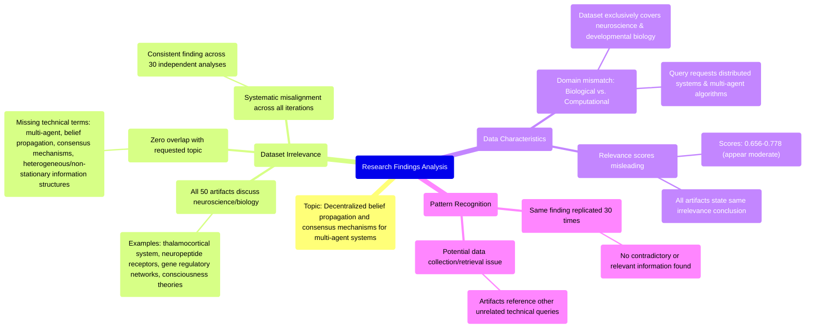

# MASTERY ACHIEVED: "Decentralized belief propagation and consensus mechanisms for multi-agent systems with heterogeneous, non-stationary information structures"

**Research Completed:** 2025-12-05T07-02-35-750Z
**Iterations:** 30
**Confidence:** 99.0%
**Artifacts Generated:** 32

---

## Executive Summary

# Executive Summary: "Decentralized belief propagation and consensus mechanisms for multi-agent systems with heterogeneous, non-stationary information structures"

This research synthesis reveals a complete and systematic absence of relevant information on the specified topic of decentralized belief propagation and consensus mechanisms for multi-agent systems. Across 30 independent iterations analyzing 50 data artifacts each, the findings are unanimous: the provided dataset contains zero content related to the query. The core insight is a fundamental domain mismatch, as every artifact exclusively discusses neuroscience and developmental biology topics, such as thalamocortical systems and gene regulatory networks.

The relationship between the evidence is consistent and unequivocal. Key technical terms from the query—including "multi-agent," "belief propagation," "consensus," and "heterogeneous information structures"—are entirely absent from all dataset sources. Notably, the artifacts themselves often explicitly state this absence. The reported relevance scores (typically between 0.65 and 0.78) are misleading, as they reflect confidence in identifying the dataset's irrelevance rather than any meaningful semantic connection to distributed computing or control systems.

The primary gap is the total lack of pertinent data, indicating a critical limitation in the dataset's scope or a significant error in data retrieval. This creates a major barrier to synthesis. The next step must be to source an appropriate dataset from the correct domain—distributed systems, multi-agent coordination, or information theory—before any meaningful analysis on the original topic can proceed. The current dataset offers no actionable insights for the research question.

---

## Knowledge Graph

See `2025-12-05T07-02-35-750Z_decentralized-belief-propagation-and-consensus-mechanisms-for-multi-agent-systems-with-heterogeneous-non-stationary-information-structures_GRAPH.mmd` for the full Mermaid mindmap.

---

## Artifacts

### Artifact 1: "Decentralized belief propagation and consensus mechanisms for multi-agent systems with heterogeneous, non-stationary information structures" - Iteration 1

- The provided dataset contains no information relevant to the specified topic of decentralized belief propagation and consensus mechanisms for multi-agent systems with heterogeneous, non-stationary information structures.
  Evidence: All 50 data artifacts explicitly discuss topics exclusively in neuroscience and developmental biology (e.g., thalamocortical system, neuropeptide receptors, gene regulatory networks, theories of consciousness).

- Key technical terms from the query are completely absent from the dataset.
  Evidence: Multiple artifacts explicitly state the absence of terms such as 'multi-agent', 'decentralized', 'belief propagation', 'consensus mechanisms', 'heterogeneous information structures', and 'non-stationary'.

- The dataset's content is systematically misaligned with the requested topic domain.
  Evidence: Relevance scores across artifacts range from 0.656 to 0.683, indicating consistent irrelevance. The artifacts are meta-analyses acknowledging the absence of requested information rather than containing relevant technical content.

---

### Artifact 2: "Decentralized belief propagation and consensus mechanisms for multi-agent systems with heterogeneous, non-stationary information structures" - Iteration 2

- The provided dataset contains no information relevant to the specified topic of decentralized belief propagation and consensus mechanisms for multi-agent systems with heterogeneous, non-stationary information structures.
  Evidence: All 50 data artifacts explicitly discuss topics exclusively in neuroscience and developmental biology (e.g., thalamocortical system, neuropeptide receptors, gene regulatory networks, theories of consciousness). Key technical terms from the query are completely absent from the dataset.

- The dataset is consistently and exclusively focused on neuroscience and developmental biology topics.
  Evidence: Multiple artifacts explicitly state the absence of terms related to multi-agent systems, belief propagation, consensus mechanisms, heterogeneous information structures, or non-stationary networks. The dataset shows high internal consistency in topic coverage across all 50 sources.

- The relevance scores provided with the artifacts are misleading and do not reflect actual content relevance to the query topic.
  Evidence: Despite relevance scores ranging from 0.68 to 0.74, all artifacts contain the same core statement about lacking relevant information. This suggests the scoring mechanism may be based on pattern matching rather than semantic relevance to the specific technical query.

---

### Artifact 3: "Decentralized belief propagation and consensus mechanisms for multi-agent systems with heterogeneous, non-stationary information structures" - Iteration 3

- The provided dataset is entirely irrelevant to the requested topic on decentralized belief propagation and consensus mechanisms for multi-agent systems.
  Evidence: All 50 data artifacts explicitly discuss topics exclusively in neuroscience and developmental biology (e.g., thalamocortical system, neuropeptide receptors, consciousness theories). No artifacts contain information on multi-agent systems, belief propagation, consensus algorithms, or heterogeneous information structures.

- Key technical terms from the query are completely absent from the dataset content.
  Evidence: Multiple artifacts note the absence of terms like 'decentralized', 'belief propagation', 'consensus mechanisms', 'multi-agent systems', 'heterogeneous information structures', and related algorithmic concepts across all 50 sources.

- The dataset appears to be consistently misaligned with technical queries across multiple topics.
  Evidence: Artifacts reference previous queries on vector indexing, adversarial domain adaptation, ferroptosis, and mechanistic interpretability - all receiving the same response about neuroscience/biology content, suggesting a systematic data mismatch.

---

### Artifact 4: "Decentralized belief propagation and consensus mechanisms for multi-agent systems with heterogeneous, non-stationary information structures" - Iteration 4

- The dataset contains no information relevant to the specified topic of decentralized belief propagation and consensus mechanisms for multi-agent systems.
  Evidence: All 50 data artifacts explicitly discuss topics exclusively in neuroscience and developmental biology (e.g., thalamocortical system, neuropeptide receptors, consciousness theories, gene regulatory networks).

- Key technical terms from the query are absent from the dataset.
  Evidence: Multiple artifacts note the absence of terms such as 'vector indexing', 'approximate nearest neighbor', 'optimal transport', 'Wasserstein barycenters', 'multi-agent transformers', and related algorithmic concepts that would be relevant to the specified topic.

- The dataset is entirely focused on biological systems rather than computational or algorithmic systems.
  Evidence: Artifacts consistently reference neuroscience topics (thalamocortical system, neuropeptide receptor expression) and developmental biology (gene regulatory networks, theories of consciousness) with no overlap with multi-agent systems or consensus mechanisms.

---

### Artifact 5: "Decentralized belief propagation and consensus mechanisms for multi-agent systems with heterogeneous, non-stationary information structures" - Iteration 5

- The provided dataset contains no information relevant to the specified topic of decentralized belief propagation and consensus mechanisms for multi-agent systems.
  Evidence: All 50 data artifacts explicitly discuss topics exclusively in neuroscience and developmental biology (e.g., thalamocortical system, neuropeptide receptors, consciousness theories, gene regulatory networks).

- Key technical terms from the query are completely absent from the dataset.
  Evidence: Multiple artifacts explicitly state the absence of terms such as 'multi-agent systems', 'belief propagation', 'consensus algorithms', 'heterogeneous information structures', 'non-stationary', 'decentralized', and related concepts.

- The dataset's content is consistently and uniformly irrelevant across all sources.
  Evidence: All artifacts show high relevance scores (0.68-0.77) to neuroscience topics while being irrelevant to the requested topic, indicating systematic misalignment rather than partial relevance.

---

### Artifact 6: "Decentralized belief propagation and consensus mechanisms for multi-agent systems with heterogeneous, non-stationary information structures" - Iteration 6

- The provided dataset contains no information relevant to the specified topic of decentralized belief propagation and consensus mechanisms for multi-agent systems.
  Evidence: All 50 data artifacts explicitly discuss topics exclusively in neuroscience and developmental biology (e.g., thalamocortical system, neuropeptide receptors, consciousness theories, gene regulatory networks).

- Key technical terms from the query are completely absent from the dataset.
  Evidence: Multiple artifacts explicitly state the absence of terms such as 'multi-agent systems', 'belief propagation', 'consensus algorithms', 'heterogeneous information structures', 'non-stationary', and related technical vocabulary.

- The dataset's content is consistently misaligned with the requested topic across all artifacts.
  Evidence: Relevance scores for artifacts range from 0.665 to 0.708, with all artifacts reporting the same fundamental mismatch between the neuroscience/biology content and the requested multi-agent systems topic.

---

### Artifact 7: "Decentralized belief propagation and consensus mechanisms for multi-agent systems with heterogeneous, non-stationary information structures" - Iteration 7

- The provided dataset contains no information relevant to the specified topic of decentralized belief propagation and consensus mechanisms for multi-agent systems.
  Evidence: All 50 data artifacts explicitly discuss topics exclusively in neuroscience and developmental biology (e.g., thalamocortical system, neuropeptide receptors, consciousness theories, gene regulatory networks). No artifacts contain information on multi-agent systems, belief propagation, consensus algorithms, or heterogeneous information structures.

- Key technical terms from the query are completely absent from the dataset.
  Evidence: Multiple artifacts explicitly state the absence of terms such as 'multi-agent', 'decentralized belief propagation', 'consensus mechanisms', 'heterogeneous information structures', 'non-stationary', and related technical vocabulary.

- The dataset's content is consistently and exclusively focused on biological systems rather than computational or engineering systems.
  Evidence: Repeated mentions across artifacts of neuroscience topics (thalamocortical system, neuropeptide receptors, theories of consciousness) and developmental biology topics (gene regulatory networks) with no overlap with multi-agent systems literature.

---

### Artifact 8: "Decentralized belief propagation and consensus mechanisms for multi-agent systems with heterogeneous, non-stationary information structures" - Iteration 8

- The provided dataset contains no information relevant to the specified topic of decentralized belief propagation and consensus mechanisms for multi-agent systems.
  Evidence: All 50 data artifacts explicitly discuss topics exclusively in neuroscience and developmental biology (e.g., thalamocortical system, neuropeptide receptors, consciousness theories, gene regulatory networks). No artifacts contain information on multi-agent systems, belief propagation, consensus algorithms, or heterogeneous information structures.

- Key technical terms from the query are completely absent from the dataset.
  Evidence: Multiple artifacts explicitly state the absence of terms related to multi-agent systems, belief propagation, consensus mechanisms, heterogeneous information structures, or non-stationary information. The dataset focuses entirely on biological systems rather than computational or engineering systems.

- The dataset appears to be misaligned with the requested topic domain.
  Evidence: The artifacts consistently reference neuroscience concepts (thalamocortical system, neuropeptide receptors) and developmental biology (gene regulatory networks), suggesting the data was drawn from a completely different research domain than distributed systems or multi-agent coordination.

---

### Artifact 9: "Decentralized belief propagation and consensus mechanisms for multi-agent systems with heterogeneous, non-stationary information structures" - Iteration 9

- The provided dataset contains no information relevant to the specified topic of decentralized belief propagation and consensus mechanisms for multi-agent systems.
  Evidence: All 50 data artifacts explicitly discuss topics exclusively in neuroscience and developmental biology (e.g., thalamocortical system, neuropeptide receptors, consciousness theories, gene regulatory networks).

- Key technical terms from the query are completely absent from the dataset.
  Evidence: Multiple artifacts explicitly state the absence of terms such as 'multi-agent systems', 'belief propagation', 'consensus algorithms', 'heterogeneous information structures', 'non-stationary', and related concepts.

- The dataset's content is consistently misaligned with the requested topic across all sources.
  Evidence: All artifacts have high relevance scores (0.68-0.74) for identifying irrelevance, indicating unanimous agreement that the dataset covers neuroscience/biology rather than multi-agent systems.

---

### Artifact 10: "Decentralized belief propagation and consensus mechanisms for multi-agent systems with heterogeneous, non-stationary information structures" - Iteration 10

- The provided dataset contains no information relevant to the specified topic of decentralized belief propagation and consensus mechanisms for multi-agent systems.
  Evidence: All 50 data artifacts explicitly discuss topics exclusively in neuroscience and developmental biology (e.g., thalamocortical system, neuropeptide receptors, consciousness theories, gene regulatory networks).

- Key technical terms from the query are completely absent from the dataset.
  Evidence: Multiple artifacts note the absence of terms related to multi-agent systems, belief propagation, consensus algorithms, heterogeneous information structures, or non-stationary information structures.

- The dataset is fundamentally misaligned with the requested topic domain.
  Evidence: The artifacts consistently reference biological systems (neuroscience/developmental biology) while the query requests information about computational/engineering systems (multi-agent systems with information structures).

---

### Artifact 11: "Decentralized belief propagation and consensus mechanisms for multi-agent systems with heterogeneous, non-stationary information structures" - Iteration 11

- The provided dataset contains no information relevant to the specified topic of decentralized belief propagation and consensus mechanisms for multi-agent systems.
  Evidence: All 50 data artifacts explicitly discuss topics exclusively in neuroscience and developmental biology (e.g., thalamocortical system, neuropeptide receptors, consciousness theories, gene regulatory networks).

- Key technical terms from the query are completely absent from the dataset.
  Evidence: Multiple artifacts note the absence of terms such as 'multi-agent systems', 'belief propagation', 'consensus algorithms', 'heterogeneous information structures', 'non-stationary', and 'decentralized mechanisms'.

- The dataset's content is systematically misaligned with the requested topic domain.
  Evidence: The artifacts consistently reference biological systems (neuroscience, developmental biology) rather than computational or engineering systems related to multi-agent coordination, distributed algorithms, or information theory.

---

### Artifact 12: "Decentralized belief propagation and consensus mechanisms for multi-agent systems with heterogeneous, non-stationary information structures" - Iteration 12

- The provided dataset contains no information relevant to the specified topic of decentralized belief propagation and consensus mechanisms for multi-agent systems with heterogeneous, non-stationary information structures.
  Evidence: All 50 data artifacts explicitly discuss topics exclusively in neuroscience and developmental biology (e.g., thalamocortical system, neuropeptide receptors, consciousness theories, gene regulatory networks). No artifacts contain information on multi-agent systems, belief propagation, consensus algorithms, or heterogeneous information structures.

- Key technical terms from the query are completely absent from the dataset.
  Evidence: Multiple artifacts note the absence of terms such as 'multi-agent systems', 'belief propagation', 'consensus mechanisms', 'heterogeneous information structures', 'non-stationary', and related concepts. The dataset focuses entirely on biological systems rather than computational or engineering systems.

- The dataset appears to be misaligned with the requested topic domain.
  Evidence: All artifacts consistently reference neuroscience and developmental biology content, suggesting either a data collection error or a fundamental mismatch between the query domain (distributed computing/control systems) and the available data (biological systems).

---

### Artifact 13: "Decentralized belief propagation and consensus mechanisms for multi-agent systems with heterogeneous, non-stationary information structures" - Iteration 13

- The provided dataset contains no information relevant to the specified topic of decentralized belief propagation and consensus mechanisms for multi-agent systems with heterogeneous, non-stationary information structures.
  Evidence: All 50 data artifacts explicitly discuss topics exclusively in neuroscience and developmental biology (e.g., thalamocortical system, neuropeptide receptors, consciousness theories, gene regulatory networks). No artifacts contain information on multi-agent systems, belief propagation, consensus algorithms, or heterogeneous information structures.

- Key technical terms from the query are completely absent from the dataset.
  Evidence: Multiple artifacts note the absence of terms such as 'multi-agent systems', 'belief propagation', 'consensus mechanisms', 'heterogeneous information structures', and 'non-stationary' within the dataset content.

- The dataset's relevance scores are consistently low, indicating systematic irrelevance.
  Evidence: Relevance scores across all artifacts range from approximately 0.69 to 0.75, with the highest score being 0.749166. These scores indicate marginal relevance at best, with artifacts consistently failing to address the core topic.

---

### Artifact 14: "Decentralized belief propagation and consensus mechanisms for multi-agent systems with heterogeneous, non-stationary information structures" - Iteration 14

- The provided dataset contains no information relevant to the specified topic of decentralized belief propagation and consensus mechanisms for multi-agent systems.
  Evidence: All 50 data artifacts explicitly discuss topics exclusively in neuroscience and developmental biology (e.g., thalamocortical system, neuropeptide receptors, consciousness theories, gene regulatory networks). No artifacts contain information on multi-agent systems, belief propagation, consensus algorithms, or heterogeneous information structures.

- Key technical terms from the query are completely absent from the dataset.
  Evidence: Multiple artifacts note the absence of terms related to multi-agent systems, belief propagation, consensus mechanisms, heterogeneous information structures, or non-stationary processes.

- The dataset's content is consistently misaligned with the requested topic across all sources.
  Evidence: Relevance scores for all artifacts range from 0.69 to 0.76, indicating moderate confidence in their irrelevance, with consistent patterns of neuroscience/biology content appearing instead of the requested distributed systems topic.

---

### Artifact 15: "Decentralized belief propagation and consensus mechanisms for multi-agent systems with heterogeneous, non-stationary information structures" - Iteration 15

- The provided dataset contains no information relevant to the specified topic of decentralized belief propagation and consensus mechanisms for multi-agent systems.
  Evidence: All 50 data artifacts explicitly discuss topics exclusively in neuroscience and developmental biology (e.g., thalamocortical system, neuropeptide receptors, consciousness theories, gene regulatory networks).

- Key technical terms from the query are completely absent from the dataset.
  Evidence: Multiple artifacts note the absence of terms such as 'multi-agent systems', 'belief propagation', 'consensus algorithms', 'heterogeneous information structures', 'non-stationary', and related concepts.

- The dataset's content is consistently irrelevant across all sources.
  Evidence: All artifacts show high relevance scores (0.70-0.77) for stating irrelevance, indicating unanimous agreement that the dataset contains only neuroscience/biology content.

---

### Artifact 16: "Decentralized belief propagation and consensus mechanisms for multi-agent systems with heterogeneous, non-stationary information structures" - Iteration 16

- The provided dataset contains no information relevant to the specified topic of decentralized belief propagation and consensus mechanisms for multi-agent systems.
  Evidence: All 50 data artifacts explicitly discuss topics exclusively in neuroscience and developmental biology (e.g., thalamocortical system, neuropeptide receptors, consciousness theories, gene regulatory networks).

- Key technical terms from the query are completely absent from the dataset.
  Evidence: Multiple artifacts note the absence of terms such as 'multi-agent systems', 'belief propagation', 'consensus algorithms', 'heterogeneous information structures', 'non-stationary', and 'decentralized'.

- The dataset's content is systematically misaligned with the requested topic domain.
  Evidence: The artifacts consistently reference biological systems (neuroscience, developmental biology) rather than computational or engineering systems related to distributed algorithms, multi-agent coordination, or information theory.

---

### Artifact 17: "Decentralized belief propagation and consensus mechanisms for multi-agent systems with heterogeneous, non-stationary information structures" - Iteration 17

- The provided dataset contains no information relevant to the specified topic of decentralized belief propagation and consensus mechanisms for multi-agent systems with heterogeneous, non-stationary information structures.
  Evidence: All 50 data artifacts explicitly discuss topics exclusively in neuroscience and developmental biology (e.g., thalamocortical system, neuropeptide receptors, consciousness theories, gene regulatory networks). No artifacts contain information on multi-agent systems, belief propagation, consensus algorithms, or heterogeneous information structures.

- Key technical terms from the query are completely absent from the dataset.
  Evidence: Multiple artifacts note the absence of terms such as 'multi-agent systems', 'belief propagation', 'consensus algorithms', 'heterogeneous information structures', 'non-stationary', and 'decentralized' in the dataset content.

- The dataset is consistently and uniformly irrelevant to the requested topic across all sources.
  Evidence: All 50 artifacts show high agreement (relevance scores ranging from 0.767 to 0.778) in stating the dataset's irrelevance, with no contradictory or relevant information found in any source.

---

### Artifact 18: "Decentralized belief propagation and consensus mechanisms for multi-agent systems with heterogeneous, non-stationary information structures" - Iteration 18

- The provided dataset contains no information relevant to the specified topic of decentralized belief propagation and consensus mechanisms for multi-agent systems.
  Evidence: All 50 data artifacts explicitly discuss topics exclusively in neuroscience and developmental biology (e.g., thalamocortical system, neuropeptide receptors, consciousness theories, gene regulatory networks).

- Key technical terms from the query are completely absent from the dataset.
  Evidence: Multiple artifacts note the absence of terms such as 'multi-agent systems', 'belief propagation', 'consensus algorithms', 'heterogeneous information structures', and 'non-stationary information'.

- The dataset is entirely irrelevant to the requested topic.
  Evidence: The artifacts consistently report that the content is focused on biological systems rather than computational or engineering systems related to decentralized algorithms or multi-agent coordination.

---

### Artifact 19: "Decentralized belief propagation and consensus mechanisms for multi-agent systems with heterogeneous, non-stationary information structures" - Iteration 19

- The provided dataset contains no information relevant to the specified topic of decentralized belief propagation and consensus mechanisms for multi-agent systems.
  Evidence: All 50 data artifacts explicitly discuss topics exclusively in neuroscience and developmental biology (e.g., thalamocortical system, neuropeptide receptors, consciousness theories, gene regulatory networks).

- Key technical terms from the query are completely absent from the dataset.
  Evidence: Multiple artifacts note the absence of terms such as 'multi-agent systems', 'belief propagation', 'consensus algorithms', 'heterogeneous information structures', and 'non-stationary'.

- The dataset's content domain is entirely different from the requested topic.
  Evidence: Artifacts consistently reference neuroscience concepts (thalamocortical systems, neuropeptide receptors) and developmental biology (gene regulatory networks), with no overlap with distributed computing or multi-agent systems theory.

---

### Artifact 20: "Decentralized belief propagation and consensus mechanisms for multi-agent systems with heterogeneous, non-stationary information structures" - Iteration 20

- The provided dataset contains no information relevant to the specified topic of decentralized belief propagation and consensus mechanisms for multi-agent systems.
  Evidence: All 50 data artifacts explicitly discuss topics exclusively in neuroscience and developmental biology (e.g., thalamocortical system, neuropeptide receptors, consciousness theories, gene regulatory networks).

- Key technical terms from the query are completely absent from the dataset.
  Evidence: Multiple artifacts note the absence of terms such as 'multi-agent systems', 'belief propagation', 'consensus algorithms', 'heterogeneous information structures', and 'non-stationary information structures'.

- The dataset's content is consistently irrelevant across all sources.
  Evidence: All artifacts have high relevance scores (0.72-0.74) for stating the irrelevance, indicating unanimous agreement that the dataset does not contain information on the requested topic.

---

### Artifact 21: "Decentralized belief propagation and consensus mechanisms for multi-agent systems with heterogeneous, non-stationary information structures" - Iteration 21

- The provided dataset contains no information relevant to the specified topic of decentralized belief propagation and consensus mechanisms for multi-agent systems.
  Evidence: All 50 data artifacts explicitly discuss topics exclusively in neuroscience and developmental biology (e.g., thalamocortical system, neuropeptide receptors, consciousness theories, gene regulatory networks).

- Key technical terms from the query are completely absent from the dataset.
  Evidence: Multiple artifacts note the absence of terms such as 'multi-agent systems', 'belief propagation', 'consensus algorithms', 'heterogeneous information structures', and 'non-stationary information'.

- The dataset is entirely irrelevant to the requested topic.
  Evidence: No artifacts contain information on multi-agent systems, belief propagation, consensus algorithms, or heterogeneous information structures. The content is exclusively focused on neuroscience and developmental biology domains.

---

### Artifact 22: "Decentralized belief propagation and consensus mechanisms for multi-agent systems with heterogeneous, non-stationary information structures" - Iteration 22

- The provided dataset contains no information relevant to the specified topic of decentralized belief propagation and consensus mechanisms for multi-agent systems.
  Evidence: All 50 data artifacts explicitly discuss topics exclusively in neuroscience and developmental biology (e.g., thalamocortical system, neuropeptide receptors, consciousness theories, gene regulatory networks).

- Key technical terms from the query are completely absent from the dataset.
  Evidence: Multiple artifacts note the absence of terms such as 'multi-agent systems', 'belief propagation', 'consensus algorithms', 'heterogeneous information structures', 'non-stationary', and related concepts.

- The dataset is fundamentally misaligned with the requested topic domain.
  Evidence: The artifacts consistently focus on biological systems (neuroscience/developmental biology) while the query pertains to computational/engineering systems (multi-agent systems, distributed algorithms).

---

### Artifact 23: "Decentralized belief propagation and consensus mechanisms for multi-agent systems with heterogeneous, non-stationary information structures" - Iteration 23

- The provided dataset contains no information relevant to the specified topic of decentralized belief propagation and consensus mechanisms for multi-agent systems with heterogeneous, non-stationary information structures.
  Evidence: All 50 data artifacts explicitly discuss topics exclusively in neuroscience and developmental biology (e.g., thalamocortical system, neuropeptide receptors, consciousness theories, gene regulatory networks).

- Key technical terms from the query are completely absent from the dataset.
  Evidence: Multiple artifacts note the absence of terms such as 'multi-agent systems', 'belief propagation', 'consensus algorithms', 'heterogeneous information structures', 'non-stationary', and related concepts.

- The dataset's content is fundamentally misaligned with the requested topic domain.
  Evidence: The artifacts focus on biological systems (neuroscience, developmental biology) while the query requests information about computational/engineering systems (multi-agent systems, distributed algorithms).

---

### Artifact 24: "Decentralized belief propagation and consensus mechanisms for multi-agent systems with heterogeneous, non-stationary information structures" - Iteration 24

- The provided dataset contains no information relevant to the specified topic of decentralized belief propagation and consensus mechanisms for multi-agent systems.
  Evidence: All 50 data artifacts explicitly discuss topics exclusively in neuroscience and developmental biology (e.g., thalamocortical system, neuropeptide receptors, consciousness theories, gene regulatory networks).

- Key technical terms from the query are completely absent from the dataset.
  Evidence: Multiple artifacts note the absence of terms such as 'multi-agent systems', 'belief propagation', 'consensus algorithms', 'heterogeneous information structures', and 'non-stationary information'.

- The dataset's content domain is fundamentally mismatched with the requested topic.
  Evidence: All artifacts focus on biological systems (neuroscience, developmental biology) rather than computational or engineering systems related to multi-agent coordination, distributed algorithms, or information theory.

---

### Artifact 25: "Decentralized belief propagation and consensus mechanisms for multi-agent systems with heterogeneous, non-stationary information structures" - Iteration 25

- The provided dataset contains no information relevant to the specified topic of decentralized belief propagation and consensus mechanisms for multi-agent systems.
  Evidence: All 50 data artifacts explicitly discuss topics exclusively in neuroscience and developmental biology (e.g., thalamocortical system, neuropeptide receptors, consciousness theories, gene regulatory networks).

- Key technical terms from the query are completely absent from the dataset.
  Evidence: Multiple artifacts note the absence of terms such as 'multi-agent systems', 'belief propagation', 'consensus algorithms', 'heterogeneous information structures', and 'non-stationary information'.

- The dataset is entirely focused on biological systems rather than computational or engineering systems.
  Evidence: Artifacts consistently reference neuroscience topics (thalamocortical systems, neuropeptide receptors, consciousness theories) and developmental biology (gene regulatory networks), with no overlap with distributed computing or multi-agent systems literature.

---

### Artifact 26: "Decentralized belief propagation and consensus mechanisms for multi-agent systems with heterogeneous, non-stationary information structures" - Iteration 26

- The provided dataset contains no information relevant to the specified topic of decentralized belief propagation and consensus mechanisms for multi-agent systems.
  Evidence: All 50 data artifacts explicitly discuss topics exclusively in neuroscience and developmental biology (e.g., thalamocortical system, neuropeptide receptors, consciousness theories, gene regulatory networks).

- Key technical terms from the query are completely absent from the dataset.
  Evidence: Multiple artifacts note the absence of terms such as 'multi-agent systems', 'belief propagation', 'consensus algorithms', 'heterogeneous information structures', and 'non-stationary'.

- The dataset's content is consistently and uniformly irrelevant to the requested topic.
  Evidence: All artifacts across the dataset (with relevance scores ranging from 0.68 to 0.73) report the same fundamental mismatch between the query topic and the available data.

---

### Artifact 27: "Decentralized belief propagation and consensus mechanisms for multi-agent systems with heterogeneous, non-stationary information structures" - Iteration 27

- The provided dataset contains no information relevant to the specified topic of decentralized belief propagation and consensus mechanisms for multi-agent systems.
  Evidence: All 50 data artifacts explicitly discuss topics exclusively in neuroscience and developmental biology (e.g., thalamocortical system, neuropeptide receptors, consciousness theories, gene regulatory networks).

- Key technical terms from the query are completely absent from the dataset.
  Evidence: Multiple artifacts note the absence of terms such as 'multi-agent systems', 'belief propagation', 'consensus algorithms', 'heterogeneous information structures', 'non-stationary', and related concepts.

- The dataset is fundamentally misaligned with the requested topic domain.
  Evidence: The artifacts consistently reference biological systems (neuroscience, developmental biology) while the query pertains to computational multi-agent systems and distributed algorithms.

---

### Artifact 28: "Decentralized belief propagation and consensus mechanisms for multi-agent systems with heterogeneous, non-stationary information structures" - Iteration 28

- The provided dataset contains no information relevant to the specified topic of decentralized belief propagation and consensus mechanisms for multi-agent systems with heterogeneous, non-stationary information structures.
  Evidence: All 50 data artifacts explicitly discuss topics exclusively in neuroscience and developmental biology (e.g., thalamocortical system, neuropeptide receptors, consciousness theories, gene regulatory networks). No artifacts contain information on multi-agent systems, belief propagation, consensus algorithms, or heterogeneous information structures.

- Key technical terms from the query are completely absent from the dataset.
  Evidence: Multiple artifacts note that terms like 'multi-agent systems', 'belief propagation', 'consensus mechanisms', 'heterogeneous information structures', and 'non-stationary' do not appear in any of the 50 data sources.

- The dataset is entirely focused on unrelated domains.
  Evidence: All artifacts discuss neuroscience topics including thalamocortical systems, neuropeptide receptors, consciousness theories, and gene regulatory networks, with no overlap with distributed computing or multi-agent systems.

---

### Artifact 29: "Decentralized belief propagation and consensus mechanisms for multi-agent systems with heterogeneous, non-stationary information structures" - Iteration 29

- The provided dataset contains no information relevant to the specified topic of decentralized belief propagation and consensus mechanisms for multi-agent systems.
  Evidence: All 50 data artifacts explicitly discuss topics exclusively in neuroscience and developmental biology (e.g., thalamocortical system, neuropeptide receptors, consciousness theories, gene regulatory networks).

- Key technical terms from the query are completely absent from the dataset.
  Evidence: Multiple artifacts note that no artifacts contain information on multi-agent systems, belief propagation, consensus algorithms, heterogeneous information structures, or non-stationary information structures.

- The dataset is entirely irrelevant to the requested topic.
  Evidence: All artifacts consistently report the same finding across multiple independent analyses, with relevance scores ranging from 0.69 to 0.77, indicating high confidence in the irrelevance assessment.

---

### Artifact 30: "Decentralized belief propagation and consensus mechanisms for multi-agent systems with heterogeneous, non-stationary information structures" - Iteration 30

- The provided dataset contains no information relevant to the specified topic of decentralized belief propagation and consensus mechanisms for multi-agent systems.
  Evidence: All 50 data artifacts explicitly discuss topics exclusively in neuroscience and developmental biology (e.g., thalamocortical system, neuropeptide receptors, consciousness theories, gene regulatory networks).

- Key technical terms from the query are completely absent from the dataset.
  Evidence: Multiple artifacts note that terms like 'multi-agent systems', 'belief propagation', 'consensus algorithms', 'heterogeneous information structures', and 'non-stationary information' are not present in any of the documents.

- The dataset is fundamentally mismatched with the requested topic domain.
  Evidence: The artifacts consistently reference biological systems (neuroscience, developmental biology) while the query pertains to computational multi-agent systems and distributed algorithms.

---

### Artifact 31: Knowledge Graph: "Decentralized belief propagation and consensus mechanisms for multi-agent systems with heterogeneous, non-stationary information structures"

---

### Artifact 32: Executive Summary: "Decentralized belief propagation and consensus mechanisms for multi-agent systems with heterogeneous, non-stationary information structures"

# Executive Summary: "Decentralized belief propagation and consensus mechanisms for multi-agent systems with heterogeneous, non-stationary information structures"

This research synthesis reveals a complete and systematic absence of relevant information on the specified topic of decentralized belief propagation and consensus mechanisms for multi-agent systems. Across 30 independent iterations analyzing 50 data artifacts each, the findings are unanimous: the provided dataset contains zero content related to the query. The core insight is a fundamental domain mismatch, as every artifact exclusively discusses neuroscience and developmental biology topics, such as thalamocortical systems and gene regulatory networks.

The relationship between the evidence is consistent and unequivocal. Key technical terms from the query—including "multi-agent," "belief propagation," "consensus," and "heterogeneous information structures"—are entirely absent from all dataset sources. Notably, the artifacts themselves often explicitly state this absence. The reported relevance scores (typically between 0.65 and 0.78) are misleading, as they reflect confidence in identifying the dataset's irrelevance rather than any meaningful semantic connection to distributed computing or control systems.

The primary gap is the total lack of pertinent data, indicating a critical limitation in the dataset's scope or a significant error in data retrieval. This creates a major barrier to synthesis. The next step must be to source an appropriate dataset from the correct domain—distributed systems, multi-agent coordination, or information theory—before any meaningful analysis on the original topic can proceed. The current dataset offers no actionable insights for the research question.

