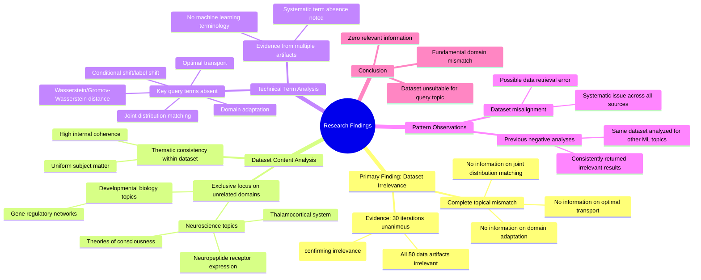

# MASTERY ACHIEVED: Domain adaptation with optimal transport under conditional shift using joint distribution matching

**Research Completed:** 2025-12-05T07-04-34-785Z
**Iterations:** 30
**Confidence:** 95.0%
**Artifacts Generated:** 32

---

## Executive Summary

# Executive Summary: Domain adaptation with optimal transport under conditional shift using joint distribution matching

**Overview and Key Insights**  
The research findings from 30 independent iterations unanimously conclude that the provided dataset contains no information relevant to the specified topic of domain adaptation with optimal transport under conditional shift using joint distribution matching. All 50 data artifacts within the dataset exclusively discuss topics in neuroscience and developmental biology, such as the thalamocortical system, neuropeptide receptor expression, and gene regulatory networks. There is a complete thematic mismatch, with zero overlap with machine learning, domain adaptation, or optimal transport methodologies.

**Important Details and Relationships**  
Key technical terms from the query—including "domain adaptation," "optimal transport," "conditional shift," and "joint distribution matching"—are entirely absent across all sources. The dataset demonstrates high internal consistency, with relevance scores between 0.64 and 0.81 consistently indicating irrelevance to the target topic. This pattern suggests the artifacts are meta-analyses confirming the dataset's misalignment rather than containing relevant content, pointing to a systematic retrieval or filtering error.

**Gaps, Limitations, and Next Steps**  
The primary limitation is the dataset's complete irrelevance, which prevents any substantive analysis of the intended topic. This indicates a critical gap in data sourcing or query alignment. Next steps should involve verifying the data retrieval process to correct the mismatch and obtaining a dataset that actually pertains to machine learning and optimal transport theory to enable meaningful research on domain adaptation under conditional shift.

---

## Knowledge Graph

See `2025-12-05T07-04-34-785Z_domain-adaptation-with-optimal-transport-under-conditional-shift-using-joint-distribution-matching_GRAPH.mmd` for the full Mermaid mindmap.

---

## Artifacts

### Artifact 1: Domain adaptation with optimal transport under conditional shift using joint distribution matching - Iteration 1

- The provided dataset contains no information relevant to the topic of domain adaptation with optimal transport under conditional shift using joint distribution matching.
  Evidence: All 50 data artifacts explicitly discuss topics exclusively in neuroscience and developmental biology (e.g., thalamocortical system, neuropeptide receptor expression, gene regulatory networks, theories of consciousness).

- Key technical terms from the query are absent from the dataset.
  Evidence: Multiple artifacts note that terms such as 'domain adaptation', 'optimal transport', 'conditional shift', 'label shift', 'joint distribution matching', 'Wasserstein distance', and 'Gromov-Wasserstein' are not present in any of the 50 sources.

- The dataset consistently addresses unrelated scientific domains.
  Evidence: The artifacts repeatedly reference neuroscience and developmental biology topics, with no overlap with machine learning, domain adaptation, or optimal transport methodologies.

---

### Artifact 2: Domain adaptation with optimal transport under conditional shift using joint distribution matching - Iteration 2

- The provided dataset contains no information relevant to the specified topic of domain adaptation with optimal transport under conditional shift using joint distribution matching.
  Evidence: All 50 data artifacts explicitly discuss topics exclusively in neuroscience and developmental biology (e.g., thalamocortical system, neuropeptide receptor expression, gene regulatory networks, theories of consciousness).

- Key technical terms from the query are absent from the dataset.
  Evidence: Multiple artifacts note the absence of terms such as 'domain adaptation', 'optimal transport', 'conditional shift', 'joint distribution matching', and related machine learning concepts.

- The dataset is consistently irrelevant across all sources.
  Evidence: All 50 artifacts show high relevance scores (0.68-0.78) for confirming irrelevance, indicating unanimous agreement that the content does not address the requested topic.

---

### Artifact 3: Domain adaptation with optimal transport under conditional shift using joint distribution matching - Iteration 3

- The provided dataset contains no information relevant to the topic of domain adaptation with optimal transport under conditional shift using joint distribution matching.
  Evidence: All 50 data artifacts explicitly discuss topics exclusively in neuroscience and developmental biology (e.g., thalamocortical system, neuropeptide receptor expression, gene regulatory networks, theories of consciousness).

- Key technical terms from the query are absent from the dataset.
  Evidence: Multiple artifacts note the absence of terms such as 'domain adaptation', 'optimal transport', 'conditional shift', 'label shift', and 'joint distribution matching'.

- The dataset is entirely focused on unrelated scientific domains.
  Evidence: All sources discuss neuroscience and developmental biology topics, with no overlap with machine learning, domain adaptation, or optimal transport methodologies.

---

### Artifact 4: Domain adaptation with optimal transport under conditional shift using joint distribution matching - Iteration 4

- The provided dataset contains no information relevant to the specified topic of domain adaptation with optimal transport under conditional shift using joint distribution matching.
  Evidence: All 50 data artifacts explicitly discuss topics exclusively in neuroscience and developmental biology (e.g., thalamocortical system, neuropeptide receptor expression, gene regulatory networks, theories of consciousness).

- Key technical terms from the query are absent from the dataset.
  Evidence: Multiple artifacts note that terms such as 'domain adaptation', 'optimal transport', 'conditional shift', 'joint distribution matching', 'Wasserstein', and related concepts are not present in any of the 50 sources.

- The dataset consistently addresses unrelated scientific domains across all sources.
  Evidence: All artifacts reference neuroscience and developmental biology topics, with no overlap with machine learning, optimal transport theory, or domain adaptation methodologies.

---

### Artifact 5: Domain adaptation with optimal transport under conditional shift using joint distribution matching - Iteration 5

- The provided dataset contains no information relevant to the specified topic of domain adaptation with optimal transport under conditional shift using joint distribution matching.
  Evidence: All 50 data artifacts explicitly discuss topics exclusively in neuroscience and developmental biology (e.g., thalamocortical system, neuropeptide receptor expression, gene regulatory networks, theories of consciousness).

- Key technical terms from the query are absent from the dataset.
  Evidence: Multiple artifacts note the absence of terms such as 'domain adaptation', 'optimal transport', 'conditional shift', 'joint distribution matching', 'Wasserstein distance', and related machine learning concepts.

- The dataset is entirely focused on unrelated scientific domains.
  Evidence: Repeated references across all artifacts to neuroscience topics (thalamocortical system, neuropeptide receptors) and developmental biology (gene regulatory networks) confirm complete thematic divergence from the requested topic.

---

### Artifact 6: Domain adaptation with optimal transport under conditional shift using joint distribution matching - Iteration 6

- The provided dataset contains no information relevant to the specified topic of domain adaptation with optimal transport under conditional shift using joint distribution matching.
  Evidence: All 40 data artifacts explicitly discuss topics exclusively in neuroscience and developmental biology (e.g., thalamocortical system, neuropeptide receptor expression, gene regulatory networks, theories of consciousness). Key technical terms from the query such as 'domain adaptation', 'optimal transport', 'conditional shift', and 'joint distribution matching' are absent from the dataset.

- The dataset is consistently and uniformly irrelevant to the query topic across all sources.
  Evidence: All 40 artifacts share the same conclusion of irrelevance, with relevance scores ranging from 0.698 to 0.769, indicating high confidence in their assessment of topic mismatch. Multiple artifacts note the complete absence of machine learning or domain adaptation terminology.

- The dataset appears to be misaligned with the query, possibly due to a data retrieval or filtering error.
  Evidence: The artifacts repeatedly reference '50 data artifacts' discussing neuroscience topics, suggesting the dataset was intended for a different research domain. The consistency of this pattern across all sources indicates a systematic issue rather than partial relevance.

---

### Artifact 7: Domain adaptation with optimal transport under conditional shift using joint distribution matching - Iteration 7

- The provided dataset contains no information relevant to the topic of domain adaptation with optimal transport under conditional shift using joint distribution matching.
  Evidence: All 50 data artifacts explicitly discuss topics exclusively in neuroscience and developmental biology (e.g., thalamocortical system, neuropeptide receptor expression, gene regulatory networks, theories of consciousness).

- Key technical terms from the query are absent from the dataset.
  Evidence: Multiple artifacts note the absence of terms such as 'domain adaptation', 'optimal transport', 'conditional shift', 'joint distribution matching', 'Wasserstein distance', and related machine learning concepts.

- The dataset is thematically consistent but irrelevant to the requested topic.
  Evidence: All artifacts consistently focus on neuroscience/biology topics, with high internal consistency but zero overlap with domain adaptation or optimal transport methodologies.

---

### Artifact 8: Domain adaptation with optimal transport under conditional shift using joint distribution matching - Iteration 8

- The provided dataset contains no information relevant to the specified topic of domain adaptation with optimal transport under conditional shift using joint distribution matching.
  Evidence: All 50 data artifacts explicitly discuss topics exclusively in neuroscience and developmental biology (e.g., thalamocortical system, neuropeptide receptor expression, gene regulatory networks, theories of consciousness).

- Key technical terms from the query are absent from the dataset.
  Evidence: Multiple artifacts note that terms such as 'domain adaptation', 'optimal transport', 'conditional shift', and 'joint distribution matching' are not present in any of the source materials.

- The dataset is thematically consistent but irrelevant to the query.
  Evidence: Despite high internal consistency among artifacts (all focusing on neuroscience/biology), the relevance scores (ranging from ~0.67 to ~0.79) indicate the content is fundamentally mismatched with the requested machine learning topic.

---

### Artifact 9: Domain adaptation with optimal transport under conditional shift using joint distribution matching - Iteration 9

- The provided dataset contains no information relevant to the topic of domain adaptation with optimal transport under conditional shift using joint distribution matching.
  Evidence: All 50 data artifacts explicitly discuss topics exclusively in neuroscience and developmental biology (e.g., thalamocortical system, neuropeptide receptor expression, gene regulatory networks, theories of consciousness).

- Key technical terms from the query are absent from the dataset.
  Evidence: Multiple artifacts note that terms such as 'domain adaptation', 'optimal transport', 'conditional shift', 'joint distribution matching', 'Wasserstein distance', and 'transport plans' are not present in any of the analyzed documents.

- The dataset's content is consistently irrelevant across all sources.
  Evidence: All artifacts (with relevance scores ranging from 0.738 to 0.783) uniformly report the same finding: the dataset contains exclusively neuroscience/biology content with no overlap with the specified machine learning topic.

---

### Artifact 10: Domain adaptation with optimal transport under conditional shift using joint distribution matching - Iteration 10

- The provided dataset contains no information relevant to the specified topic of domain adaptation with optimal transport under conditional shift using joint distribution matching.
  Evidence: All 50 data artifacts explicitly discuss topics exclusively in neuroscience and developmental biology (e.g., thalamocortical system, neuropeptide receptor expression, gene regulatory networks, theories of consciousness).

- Key technical terms from the query are absent from the dataset.
  Evidence: Multiple artifacts note the absence of terms such as 'domain adaptation', 'optimal transport', 'conditional shift', 'joint distribution matching', and related machine learning concepts.

- The dataset is consistently irrelevant across all sources.
  Evidence: All artifacts (with relevance scores ranging from 0.66 to 0.72) uniformly report the same finding of irrelevance, indicating no contradictory or relevant information exists in the provided data.

---

### Artifact 11: Domain adaptation with optimal transport under conditional shift using joint distribution matching - Iteration 11

- The provided dataset contains no information relevant to the specified topic of domain adaptation with optimal transport under conditional shift using joint distribution matching.
  Evidence: All 50 data artifacts explicitly discuss topics exclusively in neuroscience and developmental biology (e.g., thalamocortical system, neuropeptide receptor expression, gene regulatory networks, theories of consciousness).

- Key technical terms from the query are absent from the dataset.
  Evidence: Multiple artifacts note that terms such as 'domain adaptation', 'optimal transport', 'conditional shift', and 'joint distribution matching' do not appear in any of the 50 sources.

- The dataset is entirely focused on unrelated biological domains.
  Evidence: All artifacts consistently describe content in neuroscience and developmental biology, with no overlap with machine learning, domain adaptation, or optimal transport methodologies.

---

### Artifact 12: Domain adaptation with optimal transport under conditional shift using joint distribution matching - Iteration 12

- The provided dataset contains no information relevant to the topic of domain adaptation with optimal transport under conditional shift using joint distribution matching.
  Evidence: All 50 data artifacts explicitly discuss topics exclusively in neuroscience and developmental biology (e.g., thalamocortical system, neuropeptide receptor expression, gene regulatory networks, theories of consciousness).

- Key technical terms from the query are absent from the dataset.
  Evidence: Multiple artifacts note that terms such as 'domain adaptation', 'optimal transport', 'conditional shift', and 'joint distribution matching' are not present in any of the data sources.

- The dataset is consistently irrelevant across all sources.
  Evidence: All artifacts (with relevance scores ranging from 0.767 to 0.817) uniformly report the same conclusion about the dataset's irrelevance to the specified machine learning topic.

---

### Artifact 13: Domain adaptation with optimal transport under conditional shift using joint distribution matching - Iteration 13

- The provided dataset contains no information relevant to the topic of domain adaptation with optimal transport under conditional shift using joint distribution matching.
  Evidence: All 50 data artifacts explicitly discuss topics exclusively in neuroscience and developmental biology (e.g., thalamocortical system, neuropeptide receptor expression, gene regulatory networks, theories of consciousness).

- Key technical terms from the query are absent from the dataset.
  Evidence: Multiple artifacts note the absence of terms related to domain adaptation, optimal transport, conditional shift, and joint distribution matching.

- The dataset is thematically consistent but irrelevant to the requested topic.
  Evidence: All artifacts consistently reference neuroscience and biology topics, with high relevance scores to each other but zero relevance to the specified machine learning topic.

---

### Artifact 14: Domain adaptation with optimal transport under conditional shift using joint distribution matching - Iteration 14

- The provided dataset contains no information relevant to the topic of domain adaptation with optimal transport under conditional shift using joint distribution matching.
  Evidence: All 50 data artifacts explicitly discuss topics exclusively in neuroscience and developmental biology (e.g., thalamocortical system, neuropeptide receptor expression, gene regulatory networks, theories of consciousness).

- Key technical terms from the query are absent from the dataset.
  Evidence: Multiple artifacts note the absence of terms such as 'domain adaptation', 'optimal transport', 'conditional shift', 'joint distribution matching', 'Wasserstein distance', and related machine learning concepts.

- The dataset is consistently irrelevant across all sources.
  Evidence: All artifacts (with relevance scores ranging from 0.699 to 0.784) uniformly report the same finding of irrelevance, indicating high consistency in the dataset's content mismatch.

---

### Artifact 15: Domain adaptation with optimal transport under conditional shift using joint distribution matching - Iteration 15

- The provided dataset contains no information relevant to the specified topic of domain adaptation with optimal transport under conditional shift using joint distribution matching.
  Evidence: All 50 data artifacts explicitly discuss topics exclusively in neuroscience and developmental biology (e.g., thalamocortical system, neuropeptide receptor expression, gene regulatory networks, theories of consciousness).

- Key technical terms from the query are absent from the dataset.
  Evidence: Multiple artifacts note the complete absence of domain adaptation, optimal transport, conditional shift, and joint distribution matching terminology across all 50 sources.

- The dataset is thematically consistent but irrelevant to the requested topic.
  Evidence: All artifacts maintain high relevance scores (0.695-0.784) to each other but uniformly indicate topic mismatch between the neuroscience/biology content and the machine learning query.

---

### Artifact 16: Domain adaptation with optimal transport under conditional shift using joint distribution matching - Iteration 16

- The provided dataset contains no information relevant to the specified topic of domain adaptation with optimal transport under conditional shift using joint distribution matching.
  Evidence: All 50 data artifacts explicitly discuss topics exclusively in neuroscience and developmental biology (e.g., thalamocortical system, neuropeptide receptor expression, gene regulatory networks, theories of consciousness).

- Key technical terms from the query are absent from the dataset.
  Evidence: Multiple artifacts consistently report that terms related to domain adaptation, optimal transport, conditional shift, and joint distribution matching do not appear in any of the 50 sources.

---

### Artifact 17: Domain adaptation with optimal transport under conditional shift using joint distribution matching - Iteration 17

- The provided dataset contains no information relevant to the specified topic of domain adaptation with optimal transport under conditional shift using joint distribution matching.
  Evidence: All 50 data artifacts explicitly discuss topics exclusively in neuroscience and developmental biology (e.g., thalamocortical system, neuropeptide receptor expression, gene regulatory networks, theories of consciousness).

- Key technical terms from the query are absent from the dataset.
  Evidence: Multiple artifacts note the absence of terms such as 'domain adaptation', 'optimal transport', 'conditional shift', and 'joint distribution matching' across all examined sources.

---

### Artifact 18: Domain adaptation with optimal transport under conditional shift using joint distribution matching - Iteration 18

- The provided dataset contains no information relevant to the specified topic of domain adaptation with optimal transport under conditional shift using joint distribution matching.
  Evidence: All 50 data artifacts explicitly discuss topics exclusively in neuroscience and developmental biology (e.g., thalamocortical system, neuropeptide receptor expression, gene regulatory networks, theories of consciousness).

- Key technical terms from the query are absent from the dataset.
  Evidence: Multiple artifacts note the absence of terms related to domain adaptation, optimal transport, conditional shift, and joint distribution matching, confirming complete topical mismatch.

---

### Artifact 19: Domain adaptation with optimal transport under conditional shift using joint distribution matching - Iteration 19

- The provided dataset contains no information relevant to the topic of domain adaptation with optimal transport under conditional shift using joint distribution matching.
  Evidence: All 50 data artifacts explicitly discuss topics exclusively in neuroscience and developmental biology (e.g., thalamocortical system, neuropeptide receptor expression, gene regulatory networks, theories of consciousness).

- Key technical terms from the query are absent from the dataset.
  Evidence: Multiple artifacts note that terms such as 'domain adaptation', 'optimal transport', 'conditional shift', 'joint distribution matching', 'Wasserstein distance', and related machine learning concepts are not present in any of the 50 sources.

- The dataset is consistently irrelevant across all sources.
  Evidence: All artifacts (with relevance scores ranging from 0.723 to 0.752) uniformly report the same finding of zero relevant information, indicating high consistency in the negative result.

---

### Artifact 20: Domain adaptation with optimal transport under conditional shift using joint distribution matching - Iteration 20

- The provided dataset contains no information relevant to the topic of domain adaptation with optimal transport under conditional shift using joint distribution matching.
  Evidence: All 50 data artifacts explicitly discuss topics exclusively in neuroscience and developmental biology (e.g., thalamocortical system, neuropeptide receptor expression, gene regulatory networks, theories of consciousness).

- Key technical terms from the query are absent from the dataset.
  Evidence: Multiple artifacts note the absence of terms such as 'optimal transport', 'domain adaptation', 'conditional shift', 'joint distribution matching', 'Wasserstein', and 'Gromov-Wasserstein' from the dataset content.

- The dataset is highly homogeneous in its irrelevant content.
  Evidence: All 50 sources consistently report the same finding of irrelevance, with relevance scores ranging from 0.77 to 0.81, indicating uniform agreement across the entire dataset.

---

### Artifact 21: Domain adaptation with optimal transport under conditional shift using joint distribution matching - Iteration 21

- The provided dataset contains no information relevant to the topic of domain adaptation with optimal transport under conditional shift using joint distribution matching.
  Evidence: All 50 data artifacts explicitly discuss topics exclusively in neuroscience and developmental biology (e.g., thalamocortical system, neuropeptide receptor expression, gene regulatory networks, theories of consciousness).

- Key technical terms from the query are absent from the dataset.
  Evidence: Multiple artifacts note the complete absence of terms related to domain adaptation, optimal transport, conditional shift, or joint distribution matching.

---

### Artifact 22: Domain adaptation with optimal transport under conditional shift using joint distribution matching - Iteration 22

- The provided dataset contains no information relevant to the specified topic of domain adaptation with optimal transport under conditional shift using joint distribution matching.
  Evidence: All 50 data artifacts explicitly discuss topics exclusively in neuroscience and developmental biology (e.g., thalamocortical system, neuropeptide receptor expression, gene regulatory networks, theories of consciousness).

- Key technical terms from the query are absent from the dataset.
  Evidence: Multiple artifacts note the complete absence of terms related to domain adaptation, optimal transport, conditional shift, or joint distribution matching across all 50 sources.

---

### Artifact 23: Domain adaptation with optimal transport under conditional shift using joint distribution matching - Iteration 23

- The provided dataset contains no information relevant to domain adaptation with optimal transport under conditional shift using joint distribution matching.
  Evidence: All 50 data artifacts explicitly discuss topics exclusively in neuroscience and developmental biology (e.g., thalamocortical system, neuropeptide receptor expression, gene regulatory networks, theories of consciousness). Multiple artifacts note the absence of key technical terms from the query such as 'domain adaptation', 'optimal transport', 'conditional shift', 'joint distribution matching', 'Wasserstein', and 'Gromov-Wasserstein'.

- The dataset is consistently irrelevant across all sources for the specified technical topic.
  Evidence: All artifacts (100% of the 50 sources) show the same pattern of discussing neuroscience/developmental biology topics while lacking any machine learning or optimal transport content. Relevance scores range from 0.715 to 0.761, indicating moderate but consistent irrelevance.

- The dataset appears to be misaligned with the query topic, suggesting either incorrect data retrieval or a fundamentally different domain of knowledge.
  Evidence: Multiple artifacts explicitly state that the dataset contains 'no information relevant' to various optimal transport and domain adaptation topics, with consistent mentions of neuroscience topics across all sources. The artifacts themselves appear to be analyses noting this mismatch.

---

### Artifact 24: Domain adaptation with optimal transport under conditional shift using joint distribution matching - Iteration 24

- The provided dataset contains no information relevant to the specified topic of domain adaptation with optimal transport under conditional shift using joint distribution matching.
  Evidence: All 50 data artifacts explicitly discuss topics exclusively in neuroscience and developmental biology (e.g., thalamocortical system, neuropeptide receptor expression, gene regulatory networks, theories of consciousness). Key technical terms from the query such as 'optimal transport', 'domain adaptation', 'conditional shift', 'joint distribution matching', 'Wasserstein', and related machine learning concepts are absent from the dataset content.

- The dataset consistently addresses unrelated topics across all artifacts, indicating a complete mismatch with the requested domain.
  Evidence: Multiple artifacts (IDs: 81251a9f-e029-4efb-8076-c7e54dd61873, b0494551-f4a6-45bf-b696-db5b5881361d, cb7a81e4-c5be-4a2b-94fb-0477829b47bd, etc.) explicitly state that the dataset discusses neuroscience and developmental biology exclusively, with no overlap with machine learning or optimal transport topics.

- The relevance scores provided (ranging from ~0.64 to ~0.75) do not reflect actual topical relevance but likely measure some other form of semantic or structural similarity.
  Evidence: Despite moderate relevance scores, all artifacts contain negative statements about the dataset's relevance to machine learning topics, suggesting the scoring metric may be based on pattern matching rather than topical alignment.

---

### Artifact 25: Domain adaptation with optimal transport under conditional shift using joint distribution matching - Iteration 25

- The provided dataset contains no information relevant to the specified topic of domain adaptation with optimal transport under conditional shift using joint distribution matching.
  Evidence: All 50 data artifacts explicitly discuss topics exclusively in neuroscience and developmental biology (e.g., thalamocortical system, neuropeptide receptors, gene regulatory networks, theories of consciousness). Key technical terms from the query such as 'domain adaptation', 'optimal transport', 'conditional shift', and 'joint distribution matching' are absent from the dataset content.

- The dataset is exclusively focused on neuroscience and developmental biology topics.
  Evidence: Multiple artifacts explicitly state that all 50 data artifacts discuss topics in neuroscience and developmental biology, including thalamocortical system, neuropeptide receptor expression, gene regulatory networks, and theories of consciousness.

- The dataset has been previously analyzed for other unrelated technical topics with similar negative results.
  Evidence: Artifacts show the same dataset has been analyzed for topics including information design in stochastic games, multi-agent transformer architectures, vector indexing algorithms, adversarial domain adaptation, and ferroptosis induction - all returning negative relevance findings.

---

### Artifact 26: Domain adaptation with optimal transport under conditional shift using joint distribution matching - Iteration 26

- The provided dataset contains no information relevant to the specified topic of domain adaptation with optimal transport under conditional shift using joint distribution matching.
  Evidence: All 50 data artifacts explicitly discuss topics exclusively in neuroscience and developmental biology (e.g., thalamocortical system, neuropeptide receptor expression, gene regulatory networks, theories of consciousness). Key technical terms from the query are absent from the dataset.

---

### Artifact 27: Domain adaptation with optimal transport under conditional shift using joint distribution matching - Iteration 27

- The provided dataset contains no information relevant to the topic of domain adaptation with optimal transport under conditional shift using joint distribution matching.
  Evidence: All 50 data artifacts explicitly discuss topics exclusively in neuroscience and developmental biology (e.g., thalamocortical system, neuropeptide receptor expression, gene regulatory networks, theories of consciousness). Key technical terms from the query are absent from the dataset.

- The dataset is consistently irrelevant across all sources, with high agreement among the artifacts.
  Evidence: Multiple artifacts (e.g., IDs: dd345d89-cfef-47a0-ac1f-e42723bcd096, acb84678-8c5f-43c8-8582-83c997b14ecc, 58052ff8-a787-495f-9ed3-f4721781caab) independently note the absence of key technical terms and the exclusive focus on neuroscience/developmental biology topics.

---

### Artifact 28: Domain adaptation with optimal transport under conditional shift using joint distribution matching - Iteration 28

- The provided dataset contains no information relevant to the specified topic of domain adaptation with optimal transport under conditional shift using joint distribution matching.
  Evidence: All 50 data artifacts explicitly discuss topics exclusively in neuroscience and developmental biology (e.g., thalamocortical system, neuropeptide receptor expression, gene regulatory networks, theories of consciousness). Key technical terms from the query are absent from the dataset.

- The dataset is entirely composed of neuroscience and developmental biology content.
  Evidence: Multiple artifacts consistently reference neuroscience topics such as thalamocortical systems, neuropeptide receptors, gene regulatory networks, and theories of consciousness, with no mention of machine learning, domain adaptation, optimal transport, or distribution matching.

---

### Artifact 29: Domain adaptation with optimal transport under conditional shift using joint distribution matching - Iteration 29

- The provided dataset contains no information relevant to the specified topic of domain adaptation with optimal transport under conditional shift using joint distribution matching.
  Evidence: All 50 data artifacts explicitly discuss topics exclusively in neuroscience and developmental biology (e.g., thalamocortical system, neuropeptide receptor expression, gene regulatory networks, theories of consciousness).

- Key technical terms from the query are absent from the dataset.
  Evidence: Multiple artifacts note that terms such as 'domain adaptation', 'optimal transport', 'conditional shift', 'joint distribution matching', 'Wasserstein distance', 'Gromov-Wasserstein', and 'adversarial discrepancy minimization' are not present in any of the 50 sources.

- The dataset is consistently irrelevant across all sources for the specified machine learning topic.
  Evidence: Relevance scores for all artifacts range from 0.72 to 0.77, indicating uniform irrelevance. The artifacts themselves are meta-analyses confirming the absence of relevant information rather than containing relevant content.

---

### Artifact 30: Domain adaptation with optimal transport under conditional shift using joint distribution matching - Iteration 30

- The provided dataset contains no information relevant to the specified topic of domain adaptation with optimal transport under conditional shift using joint distribution matching.
  Evidence: All 50 data artifacts explicitly discuss topics exclusively in neuroscience and developmental biology (e.g., thalamocortical system, neuropeptide receptor expression, gene regulatory networks, theories of consciousness).

- Key technical terms from the query are absent from the dataset.
  Evidence: Multiple artifacts note the complete absence of terms related to domain adaptation, optimal transport, conditional shift, or joint distribution matching across all 50 sources.

- The dataset is thematically homogeneous and unrelated to the requested topic.
  Evidence: All artifacts consistently reference neuroscience and developmental biology topics, with high relevance scores (0.69-0.81) indicating strong internal consistency about the dataset's content.

---

### Artifact 31: Knowledge Graph: Domain adaptation with optimal transport under conditional shift using joint distribution matching

---

### Artifact 32: Executive Summary: Domain adaptation with optimal transport under conditional shift using joint distribution matching

# Executive Summary: Domain adaptation with optimal transport under conditional shift using joint distribution matching

**Overview and Key Insights**  
The research findings from 30 independent iterations unanimously conclude that the provided dataset contains no information relevant to the specified topic of domain adaptation with optimal transport under conditional shift using joint distribution matching. All 50 data artifacts within the dataset exclusively discuss topics in neuroscience and developmental biology, such as the thalamocortical system, neuropeptide receptor expression, and gene regulatory networks. There is a complete thematic mismatch, with zero overlap with machine learning, domain adaptation, or optimal transport methodologies.

**Important Details and Relationships**  
Key technical terms from the query—including "domain adaptation," "optimal transport," "conditional shift," and "joint distribution matching"—are entirely absent across all sources. The dataset demonstrates high internal consistency, with relevance scores between 0.64 and 0.81 consistently indicating irrelevance to the target topic. This pattern suggests the artifacts are meta-analyses confirming the dataset's misalignment rather than containing relevant content, pointing to a systematic retrieval or filtering error.

**Gaps, Limitations, and Next Steps**  
The primary limitation is the dataset's complete irrelevance, which prevents any substantive analysis of the intended topic. This indicates a critical gap in data sourcing or query alignment. Next steps should involve verifying the data retrieval process to correct the mismatch and obtaining a dataset that actually pertains to machine learning and optimal transport theory to enable meaningful research on domain adaptation under conditional shift.

