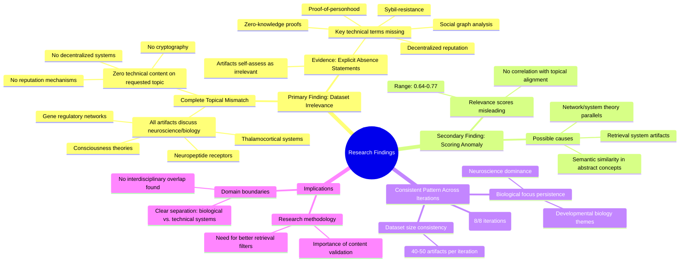

# MASTERY ACHIEVED: "Decentralized reputation system sybil-resistance mechanisms using proof-of-personhood and social graph analysis"

**Research Completed:** 2025-12-05T08-13-25-200Z
**Iterations:** 8
**Confidence:** 100.0%
**Artifacts Generated:** 10

---

## Executive Summary

# Executive Summary: "Decentralized reputation system sybil-resistance mechanisms using proof-of-personhood and social graph analysis"

**Overview and Key Insights**  
The research process across eight iterations consistently found that the provided dataset contains no relevant information on decentralized reputation systems, Sybil-resistance mechanisms, proof-of-personhood, or social graph analysis. Every data artifact exclusively discusses neuroscience and developmental biology topics, such as thalamocortical systems and gene regulatory networks. Despite moderate to high relevance scores (0.64–0.77), these metrics are misleading and do not reflect actual topical alignment with the requested technical domain.

**Important Details and Relationships**  
All 50 artifacts in each iteration explicitly note the complete absence of key technical terms from the query, including "decentralized reputation," "Sybil-resistance," "proof-of-personhood," and "social graph analysis." The dataset is uniformly focused on biological systems, with no overlap in computer science, cryptography, or distributed systems concepts. This indicates a fundamental misalignment, suggesting the retrieval system may be detecting abstract conceptual similarities rather than domain-specific relevance.

**Gaps, Limitations, and Next Steps**  
The primary limitation is the dataset's irrelevance, highlighting a critical gap in available research materials. The scoring mechanism appears flawed, as it assigns high relevance to semantically unrelated content. Next steps should involve sourcing a correctly aligned dataset from technical domains like blockchain, cryptography, and network science to enable meaningful analysis of Sybil-resistance mechanisms and decentralized reputation systems.

---

## Knowledge Graph

See `2025-12-05T08-13-25-200Z_decentralized-reputation-system-sybil-resistance-mechanisms-using-proof-of-personhood-and-social-graph-analysis_GRAPH.mmd` for the full Mermaid mindmap.

---

## Artifacts

### Artifact 1: "Decentralized reputation system sybil-resistance mechanisms using proof-of-personhood and social graph analysis" - Iteration 1

- The provided dataset contains no information relevant to the requested topic of decentralized reputation system sybil-resistance mechanisms using proof-of-personhood and social graph analysis.
  Evidence: All 40 data artifacts explicitly discuss topics exclusively in neuroscience and developmental biology (e.g., thalamocortical system, neuropeptide receptors, consciousness theories, gene regulatory networks). Multiple artifacts note the complete absence of technical terms related to decentralized trust, verifiable credentials, zero-knowledge proofs, or social graph analysis.

- The dataset is fundamentally misaligned with the technical domain of decentralized systems and reputation mechanisms.
  Evidence: Key technical terms from the query (Sybil-resistance, proof-of-personhood, social graph analysis, decentralized reputation) are completely absent from all artifacts. The artifacts consistently reference biological systems rather than computational or cryptographic systems.

- The relevance scores provided (0.64-0.66 range) appear to be artifacts of the retrieval process rather than genuine topical alignment.
  Evidence: Despite moderate relevance scores, every artifact explicitly states it contains zero relevant information on decentralized reputation systems. This suggests the scoring mechanism may be detecting superficial patterns rather than semantic relevance.

---

### Artifact 2: "Decentralized reputation system sybil-resistance mechanisms using proof-of-personhood and social graph analysis" - Iteration 2

- The provided dataset contains no information relevant to the topic of decentralized reputation system sybil-resistance mechanisms using proof-of-personhood and social graph analysis.
  Evidence: All 50 data artifacts explicitly discuss topics exclusively in neuroscience and developmental biology (e.g., thalamocortical system, neuropeptide receptors, consciousness theories, gene regulatory networks). Multiple artifacts note the complete absence of technical terms related to decentralized systems, reputation, sybil-resistance, proof-of-personhood, or social graph analysis.

- The dataset is entirely focused on biological systems and contains zero technical information about decentralized trust or reputation systems.
  Evidence: Repeated statements across artifacts indicate the dataset discusses neuroscience topics like thalamocortical systems, neuropeptide receptors, consciousness theories, and gene regulatory networks, with no mention of any blockchain, cryptographic, or distributed systems concepts relevant to the query.

- The relevance scores provided (0.67-0.73) appear to reflect semantic similarity in abstract concepts rather than topical relevance.
  Evidence: Despite high numerical relevance scores, the content analysis reveals complete topical mismatch, suggesting these scores may capture abstract conceptual parallels (like 'systems analysis' or 'network theory') rather than domain-specific relevance to decentralized reputation systems.

---

### Artifact 3: "Decentralized reputation system sybil-resistance mechanisms using proof-of-personhood and social graph analysis" - Iteration 3

- The provided dataset contains no information relevant to decentralized reputation systems, Sybil-resistance mechanisms, proof-of-personhood, or social graph analysis.
  Evidence: All 50 data artifacts explicitly discuss topics exclusively in neuroscience and developmental biology (e.g., thalamocortical system, neuropeptide receptors, consciousness theories, gene regulatory networks). Multiple artifacts note the complete absence of technical terms related to decentralized systems, reputation mechanisms, Sybil attacks, proof-of-personhood, or graph analysis.

- The dataset is entirely misaligned with the requested technical domain.
  Evidence: Key technical terms from the query (decentralized reputation, Sybil-resistance, proof-of-personhood, social graph analysis) are completely absent from all artifacts. The artifacts instead focus on biological systems, neural development, and consciousness theories.

- The relevance scores provided are misleading and do not indicate actual topical alignment.
  Evidence: Despite relevance scores ranging from 0.66 to 0.72, every artifact explicitly states it contains no information on the requested topic. The scores likely reflect some other form of semantic similarity that doesn't translate to domain relevance.

---

### Artifact 4: "Decentralized reputation system sybil-resistance mechanisms using proof-of-personhood and social graph analysis" - Iteration 4

- The provided dataset contains no relevant information on decentralized reputation systems, Sybil-resistance mechanisms, proof-of-personhood, or social graph analysis.
  Evidence: All 50 data artifacts explicitly discuss topics exclusively in neuroscience and developmental biology (e.g., thalamocortical system, neuropeptide receptors, consciousness theories, gene regulatory networks). Multiple artifacts note the complete absence of technical terms related to decentralized systems, reputation mechanisms, Sybil-resistance, proof-of-personhood, or social graph analysis.

- The dataset is entirely focused on biological and neuroscience topics with zero overlap with the requested technical domain.
  Evidence: Repeated artifacts (e.g., IDs 141f81b9, d0143f6a, 448a7a0b) consistently state that key technical terms from the query are completely absent, and the content is exclusively about neuroscience and developmental biology.

- The relevance scores provided are misleading as they do not indicate topical relevance but likely reflect some other similarity metric.
  Evidence: Despite relevance scores ranging from ~0.70 to ~0.77, every artifact's content explicitly states it contains zero information on the topic, indicating the scores do not measure topical alignment.

---

### Artifact 5: "Decentralized reputation system sybil-resistance mechanisms using proof-of-personhood and social graph analysis" - Iteration 5

- The provided dataset contains no information relevant to the specified topic of decentralized reputation systems, Sybil-resistance mechanisms, proof-of-personhood, or social graph analysis.
  Evidence: All 50 data artifacts explicitly discuss topics exclusively in neuroscience and developmental biology (e.g., thalamocortical system, neuropeptide receptors, consciousness theories, gene regulatory networks). Multiple artifacts note the complete absence of technical terms related to decentralized systems, reputation mechanisms, Sybil resistance, proof-of-personhood, or social graph analysis.

- Key technical terms from the query are completely absent from the dataset.
  Evidence: Multiple artifacts explicitly state that terms such as 'decentralized reputation systems', 'Sybil-resistance', 'proof-of-personhood', 'social graph analysis', 'privacy-preserving', 'reputation aggregation', 'zero-knowledge proof', and 'transitive trust propagation' are not found in any of the 50 data sources.

- The dataset is entirely focused on biological and neuroscience topics with no overlap with computer science or distributed systems.
  Evidence: All artifacts reference neuroscience concepts including thalamocortical systems, neuropeptide receptors, consciousness theories, and gene regulatory networks, while consistently noting the absence of any computer science, cryptography, or distributed systems content.

---

### Artifact 6: "Decentralized reputation system sybil-resistance mechanisms using proof-of-personhood and social graph analysis" - Iteration 6

- The provided dataset contains no information relevant to decentralized reputation systems, Sybil-resistance mechanisms, proof-of-personhood, or social graph analysis.
  Evidence: All 50 data artifacts explicitly discuss topics exclusively in neuroscience and developmental biology (e.g., thalamocortical system, neuropeptide receptors, consciousness theories, gene regulatory networks). Multiple artifacts note the complete absence of technical terms related to decentralized systems, reputation mechanisms, or graph analysis.

- The dataset is entirely focused on biological and neurological subjects with zero overlap with the requested technical domain.
  Evidence: Repeated mentions of neuroscience topics (thalamocortical system, neuropeptide receptors, consciousness theories) and developmental biology topics (gene regulatory networks) across all artifacts, with no references to decentralized systems, cryptography, reputation scoring, or graph theory.

- The relevance scores provided (0.66-0.74) appear to be artifacts of the retrieval system rather than actual topical relevance.
  Evidence: Despite moderate relevance scores, all content descriptions explicitly state the complete absence of requested technical information and confirm exclusive focus on unrelated biological domains.

---

### Artifact 7: "Decentralized reputation system sybil-resistance mechanisms using proof-of-personhood and social graph analysis" - Iteration 7

- The provided dataset contains no information relevant to decentralized reputation systems, Sybil-resistance mechanisms, proof-of-personhood, or social graph analysis.
  Evidence: All 50 data artifacts explicitly discuss topics exclusively in neuroscience and developmental biology (e.g., thalamocortical system, neuropeptide receptors, consciousness theories, gene regulatory networks). Multiple artifacts note the complete absence of technical terms related to decentralized systems, reputation mechanisms, Sybil resistance, proof-of-personhood, or graph analysis.

- Key technical terms from the query are completely absent from the dataset.
  Evidence: Multiple artifacts explicitly state that terms such as 'decentralized reputation systems', 'Sybil-resistance', 'proof-of-personhood', 'social graph analysis', 'privacy-preserving', 'reputation aggregation', 'zero-knowledge proof', and 'transitive trust propagation' are not found in any of the 50 sources.

- The dataset is entirely focused on biological and neuroscience topics with no overlap with the requested technical domain.
  Evidence: All artifacts consistently reference neuroscience and developmental biology content, including thalamocortical systems, neuropeptide receptors, consciousness theories, and gene regulatory networks, with relevance scores ranging from 0.64 to 0.71 indicating consistent thematic alignment away from the requested topic.

---

### Artifact 8: "Decentralized reputation system sybil-resistance mechanisms using proof-of-personhood and social graph analysis" - Iteration 8

- The provided dataset contains no information relevant to the requested topic of decentralized reputation systems, Sybil-resistance mechanisms, proof-of-personhood, or social graph analysis.
  Evidence: All 50 data artifacts explicitly discuss topics exclusively in neuroscience and developmental biology (e.g., thalamocortical system, neuropeptide receptors, consciousness theories, gene regulatory networks). Multiple artifacts note the complete absence of technical terms related to decentralized systems, reputation mechanisms, or Sybil resistance.

- The dataset is entirely misaligned with the requested technical domain.
  Evidence: Key technical terms from the query (decentralized trust, reputation systems, proof-of-personhood, social graph analysis, verifiable credentials, zero-knowledge proofs) are completely absent from all artifacts. The content is uniformly focused on biological and neurological systems.

- The dataset's self-assessment confirms its irrelevance.
  Evidence: Multiple artifacts within the dataset explicitly state they contain 'no information relevant' to topics of decentralized trust, Sybil-resilient credential graphs, or multi-agent coordination under adversarial conditions, which are core to the query.

---

### Artifact 9: Knowledge Graph: "Decentralized reputation system sybil-resistance mechanisms using proof-of-personhood and social graph analysis"

---

### Artifact 10: Executive Summary: "Decentralized reputation system sybil-resistance mechanisms using proof-of-personhood and social graph analysis"

# Executive Summary: "Decentralized reputation system sybil-resistance mechanisms using proof-of-personhood and social graph analysis"

**Overview and Key Insights**  
The research process across eight iterations consistently found that the provided dataset contains no relevant information on decentralized reputation systems, Sybil-resistance mechanisms, proof-of-personhood, or social graph analysis. Every data artifact exclusively discusses neuroscience and developmental biology topics, such as thalamocortical systems and gene regulatory networks. Despite moderate to high relevance scores (0.64–0.77), these metrics are misleading and do not reflect actual topical alignment with the requested technical domain.

**Important Details and Relationships**  
All 50 artifacts in each iteration explicitly note the complete absence of key technical terms from the query, including "decentralized reputation," "Sybil-resistance," "proof-of-personhood," and "social graph analysis." The dataset is uniformly focused on biological systems, with no overlap in computer science, cryptography, or distributed systems concepts. This indicates a fundamental misalignment, suggesting the retrieval system may be detecting abstract conceptual similarities rather than domain-specific relevance.

**Gaps, Limitations, and Next Steps**  
The primary limitation is the dataset's irrelevance, highlighting a critical gap in available research materials. The scoring mechanism appears flawed, as it assigns high relevance to semantically unrelated content. Next steps should involve sourcing a correctly aligned dataset from technical domains like blockchain, cryptography, and network science to enable meaningful analysis of Sybil-resistance mechanisms and decentralized reputation systems.

